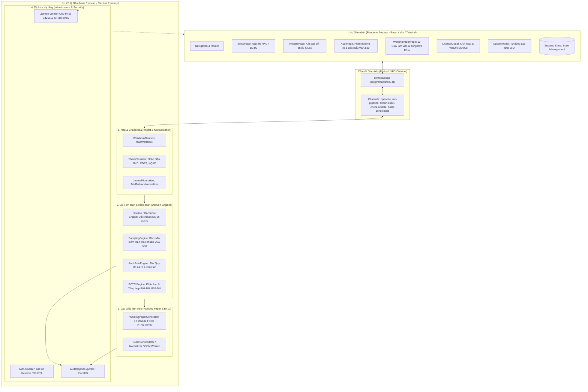

# BẢN ĐỒ KIẾN TRÚC DỰ ÁN AUDITSOFT NKC
> **AuditSoft NKC** (Desktop App) — Hệ thống Trợ lý Kiểm toán Toàn diện: Đối chiếu Nhật ký chung (NKC) & Cân đối phát sinh (CĐSPS), Phân tích Rủi ro Kiểm toán, Bốc mẫu VSA 530, Lập 12 Giấy làm việc (Working Papers) & Tổng hợp B410.

---

## 1. Sơ đồ Tổng quan Kiến trúc Hệ thống (System Architecture)



---

## 2. Bóc tách Các Phân Hệ & Trách Nhiệm Chi Tiết (Module Responsibilities)

### 2.1. Lớp Giao diện (Renderer: `src/renderer/`)
- **Khung công nghệ**: React 18, Vite, TypeScript, Zustand (Quản lý State), Tailwind CSS / Vanilla CSS dark-mode.
- **Các màn hình chính**:
  - `SetupPage.tsx`: Nhận kéo thả file Excel NKC, CDFS, kiểm tra tính hợp lệ trước khi phân tích.
  - `ResultsPage.tsx`: Bảng đối chiếu chéo số dư và phát sinh (`VirtualTable.tsx` tối ưu cuộn mượt cho hàng trăm nghìn dòng).
  - `audit/AuditPage.tsx`: Phân tích rủi ro nghiệp vụ đặc biệt (bút toán cuối kỳ, số tiền tròn, nghiệp vụ lạ, ...) & tab Bốc mẫu kiểm toán (`SamplingTab.tsx`).
  - `pages/WorkingPaperPage.tsx`: Tạo 12 mẫu Giấy làm việc kiểm toán (Tiền, Phải thu, Tồn kho, Tài sản cố định, Vay, Thuế, Lương, Doanh thu, Chi phí,...) và tích hợp bộ tổng hợp biểu B410.
  - `components/LicenseModal.tsx`: Hệ thống hiển thị bản quyền, bộ đếm số lần xuất thử nghiệm (10 lần), sinh mã VietQR động chuẩn EMVCo (Napas 247).

### 2.2. Lớp Giao tiếp An toàn (Preload & Shared Contracts: `src/preload/`, `src/shared/`)
- Đảm bảo an toàn theo chuẩn bảo mật Electron (`contextIsolation: true`, `nodeIntegration: false`).
- **`src/shared/ipc.ts`**: Định nghĩa chặt chẽ TypeScript Types cho toàn bộ request/response giữa Renderer và Main.
- **`src/shared/license.ts`**: Thuật toán xác minh chữ ký số bất đối xứng **Ed25519** (Client chỉ lưu Master Public Key).
- **`src/shared/vietqr.ts`**: Bộ tạo chuỗi VietQR TLV chuẩn quốc tế EMVCo phục vụ thanh toán tự động.

### 2.3. Lớp Lõi Nghiệp vụ Kiểm toán (Main Process & Domain: `src/main/`, `src/domain/`)
1. **Phân hệ Nhập & Phân tích Excel (`src/main/excel/`, `src/infrastructure/excel/`)**:
   - `WorkbookReader.ts` / `readWorkbook.ts`: Đọc file Excel đa luồng qua `exceljs` hoặc streaming, tự động nhận diện header lệch dòng (dòng 1, dòng 2, dòng 3).
   - `SheetClassifier.ts`: Nhận diện ngữ nghĩa sheet (phát hiện đâu là NKC, CDFS, KQKD mà không bắt buộc người dùng đổi tên sheet).
2. **Phân hệ Đối chiếu & Rủi ro (`src/main/accounting/`, `src/main/risks/`, `src/domain/pipeline/`)**:
   - `reconcile.ts`: So khớp số liệu phát sinh giữa sổ chi tiết NKC và bảng CĐSPS.
   - `AuditRuleEngine.ts`: Chạy tập hợp các quy tắc kiểm toán:
     - `ReconciliationRules.ts`: Lệch số dư đầu kỳ/cuối kỳ, lệch phát sinh nợ/có.
     - `JournalEntryRules.ts`: Bút toán vào ngày nghỉ/lễ, bút toán đảo chiều, số tiền vượt ngưỡng trọng yếu.
     - `RevenueRules.ts`, `ExpenseRules.ts`, `CogsRules.ts`: Kiểm tra ghi nhận doanh thu/chi phí bất thường.
3. **Phân hệ Bốc mẫu Kiểm toán VSA 530 (`src/domain/sampling/`)**:
   - Tính toán mức trọng yếu (Materiality - PM, TE, SAD).
   - Tự động phân tầng (High Value / Key Items) và lấy mẫu đại diện ngẫu nhiên có hệ thống (Systematic / Random Sampling).
   - Xuất file mẫu làm việc kiểm toán chi tiết có công thức kiểm tra chứng từ.
4. **Phân hệ Giấy làm việc & B410 (`src/domain/workingpaper/`)**:
   - 12 Bộ Fillers (`D100_CashFiller`, `D300_ReceivableFiller`, `D500_InventoryFiller`,...): Tự động điền dữ liệu đã lọc vào các template giấy làm việc chuẩn VACPA.
   - `b410/`: Bộ xử lý bảng tổng hợp sai sót kiểm toán B410 (Parser, Shape Filter, Normalizer, Consolidator và PowerShell COM Worker xuất Excel tốc độ cao).

---

## 3. Bản đồ Luồng Dữ liệu (Data Flow)

```
[File Excel NKC/BCTC]
        │
        ▼
[Excel Reader & Classifier] ──> Tự nhận diện cấu trúc dòng, loại bỏ subtotal
        │
        ▼
[Normalizer Engine] ──────────> Chuẩn hóa định dạng Ngày, TK, Tiền tệ (BigInt Money)
        │
        ├────────────────────────┬────────────────────────┐
        ▼                        ▼                        ▼
[Đối chiếu NKC - CDFS]    [Bốc mẫu VSA 530]        [Bộ Quy tắc Rủi ro]
 (Reconcile Engine)       (Sampling Engine)        (Audit Rules Engine)
        │                        │                        │
        └────────────────────────┼────────────────────────┘
                                 │
                                 ▼
                    [Working Paper Generator]
                                 │
                                 ▼
                     [Báo cáo Kiểm toán Excel]
                     (12 Sheet WP + B410 + Mẫu)
```

---

## 4. Công cụ Hỗ trợ & Vận hành Nội bộ (Scripts & Tooling)
- `Tao-Key-Nhanh.bat` & `scripts/keygen-gui-server.mjs`: Trạm tạo Key bản quyền nội bộ (Keygen Studio GUI) ký số Ed25519 bằng Private Key.
- `Phat-Hanh-Ban-Moi.bat` & `scripts/publish-distribution.mjs`: Script tự động build, ký mã, đóng gói installer NSIS/Portable và đẩy bản cập nhật lên GitHub/Cloud.
- `2-Chay-App.bat` / `1-Chay-Dev.bat`: Khởi động nhanh môi trường làm việc.
