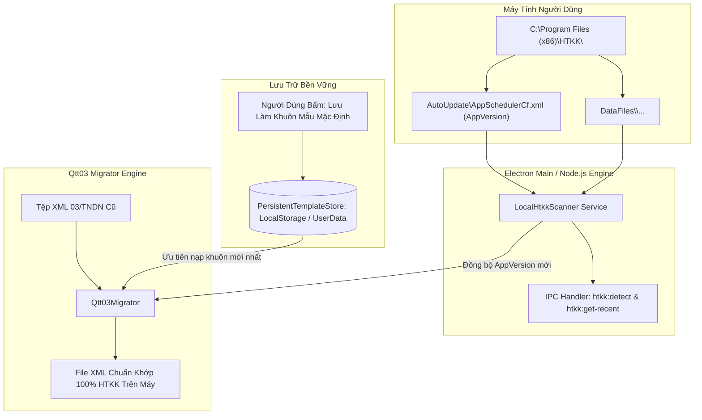

# Tự Động Đồng Bộ Khung Mẫu & Phiên Bản Từ HTKK Cục Bộ Trên Máy Tính

## Overview

Khi Tổng cục Thuế cập nhật các phiên bản HTKK mới (ví dụ từ HTKK 5.6.x lên 5.7.x, 5.8.x...), các tệp tờ khai cũ thường bị lỗi cấu trúc XSD hoặc sai lệch phiên bản `pbanDVu`, `pbanTKhaiXML`. Để người dùng không phải kéo tệp mẫu thủ công mỗi lần chuyển đổi, hệ thống hiện thực hóa giải pháp kết hợp **Phương Án 1 & Phương Án 2**:

1. **Local HTKK Auto-Scanner (Phương án 2):** Ứng dụng tự động dò tìm thư mục cài đặt HTKK trên máy tính Windows (`C:\Program Files (x86)\HTKK`, `C:\HTKK`...), đọc trực tiếp phiên bản cập nhật từ tệp `AutoUpdate\AppSchedulerCf.xml` (`AppVersion`) và các tệp tờ khai gần nhất trong `DataFiles`.
2. **Persistent Template Memory (Phương án 1):** Khi người dùng nạp một tệp XML mới kết xuất từ HTKK mới nhất, ứng dụng cung cấp nút **"Lưu làm khuôn mẫu mặc định"**. Tệp này được lưu trữ bền vững trong hệ thống; từ đó về sau, mọi tệp cũ chuyển đổi ở Chế độ tự động đều tự động áp dụng theo khuôn mẫu này.

## Goals

| # | Goal | Priority |
|---|------|----------|
| 1 | Xây dựng Service `LocalHtkkScanner` (chạy trên Node.js qua Electron IPC) tự động quét thư mục cài đặt HTKK trên máy, đọc phiên bản `AppVersion` hiện tại và danh sách tệp XML gần nhất | P1 |
| 2 | Xây dựng Store `PersistentTemplateStore` lưu trữ bền vững khuôn mẫu XML tùy chỉnh của người dùng (hỗ trợ lưu, nạp, kiểm tra và đặt lại về mặc định) | P1 |
| 3 | Nâng cấp `Qtt03Migrator`: Tự động ưu tiên sử dụng khuôn mẫu mặc định đã lưu và tự động cập nhật số hiệu phiên bản dịch vụ (`pbanDVu`, `pbanTKhaiXML`) khớp với HTKK trên máy | P1 |
| 4 | Cập nhật giao diện: Thêm thẻ thông tin "HTKK trên máy" (hiển thị phiên bản, trạng thái), nút "Lưu làm khuôn mẫu mặc định", và nút "Đọc mẫu từ HTKK", phong cách doanh nghiệp tối giản không dùng emoji AI | P1 |
| 5 | Bộ kiểm thử tự động (Unit & Integration tests) xác thực quét thành công thư mục HTKK thực tế và lưu trữ template bền vững | P1 |

## Phases

| # | Phase | Status | Priority | Effort |
|---|-------|--------|----------|--------|
| 1 | [Phase 1: Local HTKK Scanner Service (Node.js & IPC)](./phase-01-start.md) | Pending | P1 | 3h |
| 2 | [Phase 2: Persistent Custom Template Store](./phase-02-persistent-custom-template-store.md) | Pending | P1 | 2h |
| 3 | [Phase 3: Migration Engine Integration & Version Synchronizer](./phase-03-engine-integration-and-version-synchronizer.md) | Pending | P1 | 3h |
| 4 | [Phase 4: UI Template Manager & Local Sync Card](./phase-04-ui-template-manager-and-local-sync-card.md) | Pending | P1 | 3h |
| 5 | [Phase 5: E2E Testing & Windows Local Verification](./phase-05-e2e-testing-and-verification.md) | Pending | P1 | 2h |

## Architecture & Data Flow

## Success Criteria

- [ ] Tự động phát hiện HTKK cài đặt tại `C:\Program Files (x86)\HTKK\` trên máy tính người dùng và đọc đúng `AppVersion`.
- [ ] Cho phép người dùng bấm "Lưu làm khuôn mẫu mặc định" để ghi nhớ tệp mẫu mới vĩnh viễn cho các lần mở ứng dụng sau.
- [ ] Khi chuyển đổi tệp cũ ở Chế độ tự động, ứng dụng tự động áp dụng khuôn mẫu đã lưu và tự nâng cấp version theo đúng bản HTKK trên máy.
- [ ] Giao diện kế toán chuẩn mực, thanh thoát, hoàn toàn không có emoji AI.
- [ ] Vượt qua 100% các bài kiểm thử unit/integration và typecheck.
