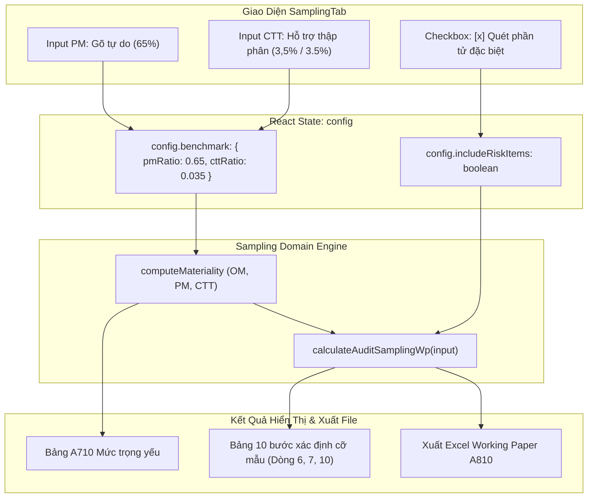

# Khắc phục Lỗi Nhập Liệu Tỷ Lệ (PM 65%, CTT 3,5%) & Bổ Sung Tùy Chọn Phần Tử Đặc Biệt

## Overview

Trong quá trình thực hiện bước chọn mẫu kiểm toán theo chuẩn VSA 320 và VSA 530 tại thẻ **Chọn mẫu kiểm toán (SamplingTab)**:
1. **Lỗi nhập liệu tỷ lệ PM & CTT:**
   - Khi người dùng muốn nhập `65%` tại ô PM (f) hoặc `3,5%` tại ô CTT (h), hệ thống bị lỗi nghiêm trọng do:
     - Ô PM kẹp giá trị `Math.max(0.5, ...)` ngay trên từng ký tự gõ, khiến gõ số `6` tự động nhảy thành `50`, gõ tiếp số `5` thành `75`, và không thể xóa trắng để nhập lại.
     - Ô CTT bị ép cứng `step="1"` và `Math.round(cttRatio * 100)` chỉ cho phép số nguyên (làm tròn `3,5%` thành `4%`), `min="1"` chặn không cho nhập $< 1\%$, và không chấp nhận dấu phẩy thập phân kiểu Việt Nam `,`.
     - Ô OM (d) cũng gặp hiện tượng giật khi xóa trắng hoặc gõ số lẻ.
2. **Nhu cầu tùy chọn Phần tử đặc biệt (Dòng 6 bảng 10 bước):**
   - Hiện tại thuật toán `calculateAuditSamplingWp` luôn tự động cưỡng bức quét `checkSpecificRisk` (ngày 31/12, số tiền tròn, từ khóa nhạy cảm) vào Dòng 6: *Giá trị phần tử đặc biệt*.
   - Theo thực tế kiểm toán, KTV cần quyền linh hoạt: có thể **BẬT** (để quét mẫu rủi ro riêng) hoặc **TẮT** (để toàn bộ tổng thể còn lại được phân bổ đều qua Khoảng cách mẫu KCM và Bước nhảy đại diện).

Kế hoạch này giải quyết dứt điểm cả 2 bài toán trên ở tầng Domain Logic, UI Component, và Bộ kiểm thử tự động.

## Goals

| # | Goal | Priority |
|---|------|----------|
| 1 | Mở rộng Domain Engine `calculateAuditSamplingWp`: nhận cờ `includeRiskItems?: boolean`. Khi tắt, Dòng 6 = 0 mẫu/0 đ, tự động tính dồn sang Cỡ mẫu còn lại (Dòng 7) và Bước nhảy (Dòng 10) | P1 |
| 2 | Sửa cơ chế quản lý input tại PM, CTT, OM: không kẹp tức thời trên từng phím bấm, cho phép xóa trắng, hỗ trợ số thập phân (bước 0.1), hỗ trợ cả dấu `,` và `.` | P1 |
| 3 | Bỏ hàm làm tròn `Math.round` ở CTT để lưu trữ và hiển thị chính xác các tỷ lệ lẻ như `3.5%` hay `0.5%` | P1 |
| 4 | Thêm Checkbox tùy chọn "Quét phần tử đặc biệt (rủi ro đặc thù)" trên giao diện SamplingTab | P1 |
| 5 | Bộ kiểm thử tự động (Unit test) cho `calculateAuditSamplingWp` cả 2 trạng thái Bật và Tắt, đảm bảo không gãy xuất Excel | P1 |

## Phases

| # | Phase | Status | Priority | Effort |
|---|-------|--------|----------|--------|
| 1 | [Phase 1: Domain Engine & Sampling Algorithm](./phase-01-domain-engine-risk-toggle.md) | Completed | P1 | 1.5h |
| 2 | [Phase 2: Input Field Fixes & Decimal Formatting](./phase-02-input-fields-and-decimal-fix.md) | Completed | P1 | 1.5h |
| 3 | [Phase 3: UI Toggle & End-to-End Verification](./phase-03-ui-toggle-and-verification.md) | Completed | P1 | 1h |

## Architecture & Data Flow

## Key Files Affected

- `src/domain/sampling/auditSamplingWp.ts`: Bổ sung `includeRiskItems?: boolean` vào input, điều kiện hóa `checkSpecificRisk`.
- `src/domain/sampling/auditSamplingWp.test.ts`: Thêm ca kiểm thử khi bật/tắt phần tử đặc biệt.
- `src/renderer/components/SamplingTab.tsx`:
  - Nâng cấp ô nhập PM (f), CTT (h), OM (d).
  - Thêm Checkbox tùy chọn "Quét phần tử đặc biệt".
  - Truyền `includeRiskItems` vào `calculateAuditSamplingWp`.
- `src/renderer/styles.css`: Tinh chỉnh định dạng hiển thị ô nhập tỷ lệ nếu cần.

## Acceptance Criteria

- [x] Gõ `65` vào ô PM $\rightarrow$ hiển thị `65%`, PM tính chính xác bằng $65\% \times \text{OM}$.
- [x] Gõ `3,5` hoặc `3.5` vào ô CTT $\rightarrow$ hiển thị `3,5%` (hoặc `3.5%`), không bị làm tròn lên `4%`, CTT tính chính xác bằng $3.5\% \times \text{OM}$.
- [x] Có thể xóa trắng ô nhập liệu để nhập lại từ đầu mà không bị nhảy về số mặc định ngay giữa chừng.
- [x] Bỏ tick tùy chọn "Quét phần tử đặc biệt" $\rightarrow$ Dòng 6 hiển thị 0 đ (0 mẫu), Cỡ mẫu còn lại (Dòng 7) và Bước nhảy (Dòng 10) tự động phân bổ lại toàn bộ số dư còn lại.
- [x] Tick chọn lại $\rightarrow$ Dòng 6 hiển thị lại các mẫu rủi ro đặc thù như cũ.
- [x] Xuất Excel Working Paper không gặp lỗi công thức.
- [x] 100% kiểm thử sampling và typecheck vượt qua thành công.
