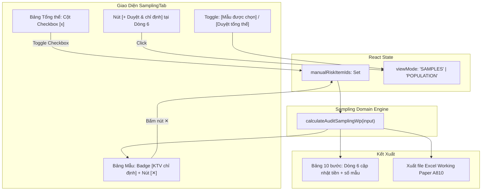

# Cho Phép Kiểm Toán Viên Tự Tay Tích Chọn Dòng Làm Phần Tử Đặc Biệt (VSA 530)

## Overview

Theo chuẩn mực kiểm toán Việt Nam số 530 (VSA 530) và thông lệ kiểm toán Big 4 / VACPA, bên cạnh việc hệ thống tự động quét các rủi ro máy móc (ngày 31/12, số tiền tròn, từ khóa nhạy cảm), **Kiểm toán viên (KTV) có quyền sử dụng phán đoán nghề nghiệp để tự tay chỉ định bất kỳ nghiệp vụ nào trong tổng thể làm Phần tử đặc biệt cần kiểm tra 100%** (ví dụ: giao dịch với bên liên quan cụ thể, nghiệp vụ có chứng từ mập mờ, khoản chi phí bất thường...).

Kế hoạch này triển khai **Phương án 1 (Duyệt tổng thể chứng từ kèm Checkbox)**:
1. Thêm công tắc chuyển chế độ hiển thị tại khu vực bảng mẫu:
   - **Chế độ 1:** *Mẫu kiểm toán được chọn ($N$ mẫu)* — Mặc định, hiển thị danh sách mẫu thực tế cần kiểm tra thực địa.
   - **Chế độ 2:** *Duyệt toàn bộ tổng thể chứng từ ($M$ dòng)* — Hiển thị toàn bộ sổ kế toán của phần hành đang chọn, kèm cột checkbox $\boxed{\checkmark}$ đầu dòng để KTV tích chọn/bỏ chọn.
2. Mở rộng Domain Engine `calculateAuditSamplingWp`: tiếp nhận danh sách `manualRiskItemIds?: string[]`. Khi KTV tick chọn:
   - Dòng 6: *Giá trị phần tử đặc biệt (2)* tự động cộng thêm giá trị và số lượng các dòng này.
   - Dòng 7: *Cỡ mẫu còn lại* và Dòng 10: *Bước nhảy* tự động tính toán lại, trừ bớt số tiền KTV đã chỉ định ra khỏi tổng thể còn lại.
   - Danh sách mẫu gắn nhãn nhận diện riêng: `Mẫu đặc biệt (KTV chỉ định)` kèm nút gỡ nhanh `[✕]`.
   - File Excel Working Paper A810 xuất ra giữ nguyên công thức và phản ánh chính xác các dòng KTV chỉ định.

## Goals

| # | Goal | Priority |
|---|------|----------|
| 1 | Mở rộng `AuditSamplingWpInput` nhận `manualRiskItemIds?: readonly string[]`. Đưa các khoản mục này vào `riskItems` với lý do *"KTV phán đoán & chỉ định thủ công"* | P1 |
| 2 | Đảm bảo ưu tiên phân loại: Nếu dòng có giá trị $\ge \text{KCM}$, luôn ưu tiên xếp vào nhóm *Lớn hơn KCM (Mục 5)* để tránh tính trùng số tiền | P1 |
| 3 | Thêm state `manualRiskItemIds: Set<string>` và `viewMode: 'SAMPLES' \| 'POPULATION'` trong `SamplingTab.tsx` | P1 |
| 4 | Cung cấp thanh chuyển đổi chế độ xem mượt mà kèm bộ đếm số lượng dòng KTV đã chỉ định | P1 |
| 5 | Tại bảng duyệt tổng thể: Cột checkbox $\boxed{\checkmark}$, highlight dòng được chọn, vô hiệu hóa dòng $\ge \text{KCM}$ kèm huy hiệu báo hiệu | P1 |
| 6 | Tại bảng mẫu được chọn: Huy hiệu `KTV chỉ định` màu xanh chuyên nghiệp kèm nút gỡ `[✕]` | P1 |
| 7 | Nút bấm nhanh `[+ Duyệt & chỉ định thêm]` tại Dòng 6 của Bảng 10 bước | P2 |
| 8 | Bộ unit test trong `auditSamplingWp.test.ts` và kiểm tra tính toàn vẹn file Excel | P1 |

## Phases

| # | Phase | Status | Priority | Effort |
| 1 | [Phase 1: Domain Engine Support for Manual Risk Items](./phase-01-domain-manual-risk-items.md) | Completed | P1 | 1.0h |
| 2 | [Phase 2: UI View Mode & Manual Selection Table](./phase-02-ui-population-view-and-checkboxes.md) | Completed | P1 | 1.5h |
| 3 | [Phase 3: Integration, Styling & Verification](./phase-03-integration-and-verification.md) | Completed | P1 | 1.0h |

## Architecture & Data Flow

## Key Files Affected

- `src/domain/sampling/auditSamplingWp.ts`: Mở rộng interface và thuật toán phân loại cho `manualRiskItemIds`.
- `src/domain/sampling/auditSamplingWp.test.ts`: Thêm ca kiểm thử chỉ định phần tử đặc biệt thủ công.
- `src/renderer/components/SamplingTab.tsx`: Bổ sung viewMode, cột checkbox, toggle toolbar và nút gỡ.
- `src/renderer/styles.css`: Định dạng nút chuyển tab, badge KTV chỉ định và nút gỡ nhanh.

## Acceptance Criteria

- [x] Trong tab "Duyệt toàn bộ tổng thể", KTV có thể tìm kiếm, cuộn danh sách và tick chọn bất kỳ dòng nào.
- [x] Khi tick chọn 1 dòng $\rightarrow$ Bảng 10 bước Dòng 6 tăng đúng số tiền và số mẫu của dòng đó.
- [x] Khi chuyển sang tab "Mẫu kiểm toán được chọn" $\rightarrow$ Dòng này xuất hiện trong bảng với nhãn `Mẫu đặc biệt (KTV chỉ định)`.
- [x] Bấm nút `[✕]` trên dòng đó hoặc bỏ tick ở tab tổng thể $\rightarrow$ Dòng bị gỡ khỏi danh sách phần tử đặc biệt, Dòng 6 tự giảm số tiền.
- [x] Các dòng có số tiền $\ge \text{KCM}$ luôn tự động thuộc Mục 5 (Kiểm tra 100%), checkbox bị khóa hoặc hiển thị nhãn `Lớn hơn KCM` để tránh tính trùng.
- [x] Xuất file Excel Working Paper A810 phản ánh chính xác các dòng KTV đã chỉ định, không lỗi công thức.
- [x] 100% tests và typecheck vượt qua thành công.
