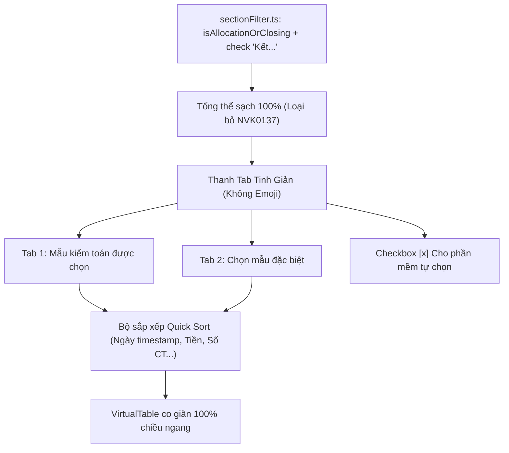

# Tối Ưu Chọn Mẫu Đặc Biệt: Lọc Bút Toán Kết Chuyển, Tinh Giản Icon, Checkbox Tự Động & Sắp Xếp Toàn Diện

## Overview

Sau khi đưa tính năng tự tay chọn phần tử đặc biệt vào thực tế, người dùng kiểm toán viên phát hiện 3 điểm cốt lõi cần hoàn thiện:
1. **Lỗi lọt bút toán kết chuyển (NVK0137) vào mẫu:** Trong sổ kế toán, các dòng kết chuyển cuối kỳ (như NVK0137 kết chuyển doanh thu 511 sang 911) có cột TK Nợ ghi chữ *"Kết chuyển..."* và số tiền ghi số hiệu tài khoản 911. Do `sectionFilter.ts` chỉ kiểm tra mã số `911` mà chưa quét chuỗi chữ *"Kết..."* và chưa gọi `isAllocationOrClosing`, dòng này bị lọt vào tập mẫu bước nhảy.
2. **Cấu trúc Tab & Tinh giản Icon theo phong cách chuyên nghiệp:**
   - Đổi tên Tab 2: từ *"🔍 Duyệt toàn bộ tổng thể"* $\rightarrow$ **"Chọn mẫu đặc biệt"**.
   - Bỏ toàn bộ các icon/emoji rườm rà (📋, 🔍, 🎯...) trên thanh điều hướng tab, giữ phong cách kế toán - kiểm toán tối giản, trang nhã.
   - Thêm Checkbox trực quan ngay cạnh nút Tab 2: **`[x] Cho phần mềm tự chọn`** (liên kết với cờ tự động quét VSA 530). KTV có thể bật để máy quét tự động kết hợp tự chọn thủ công, hoặc tắt để hoàn toàn tự chọn bằng tay.
   - Badge đếm hiển thị chuẩn xác: `(KTV chọn: K dòng)`.
3. **Sắp xếp nhanh (Quick Sort) toàn diện:**
   - Kích hoạt Sort trên **tất cả các cột** ở **cả 2 bảng** (Bảng Mẫu kiểm toán được chọn và Bảng Chọn mẫu đặc biệt).
   - Cột **Ngày CT** được phân tích định dạng `DD/MM/YYYY` sang timestamp số học để sắp xếp đúng tuyệt đối theo dòng thời gian.
   - Bảng Mẫu kiểm toán được chọn (Tab 1) cũng co giãn 100% bề ngang, cột *Tham chiếu KTV* không bị cắt chữ `[Chờ...`.

## Goals

| # | Goal | Priority |
|---|------|----------|
| 1 | Nâng cấp `sectionFilter.ts`: Loại trừ triệt để mọi bút toán kết chuyển (chứa chữ *"Kết..."*, `isAllocationOrClosing`) khi bật `excludeKetChuyen` | P1 |
| 2 | Viết unit test xác thực dòng kết chuyển lệch cột NVK0137 bị loại trừ 100% | P1 |
| 3 | Tinh giản giao diện: Bỏ toàn bộ emoji, đổi tên Tab 2 thành "Chọn mẫu đặc biệt", thêm Checkbox "Cho phần mềm tự chọn" ngay cạnh tab | P1 |
| 4 | Cập nhật hàm Sort ngày tháng theo timestamp thực tế (không so sánh chuỗi), bật sort cho cả 2 bảng | P1 |
| 5 | Tự động co giãn 100% bề ngang cho cả Tab 1 Mẫu được chọn, hiển thị trọn vẹn cột Tham chiếu KTV | P1 |
| 6 | Kiểm thử toàn diện với Vitest và TypeScript typecheck | P1 |

## Phases

| # | Phase | Status | Priority | Effort |
|---|-------|--------|----------|--------|
| 1 | [Phase 1: Filter Out Closing Entries](./phase-01-filter-closing-entries.md) | Completed | P1 | 0.5h |
| 2 | [Phase 2: Tab UI & Auto-Scan Checkbox](./phase-02-refine-tab-ui-and-auto-scan-toggle.md) | Completed | P1 | 1.0h |
| 3 | [Phase 3: Universal Quick Sort & Full Width](./phase-03-universal-quick-sort-and-full-width.md) | Completed | P1 | 1.0h |

## Architecture & Data Flow

## Key Files Affected

- `src/domain/sampling/sectionFilter.ts`: Mở rộng điều kiện loại trừ bút toán kết chuyển.
- `src/domain/sampling/samplingEngine.test.ts`: Thêm ca kiểm thử loại trừ bút toán kết chuyển có text.
- `src/renderer/components/SamplingTab.tsx`: Tinh giản tab, thêm checkbox tự động quét, hoàn thiện logic Quick Sort.
- `src/renderer/styles.css`: Bỏ icon thừa, tinh chỉnh CSS cho checkbox cạnh tab.

## Acceptance Criteria

- [x] Dòng kết chuyển NVK0137 không còn xuất hiện trong danh sách mẫu lấy (cả tổng thể lẫn mẫu đại diện).
- [x] Không còn icon/emoji rườm rà trên các nút tab; Tab 2 đổi tên thành "Chọn mẫu đặc biệt".
- [x] Checkbox "Cho phần mềm tự chọn" nằm ngay cạnh Tab 2 hoạt động nhạy bén theo thời gian thực.
- [x] Click tiêu đề "Ngày CT" ở cả 2 bảng sắp xếp đúng theo thứ tự thời gian năm $\rightarrow$ tháng $\rightarrow$ ngày.
- [x] Cột Tham chiếu KTV ở Tab 1 không bị cắt chữ, cả 2 bảng lấp đầy 100% chiều ngang màn hình.
- [x] 100% kiểm thử Vitest và TypeScript typecheck vượt qua.
