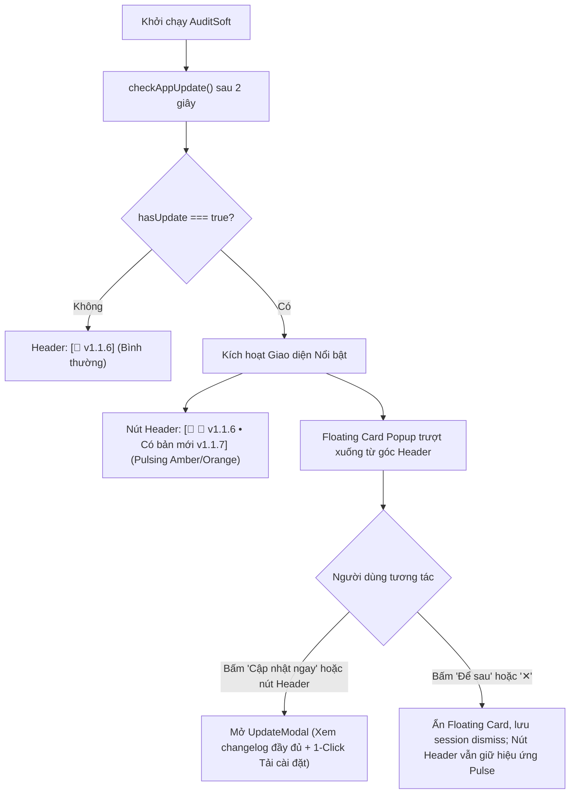

# Nâng Cấp Thông Báo Cập Nhật Nổi Bật: Floating Popup Card & Pulsing Header Badge

## Overview

Hiện tại trên thanh tiêu đề của AuditSoft, nút phiên bản **`[🔄 v1.1.6]`** (ảnh người dùng đính kèm) hiển thị rất kín đáo và chìm vào thanh header. 
Khi khởi động ứng dụng, dù logic nền có tự động kiểm tra bản phát hành mới qua `checkAppUpdate()`, hệ thống lại **không tự động mở bất kỳ thông báo hay modal nào**. Nút phiên bản chỉ chuyển nhẹ sang màu xanh pastel nhạt (`.has-update`), khiến người dùng hoàn toàn không nhận ra việc đã có phiên bản mới với các tính năng hoặc bản sửa lỗi quan trọng.

Kế hoạch này giải quyết triệt để vấn đề trên theo **Phương án 2 (Đề xuất)** đã được người dùng đồng ý:
1. **Nâng cấp nút phiên bản trên Header:** Khi phát hiện `hasUpdate: true`, nút sẽ chuyển sang visual cảnh báo nổi bật (nền sáng, viền phát sáng amber/cam, chấm tròn nhịp thở nhấp nháy `pulse-dot`, hiển thị rõ `Có bản mới v1.1.X`).
2. **Triển khai Floating Popup Card (`UpdateNoticePopup`):** Thẻ thông báo nổi tự động trượt ra mượt mà ngay dưới nút Header khi có bản mới. Thẻ trình bày ngắn gọn phiên bản mới, tóm tắt changelog nổi bật, kèm 2 nút hành động: **[Cập nhật ngay]** (mở `UpdateModal` 1-click cài đặt) và **[Để sau]** / **[✕]** (tắt popup để không phiền phiên làm việc hiện tại).

## Goals

| # | Goal | Priority |
|---|------|----------|
| 1 | Nâng cấp nút Header `btn-update-header` với visual nổi bật: màu viền phát sáng, chấm tròn nhịp đập pulse animation khi có bản mới | P1 |
| 2 | Xây dựng component `UpdateNoticePopup.tsx`: Thẻ thông báo nổi định vị neo góc phải Header, hiển thị tóm tắt changelog và 2 nút hành động | P1 |
| 3 | Quản lý trạng thái thông minh trong `store.ts`: Lưu trạng thái `dismissedUpdateNotice` để không hiện lặp lại gây phiền khi người dùng đã bấm "Để sau" trong phiên hiện tại | P1 |
| 4 | Tích hợp liền mạch với `UpdateModal.tsx` và cơ chế tải/cài đặt tự động hiện có | P1 |
| 5 | Kiểm thử giao diện, hiệu ứng animation và kiểm tra kiểu dữ liệu TypeScript (0 lỗi typecheck) | P1 |

## Phases

| # | Phase | Status | Priority | Effort |
|---|-------|--------|----------|--------|
| 1 | [Phase 1: Header Update Badge & Pulse Effect](./phase-01-header-update-badge-and-pulse.md) | Completed | P1 | 0.5h |
| 2 | [Phase 2: Floating Update Card Popup](./phase-02-floating-update-card-popup.md) | Completed | P1 | 1.0h |
| 3 | [Phase 3: Integration & Verification](./phase-03-integration-verification-smoke-test.md) | Completed | P1 | 0.5h |

## Architecture & UI Flow

## Acceptance Criteria

- [x] Khi không có bản mới (`hasUpdate: false`): Nút Header hiển thị `[🔄 v1.1.6]` thanh lịch, tinh tế như cũ.
- [x] Khi phát hiện bản mới (`hasUpdate: true`):
  - Nút Header chuyển sang phong cách nổi bật rõ rệt: viền màu hổ phách/cam, có chấm pulse dot nhấp nháy thu hút ánh nhìn, hiển thị nhãn `Bản mới vX.X.X`.
  - Thẻ thông báo nổi (`UpdateNoticePopup`) tự động trượt ra ở góc phải màn hình bên dưới nút Header.
  - Thẻ hiển thị rõ số phiên bản mới, ngày phát hành (nếu có), 1-2 dòng điểm mới, nút **[Cập nhật ngay]** và nút **[Để sau]**.
- [x] Bấm **[Cập nhật ngay]** hoặc bấm vào nút Header sẽ mở hộp thoại `UpdateModal` đầy đủ để tiến hành tải/cập nhật tự động.
- [x] Bấm **[Để sau]** hoặc nút **[✕]** sẽ ẩn thẻ popup và không tự động bật lại trong phiên làm việc đó (nút Header vẫn giữ trạng thái nổi bật để bấm lại bất cứ lúc nào).
- [x] Toàn bộ mã nguồn vượt qua kiểm tra TypeScript typecheck mà không có lỗi.
