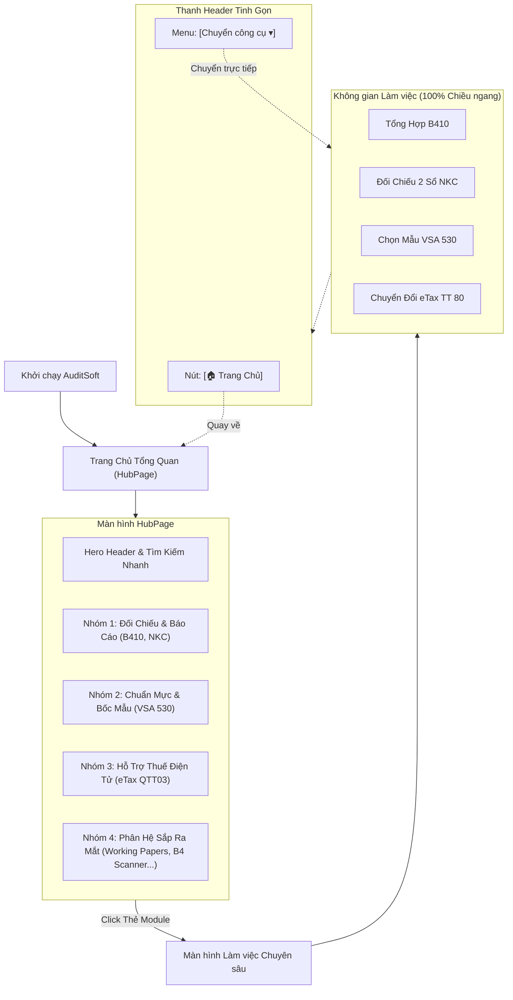

# Kiến Trúc Hub & Spoke: Trang Chủ Tổng Quan Các Phân Hệ & Điều Hướng Mở Rộng Không Giới Hạn

## Overview

Hiện tại, thanh tiêu đề của AuditSoft đang hiển thị 4 nút phân hệ chức năng theo chiều ngang (`[1 Tổng Hợp B410] [2 Đối Chiếu 2 Sổ NKC] [3 Chọn Mẫu VSA 530] [4 Chuyển Đổi Tờ Khai eTax]`).
Kiến trúc này gặp 2 hạn chế mang tính nền tảng:
1. **Thiếu tính mở rộng (Scalability bottleneck):** Khi hệ thống bổ sung thêm các phân hệ mới (như *Lập 12 Giấy làm việc tự động*, *Rà soát rủi ro thuế & B4*, *Thư xác nhận VSA 505*, v.v.), thanh ngang sẽ lập tức bị tràn, chữ bị cắt vụn và gây rối mắt.
2. **Thiếu điểm chạm trung tâm (No Launchpad/Overview):** Khi mở phần mềm, người dùng bị đẩy thẳng vào một màn hình công cụ cụ thể thay vì có một "Bảng điều khiển trung tâm" (Hub) để nhìn nhận tổng thể hệ sinh thái công cụ, tìm kiếm nhanh và lựa chọn nhiệm vụ phù hợp cho phiên làm việc.

Kế hoạch này thực hiện tái cấu trúc giao diện theo **Mô hình Hub & Spoke (Trang Chủ & Các Nhánh Phân Hệ)**:
- **Trung Tâm (Hub):** Màn hình Trang Chủ Tổng Quan (`HubPage`) với Hero banner hiện đại, ô tìm kiếm nhanh, và lưới thẻ (Card Grid) phân loại chuyên nghiệp, hỗ trợ mở rộng lên hàng chục công cụ mà không giới hạn không gian.
- **Các Nhánh (Spoke):** Mỗi công cụ là một không gian làm việc độc lập. Khi đang ở trong bất kỳ công cụ nào, thanh Header hiển thị tinh gọn nút **`[🏠 Trang Chủ]`** cùng bộ **Chuyển đổi công cụ nhanh (Quick Switcher)** để chuyển đổi tức thì.

## Goals

| # | Goal | Priority |
|---|------|----------|
| 1 | Xây dựng `modulesRegistry.ts`: Kiến trúc cấu hình module dạng khai báo (declarative registry), dễ dàng thêm phân hệ mới trong tương lai | P1 |
| 2 | Mở rộng `store.ts`: Bổ sung view `'hub'` làm màn hình mặc định khi khởi động phần mềm | P1 |
| 3 | Triển khai `HubPage.tsx`: Trang chủ dạng lưới thẻ (Grid Cards), phân nhóm danh mục (Đối chiếu, Chuẩn mực, Thuế, và Sắp ra mắt), có tìm kiếm/lọc nhanh | P1 |
| 4 | Tinh giản Header Topbar: Thay thanh ngang 4 nút bằng nút `[🏠 Trang Chủ]` + Breadcrumb + Dropdown `Chuyển công cụ ▾` | P1 |
| 5 | Bảo toàn 100% logic và trạng thái làm việc của các module hiện tại | P1 |
| 6 | Kiểm thử tự động (Unit test) và xác thực TypeScript typecheck không lỗi | P1 |

## Phases

| # | Phase | Status | Priority | Effort |
|---|-------|--------|----------|--------|
| 1 | [Phase 1: Module Registry & State Architecture](./phase-01-module-registry-and-state.md) | Completed | P1 | 0.5h |
| 2 | [Phase 2: Hub Homepage Component & Scalable Grid](./phase-02-hub-homepage-component.md) | Completed | P1 | 1.0h |
| 3 | [Phase 3: Header Navigation & Quick Switcher Integration](./phase-03-header-navigation-and-switcher.md) | Completed | P1 | 1.0h |
| 4 | [Phase 4: Integration, Testing & Verification](./phase-04-integration-testing-verification.md) | Completed | P1 | 0.5h |

## Architecture & Navigation Flow

## Acceptance Criteria

- [x] Khi khởi động phần mềm, màn hình hiển thị đầu tiên là **Trang Chủ Tổng Quan (`HubPage`)** thay vì rơi thẳng vào một phân hệ cố định.
- [x] Trang Chủ hiển thị đầy đủ 4 phân hệ đang hoạt động kèm 2+ thẻ xem trước cho các phân hệ tương lai.
- [x] Có thanh tìm kiếm/lọc nhanh: Khi KTV gõ "mẫu", "b410", "thuế" hay "nkc", lưới thẻ lọc tức thì theo thời gian thực.
- [x] Bấm vào bất kỳ thẻ module nào sẽ chuyển mượt mà vào đúng không gian làm việc của module đó.
- [x] Khi đang ở trong một phân hệ, thanh Header không còn 4 nút nằm ngang chiếm chỗ; thay vào đó là nút `[🏠 Trang Chủ]` và bộ `[Chuyển công cụ ▾]`.
- [x] Bấm `[🏠 Trang Chủ]` quay lại màn hình tổng quan; bấm menu chuyển công cụ cho phép nhảy trực tiếp sang module khác mà không làm mất dữ liệu đang làm dở.
- [x] TypeScript typecheck hoàn toàn không có lỗi; toàn bộ test suite vượt qua.
