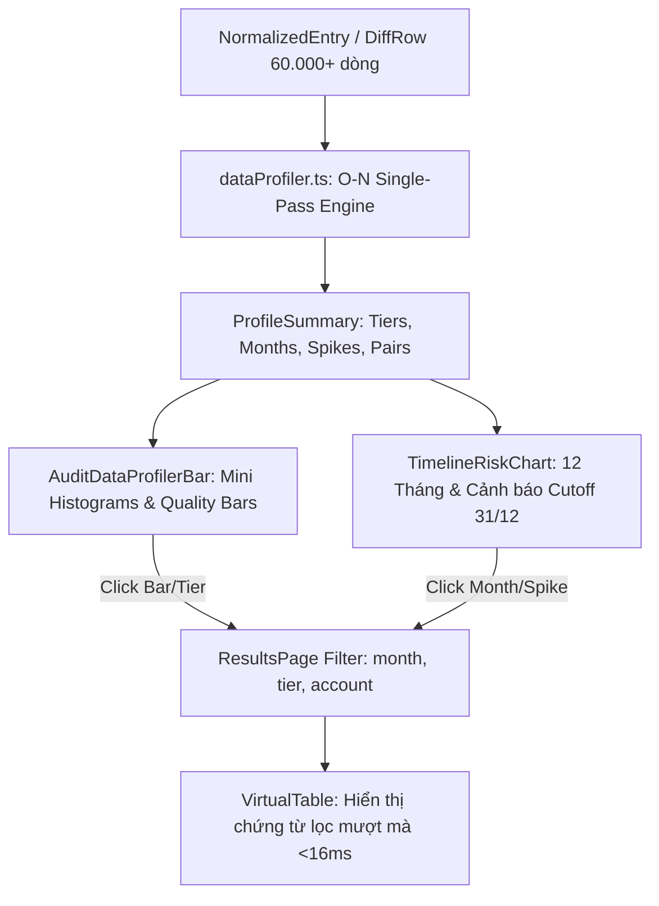

# Kế Hoạch Triển Khai: Bộ Công Cụ Trực Quan Hóa Dữ Liệu & Nhận Diện Rủi Ro Kiểm Toán (Audit Data Profiler)

> **Trạng thái:** ✅ ĐÃ HOÀN THÀNH TOÀN DIỆN (COMPLETED) — 2026-09-10
> **Kiểm thử:** 100% PASS (`dataProfiler.test.ts` 6/6, `volume.test.ts` 1/1, `typecheck` 0 lỗi)
## 1. Tổng Quan (Executive Summary)

Dự án phát triển phân hệ **Audit Data Profiler & Visual Risk Inspector** theo phong cách Data Profiling của Power Query / MindBridge AI, tích hợp trực tiếp vào ứng dụng AuditSoft. Thay vì yêu cầu kiểm toán viên đọc và lọc hàng chục nghìn dòng số liệu thô trong bảng tính, công cụ cung cấp giao diện trực quan hóa dữ liệu tức thì:
1. **Phân phối giá trị giao dịch (Value Distribution Histogram)**: Nhận diện ngay các dòng tiền bất thường, nghiệp vụ vượt ngưỡng trọng yếu (Key items $\ge$ PM) hoặc tập trung sát ngưỡng phê duyệt.
2. **Biểu đồ dòng thời gian & Rủi ro Cutoff (Timeline Spikes)**: Trực quan hóa mật độ phát sinh 12 tháng, làm nổi bật đột biến ngày khóa sổ 31/12 và các giao dịch phát sinh vào ngày nghỉ.
3. **Ma trận cặp tài khoản đối ứng (Account Pair Profiler)**: Phát hiện nhanh các cặp tài khoản hiếm gặp (rare counter-accounts) có nguy cơ gian lận theo VSA 240.
4. **Tương tác lọc 1-Click (Interactive Click-to-Filter)**: Nhấp trực tiếp vào bất kỳ cột biểu đồ nào để lọc tức thì danh sách chứng từ bên dưới.

---

## 2. Kiến Trúc & Luồng Dữ Liệu

---

## 3. Lộ Trình Triển Khai Theo Giai Đoạn (Phased Roadmap)

| Giai đoạn | Nội dung thực hiện | File tác động chính | Tiêu chí nghiệm thu (Acceptance) |
| :--- | :--- | :--- | :--- |
| **Phase 1** | Xây dựng lõi tính toán thống kê & phân phối dữ liệu (`dataProfiler.ts`) | `src/domain/profiling/dataProfiler.ts` `src/domain/profiling/dataProfiler.test.ts` | Xử lý 60.000 dòng < 25ms; tính chuẩn xác 12 tháng, các tầng tiền & cutoff |
| **Phase 2** | Thiết kế bộ component trực quan hóa dữ liệu (Profiler Bar & Timeline) | `src/renderer/components/DataProfiler/AuditDataProfilerBar.tsx` `src/renderer/components/DataProfiler/TimelineRiskChart.tsx` `src/renderer/styles.css` | Giao diện thanh lịch, chuẩn mực kiểm toán, không dùng emoji màu mè |
| **Phase 3** | Tích hợp vào `ResultsPage`, liên kết bộ lọc tương tác 1-Click & Kiểm thử | `src/renderer/pages/ResultsPage.tsx` `src/renderer/state/store.ts` | Bấm vào biểu đồ lọc bảng tức thì; Full test suite & Typecheck 100% PASS |

---

## 4. Chi Tiết Các File Giai Đoạn

- `phase-01-domain-profiling-engine.md`: Thiết kế thuật toán bóc tách dữ liệu O(N) đơn lượt, chia nhóm theo tháng, phân tầng trọng yếu và phát hiện cutoff.
- `phase-02-ui-profiler-and-timeline-components.md`: Xây dựng các UI component mini histogram, thẻ thống kê chất lượng dữ liệu và biểu đồ dòng thời gian.
- `phase-03-integration-filter-and-verification.md`: Gắn vào trang kết quả đối chiếu, cấu hình chế độ thu gọn/mở rộng và kiểm thử toàn diện.
