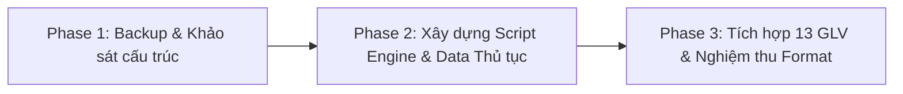

# Kế Hoạch Triển Khai: Tích Hợp Thủ Tục Kiểm Toán Chuẩn VACPA Vào Toàn Bộ GLV Hiện Tại (Phương Án 1)

> **Trạng thái:** ✅ ĐÃ HOÀN THÀNH TOÀN DIỆN (COMPLETED) — 2026-09-10
> **Kết quả:** 13/13 file GLV trong `GLV MAU` đã tích hợp đầy đủ bảng Thủ Tục Kiểm Toán theo Bảng chấm điểm VACPA 2014. Định dạng và công thức bảo toàn 100%.
## 1. Tổng Quan (Executive Summary)

Dự án thực hiện bổ sung bảng **Chương Trình Kiểm Toán & Thủ Tục Thực Hiện** chuẩn mực theo đúng tiêu chí của **Bảng chấm điểm Hồ sơ kiểm toán BCTC (Bộ Tài chính & VACPA)** vào 13 file Giấy làm việc (GLV) mẫu hiện tại trong thư mục `D:\Desktop\Project\5. AuditSoft\GLV MAU`.
- **Mục tiêu cốt lõi**: Giúp hồ sơ kiểm toán đạt điểm tối đa khi kiểm tra soát xét chất lượng dịch vụ kiểm toán, minh chứng đầy đủ bằng chứng kiểm toán thu thập theo các chuẩn mực VSA (VSA 240, 250, 315, 330, 500, 501, 505, 520, 540, 550, 560, 570).
- **Phạm vi**: Áp dụng cho toàn bộ các phần hành thực hiện kiểm toán: **D-series (Tài sản), E-series (Nợ phải trả), F-series (Nguồn vốn), G-series (Doanh thu & Chi phí)**. Riêng bộ file `A - B - H` tạm thời gác lại làm sau theo yêu cầu người dùng.
- **Nguyên tắc tối cao về FORMAT**: Bảo toàn 100% định dạng nguyên bản của file Excel mẫu (font chữ, cỡ chữ, đường viền thin border, công thức liên kết giữa các sheet, màu sắc nhận diện). Bảng thủ tục kiểm toán được bố trí chuyên nghiệp ở phần đầu sheet `*20`, đẩy nội dung thuyết minh BCTC hiện hữu xuống phía dưới một cách an toàn, không làm đè hay mất dữ liệu.

---

## 2. Danh Sách 13 File GLV Cần Tích Hợp Thủ Tục Kiểm Toán

| STT | Tên file GLV trong `GLV MAU` | Sheet mục tiêu | Nội dung thủ tục chuẩn VACPA tương ứng |
| :---: | :--- | :---: | :--- |
| 1 | `D100 - Tien - Mau 2024 - Thinh.xlsx` | `D 120` | Mục 1.0: Kiểm kê tiền mặt, TXN ngân hàng, đối chiếu sổ phụ, kiểm tra LCTT (VSA 330, 500, 505) |
| 2 | `D200 - Dau tu - ABC 2020.xlsx` | `D220` | Mục 2.0: Quyền sở hữu, gửi TXN đầu tư, thủ tục thay thế, dự phòng giảm giá đầu tư (VSA 330, 505, 540) |
| 3 | `D300 - Phai thu - Mau 2025 - Thinh.xlsx` | `D 320` | Mục 3.0: Gửi TXN phải thu, biên bản đối chiếu, thủ tục kiểm toán thay thế, trả trước, dự phòng nợ khó đòi (VSA 330, 505, 240, 540) |
| 4 | `D500 - HTK - Mau 2024 - Thinh.xlsx` | `D520` | Mục 4.0: Chứng kiến kiểm kê HTK, đối chiếu sổ kho, phương pháp tính giá, tính giá thành, dự phòng giảm giá HTK (VSA 501, 330, 540) |
| 5 | `D600 - Phan bo - Mau 2024 - Thinh.xlsx` | `D620` | Mục 5.0: Chọn mẫu chi phí trả trước, kiểm tra tính phù hợp và nhất quán của tiêu thức phân bổ (VSA 330, 530, 540) |
| 6 | `D700 - Tai san - Mau 2024 - Thinh.xlsx` | `D720` | Mục 6.0: Chọn mẫu tăng giảm TSCĐ/XDCB, kiểm tra hiện hữu, kiểm tra bảng tính khấu hao, **ước tính độc lập chi phí khấu hao (VSA 520/540)** |
| 7 | `E100 - Vay - Mau 2024 - Thinh.xlsx` | `E 120` | Mục 7.0: Gửi TXN vay, thủ tục thay thế, **ước tính độc lập chi phí lãi vay trong kỳ**, phân loại nợ ngắn/dài hạn (VSA 330, 505, 520, 540) |
| 8 | `E200 - Phai tra - Mau 2024 - Thinh.xlsx` | `E220` | Mục 8.0 & 11.0: TXN phải trả, thủ tục thay thế, **kiểm tra tìm kiếm nợ chưa ghi sổ sau niên độ (Unrecorded liabilities)**, chi phí phải trả trích trước |
| 9 | `E300 - Thue - Mau 2024 - Thinh.xlsx` | `E 320` | Mục 9.0: Thuế suất, **đối chiếu số liệu hạch toán với tờ khai thuế các tháng (kể cả sau niên độ)**, ước tính thuế phải nộp (VSA 250, 330, 520) |
| 10 | `E400 - Luong - Mau 2025 - Thinh.xlsx` | `E 420` | Mục 10.0: Phân tích biến động lương tháng/quý hoặc ước tính độc lập, phân bổ vào giá thành, **đối chiếu quyết toán BHXH**, thu nhập HĐQT/BGĐ |
| 11 | `F100 - Von - Mau 2024 - Thinh.xlsx` | `F120` | Mục 12.0: Đối chiếu ĐKKD/danh sách cổ đông, đối chiếu lợi nhuận tăng với KQKD, phân phối lợi nhuận & trích lập quỹ (VSA 330, 505, 250) |
| 12 | `G100 - Doanh thu - Mau 2025- Thinh.xlsx` | `G120` | Mục 14.0: Phân tích biến động doanh thu, đối chiếu với bộ phận bán hàng/kho, đối chiếu tờ khai GTGT, chọn mẫu hóa đơn, **kiểm tra Cut-off trước và sau 31/12** |
| 13 | `G200 - 300 - 400 -  Mau 2025 - Thinh.xlsx` | `G220` | Mục 15.0, 16.0, 17.0: Tỷ lệ lãi gộp (Gross Margin), nguyên tắc phù hợp doanh thu - giá vốn, Cut-off giá vốn, phân tích chi phí bán hàng/QLDN, chi phí tài chính |

---

## 3. Lộ Trình Triển Khai 3 Giai Đoạn (Phased Roadmap)

- **Phase 1: Sao lưu bảo vệ & Khảo sát chi tiết cấu trúc 13 file GLV hiện tại**
  - Sao lưu toàn bộ thư mục `GLV MAU` sang `GLV MAU_BACKUP_20260910`.
  - Khảo sát dòng chèn thích hợp trên từng sheet `*20`, kiểm tra các liên kết tham chiếu (`*110`, `*141`, `*146`, `*191`, `*195`, `*196`...).
- **Phase 2: Xây dựng Script Engine tiêm Thủ tục kiểm toán chuẩn hóa VACPA**
  - Viết script Python `scripts/inject-vacpa-procedures.py` sử dụng `openpyxl`.
  - Định nghĩa cơ sở dữ liệu thủ tục kiểm toán chuẩn mực bám sát 24 tiêu chí của Bảng chấm điểm 2014.
  - Clone chính xác kiểu dáng (Header font, border, màu nền, alignment) của file mẫu.
- **Phase 3: Thực thi cập nhật 13 file GLV & Kiểm tra nghiệm thu định dạng toàn diện**
  - Chạy tiêm thủ tục theo từng nhóm phần hành (D -> E -> F -> G).
  - Tự động kiểm tra tính toàn vẹn của workbook: Không mất công thức, không lỗi ô, mở file mượt mà trên Excel.
