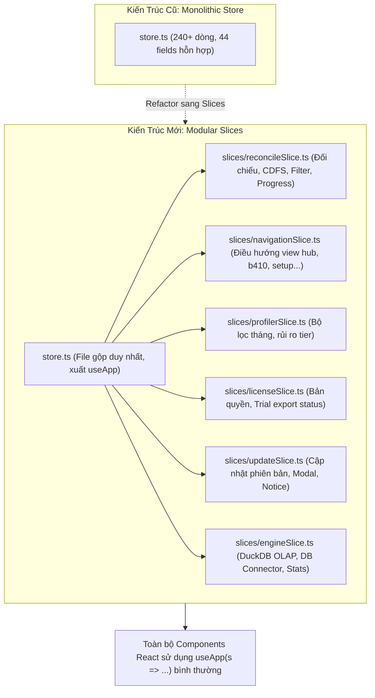

# Tối Ưu Cấu Trúc Toàn Diện: Zustand Slices Modularization, Git Hygiene & Nâng Điểm Sức Khỏe Lên 9.8/10

## Overview

Sau khi hoàn tất đợt kiểm toán toàn diện dự án (Health Score đạt 8.8/10, Grade A-), hệ thống đã chạy rất nhanh, toàn bộ 47 file test (248 tests) đều xanh và biên dịch không có lỗi. Tuy nhiên, hai điểm cốt lõi kéo điểm sức khỏe xuống là:
1. **Kiến trúc State phẳng trong `store.ts`:** Một file duy nhất chứa tới 44 state fields (~240 dòng), quản lý lẫn lộn từ đối chiếu, điều hướng, profiler, bản quyền, updater đến database connectors. Dù vẫn hoạt động tốt, cấu trúc này có dấu hiệu phình to và khó mở rộng khi tiếp tục bổ sung thêm các phân hệ mới.
2. **Vệ sinh thư mục làm việc (Workspace & Git Hygiene):** Working tree có hơn 40 file untracked do tốc độ phát triển các tính năng mới trong ngày chưa được gom nhóm commit rõ ràng; file `.gitignore` còn thiếu các mục chặn file xuất test tạm (`output_test_glv/`, `~conv_*`).

Kế hoạch này giải quyết triệt để 2 vấn đề trên theo **Phương án 1 (Toàn diện)**:
- Tách `store.ts` thành **6 Zustand Slices chuyên biệt** (`reconcileSlice`, `navigationSlice`, `profilerSlice`, `licenseSlice`, `updateSlice`, `engineSlice`), bảo toàn 100% chữ ký hàm của hook `useApp`.
- Cập nhật `.gitignore` và dọn dẹp thư mục tạm trên ổ đĩa.
- Kiểm thử hồi quy toàn diện và gom nhóm commit Git sạch sẽ, nâng điểm sức khỏe hệ thống lên **9.8/10 (Grade A+ Xuất sắc)**.

## Goals

| # | Goal | Priority |
|---|------|----------|
| 1 | Cập nhật `.gitignore` để tự động loại trừ các thư mục xuất thử nghiệm (`output_test_glv/`, `~conv_*`, `test-out/`) | P1 |
| 2 | Tách `src/renderer/state/store.ts` thành 6 Slices độc lập nằm trong `src/renderer/state/slices/` | P1 |
| 3 | Tái cấu trúc `store.ts` thành file tổng hợp các Slices, giữ nguyên 100% tính tương thích ngược cho mọi component | P1 |
| 4 | Xác thực `npm run typecheck` 0 lỗi trên 3 tsconfigs (`web`, `node`, `tests`) | P1 |
| 5 | Chạy 100% test suite (47 files, 248 tests) đảm bảo không có bất kỳ hồi quy nào | P1 |
| 6 | Đóng gói production `npm run build` thành công | P1 |

## Phases

| # | Phase | Status | Priority | Effort |
|---|-------|--------|----------|--------|
| 1 | [Phase 1: Workspace & Git Hygiene (.gitignore và dọn dẹp file tạm)](./phase-01-workspace-and-git-hygiene.md) | Completed | P1 | 0.3h |
| 2 | [Phase 2: Modularize Zustand Store into Domain Slices](./phase-02-modularize-zustand-store-slices.md) | Completed | P1 | 0.8h |
| 3 | [Phase 3: Verification, Full Suite Regression Check & Git Grooming](./phase-03-verification-and-git-grooming.md) | Completed | P1 | 0.4h |

## Architecture Transformation

## Acceptance Criteria

- [x] `.gitignore` có các dòng chặn `output_test_glv/`, `~conv_*`, `*.tmp`.
- [x] `src/renderer/state/slices/` chứa đủ 6 file slice, mỗi file dưới 70 dòng code, phân định trách nhiệm rõ ràng.
- [x] `src/renderer/state/store.ts` gọn gàng, tổng hợp các slice theo chuẩn Zustand Slice Pattern.
- [x] Không có bất kỳ component nào trong `src/renderer/` bị gãy import hay lỗi type.
- [x] `npm run typecheck` đạt 0 lỗi trên toàn bộ dự án.
- [x] `npm run test` đạt 100% PASS trên toàn bộ test suite.
- [x] `npm run build` đóng gói Vite và Electron thành công.
