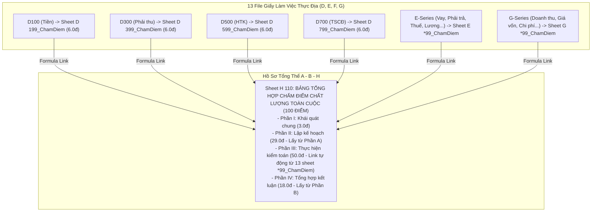

# Kế Hoạch Triển Khai: Tích Hợp Bảng Tự Chấm Điểm & Rà Soát Chất Lượng (VACPA Self-Scoring Sheet) Vào 13 File GLV

> **Trạng thái:** ✅ ĐÃ HOÀN THÀNH TOÀN DIỆN (COMPLETED) — 2026-09-10
> **Kết quả:** 13/13 file GLV trong `GLV MAU` đã được tạo mới Sheet `*99_ChamDiem` ở cuối workbook với đầy đủ công thức `SUM`, `IF`, format Cambria chuẩn mực và bảng tọa độ liên kết sẵn sàng nối sang Sheet `H 110` file `A - B - H`.
## 1. Tổng Quan (Executive Summary)

Kế hoạch này triển khai giải pháp **Kiểm Soát Chất Lượng Hồ Sơ 2 Cấp (Two-Tier Quality Control)** theo chuẩn mực quốc tế **VSQC 1 & VSA 220**:
- **Tại thực địa (Cấp 1 - Trợ lý & KTV thực hiện)**: Mỗi file GLV phần hành trong `GLV MAU` sẽ được bổ sung một sheet chuyên biệt mang tên `*99_ChamDiem` (ví dụ: `D 199_ChamDiem`, `D 399_ChamDiem`...). Sheet này chứa toàn bộ các câu hỏi kiểm tra chất lượng của Bộ Tài chính/VACPA cho riêng phần hành đó, giúp KTV tự rà soát xem mình đã làm đủ thủ tục chưa, thiếu bằng chứng gì để chủ động bổ sung trước khi nộp hồ sơ.
- **Tại cấp soát xét (Cấp 2 - Trưởng nhóm & Partner)**: Tạo nền tảng để sau này file `A - B - H` (Sheet `H 110`) chỉ cần link tự động kết quả điểm số từ 13 sheet con này về bảng tổng hợp điểm toàn cuộc kiểm toán (thang điểm 100).

---

## 2. Kiến Trúc Liên Kết Giữa GLV và File A - B - H

---

## 3. Danh Sách 13 Sheet Chấm Điểm Sẽ Được Bổ Sung

| STT | File GLV trong `GLV MAU` | Tên sheet chấm điểm mới | Số tiêu chí đánh giá | Điểm chuẩn tối đa |
| :---: | :--- | :---: | :---: | :---: |
| 1 | `D100 - Tien - Mau 2024 - Thinh.xlsx` | `D 199_ChamDiem` | 6 tiêu chí (Mục 1.0) | **6.0 điểm** |
| 2 | `D200 - Dau tu - ABC 2020.xlsx` | `D 299_ChamDiem` | 5 tiêu chí (Mục 2.0) | **5.0 điểm** |
| 3 | `D300 - Phai thu - Mau 2025 - Thinh.xlsx` | `D 399_ChamDiem` | 6 tiêu chí (Mục 3.0) | **6.0 điểm** |
| 4 | `D500 - HTK - Mau 2024 - Thinh.xlsx` | `D 599_ChamDiem` | 6 tiêu chí (Mục 4.0) | **6.0 điểm** |
| 5 | `D600 - Phan bo - Mau 2024 - Thinh.xlsx` | `D 699_ChamDiem` | 3 tiêu chí (Mục 5.0) | **3.0 điểm** |
| 6 | `D700 - Tai san - Mau 2024 - Thinh.xlsx` | `D 799_ChamDiem` | 6 tiêu chí (Mục 6.0) | **6.0 điểm** |
| 7 | `E100 - Vay - Mau 2024 - Thinh.xlsx` | `E 199_ChamDiem` | 6 tiêu chí (Mục 7.0) | **6.0 điểm** |
| 8 | `E200 - Phai tra - Mau 2024 - Thinh.xlsx` | `E 299_ChamDiem` | 9 tiêu chí (Mục 8.0 & 11.0) | **9.0 điểm** |
| 9 | `E300 - Thue - Mau 2024 - Thinh.xlsx` | `E 399_ChamDiem` | 4 tiêu chí (Mục 9.0) | **4.0 điểm** |
| 10 | `E400 - Luong - Mau 2025 - Thinh.xlsx` | `E 499_ChamDiem` | 5 tiêu chí (Mục 10.0) | **5.0 điểm** |
| 11 | `F100 - Von - Mau 2024 - Thinh.xlsx` | `F 199_ChamDiem` | 6 tiêu chí (Mục 12.0) | **6.0 điểm** |
| 12 | `G100 - Doanh thu - Mau 2025- Thinh.xlsx` | `G 199_ChamDiem` | 6 tiêu chí (Mục 14.0) | **6.0 điểm** |
| 13 | `G200 - 300 - 400 -  Mau 2025 - Thinh.xlsx` | `G 299_ChamDiem` | 14 tiêu chí (Mục 15.0, 16.0, 17.0) | **14.0 điểm** |

---

## 4. Cấu Trúc Bảng Chấm Điểm & Công Thức Tự Động

Mỗi sheet chấm điểm được định dạng chuyên nghiệp theo chuẩn VACPA:
- **Khung tiêu đề**: Ký hiệu, Tên phần hành, Khách hàng, Niên độ, KTV thực hiện.
- **Khung tóm tắt điểm số (KPI Box)**:
  - *Điểm chuẩn tối đa*: ví dụ `6.0` điểm.
  - *Điểm tự chấm*: Công thức Excel `=SUM(F11:F16)` tự động cộng điểm.
  - *Tỷ lệ hoàn thành*: `=F17/D17*100` (%)
  - *Đánh giá*: `=IF(F17>=D17,"ĐẠT YÊU CẦU","CẦN BỔ SUNG THỦ TỤC")`
- **8 Cột dữ liệu chuẩn**:
  - `A`: STT tiêu chí (1.1, 1.2, 1.3...)
  - `B`: Nội dung tiêu chí kiểm tra (Nguyên văn theo Bảng chấm điểm Bộ Tài chính)
  - `C`: Chuẩn mực VSA viện dẫn
  - `D`: Điểm chuẩn
  - `E`: Trạng thái (`[ Đã làm ]` / `[ Chưa làm ]` / `[ N/A ]`)
  - `F`: Điểm tự chấm (Mặc định bằng điểm chuẩn khi đã hoàn thành)
  - `G`: Tham chiếu bằng chứng GLV (link chính xác sang các sheet con trong file)
  - `H`: Ghi chú & Thủ tục bổ sung cần làm (nếu chưa hoàn thành)

---

## 5. Lộ Trình 3 Giai Đoạn (Phased Roadmap)

1. **Phase 1: Bóc tách cơ sở dữ liệu tiêu chí chấm điểm chi tiết (`phase-01-database-and-scoring-engine.md`)**
   - Trích xuất 100% nguyên văn 98 câu hỏi chấm điểm từ file `1. Du thao Bang cham diem HSKT BCTC - 3.11.2014.xls`.
   - Phân loại chính xác cho 13 file GLV tương ứng, kèm mã VSA và điểm chuẩn từng câu.
2. **Phase 2: Xây dựng Script Engine sinh Sheet Chấm điểm (`phase-02-sheet-generator-and-styler.md`)**
   - Viết script Python `scripts/inject-vacpa-scoring-sheets.py` sử dụng `openpyxl`.
   - Thiết kế layout, font chữ Cambria, màu sắc nhận diện, viền thin border và các công thức Excel tự động tính tổng điểm (`SUM`, `IF`).
3. **Phase 3: Thực thi cập nhật 13 file GLV & Kiểm tra nghiệm thu (`phase-03-injection-and-integrity-verification.md`)**
   - Chèn sheet `*99_ChamDiem` vào đúng vị trí cuối cùng của từng workbook.
   - Kiểm tra tính toán công thức và độ vẹn toàn của 100% các sheet cũ trong workbook.
