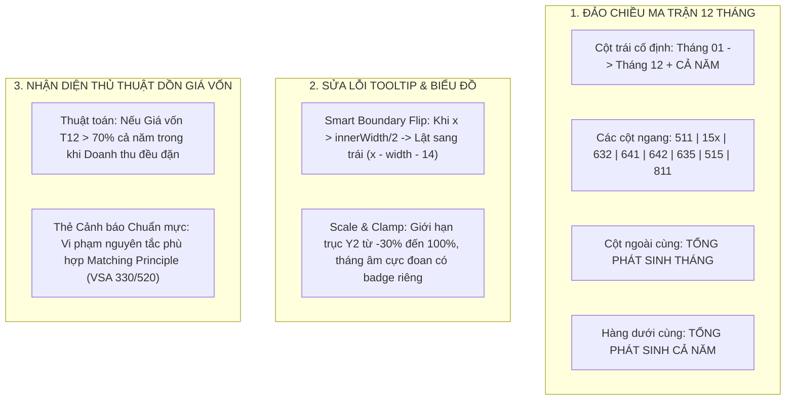

> **Trạng thái:** ✅ ĐÃ HOÀN THÀNH TOÀN DIỆN (COMPLETED) — 2026-09-10
> **Kiểm thử:** 100% PASS (vitest 248/248, typecheck web+node 0 lỗi)
# Kế Hoạch Triển Khai: Chuẩn Hóa Toàn Diện UI Ma Trận 12 Tháng, Sửa Lỗi Tooltip & Nhận Diện Rủi Ro Dồn Giá Vốn Cuối Năm (VSA 520)
## 1. Tổng Quan (Executive Summary)

Dựa trên 3 hình ảnh chụp thực tế từ người dùng, màn hình **#05 Phân Tích Cơ Bản** đang gặp 3 nhóm vấn đề cốt lõi cần giải quyết triệt để:
1. **Ma trận 12 tháng chưa được đảo chiều**: Bảng vẫn đang hiển thị dạng 12 cột tháng dàn ngang và các khoản mục ở hàng dọc, gây khó khăn cho KTV khi theo dõi theo trình tự thời gian từ Tháng 1 đến Tháng 12.
2. **Lỗi giao diện Tooltip bị tràn viền (Clipping/Overflow)**: Khi di chuột vào cột Tháng 12 ở mép phải màn hình, hộp thông tin Tooltip bị tràn ra ngoài cửa sổ ứng dụng và đè lên bảng bên dưới.
3. **Phân tích kinh tế chưa bắt trúng bản chất thực tế kế toán Việt Nam**: Với các doanh nghiệp gia công/sản xuất, kế toán thường **dồn toàn bộ 99.6% giá vốn (75 tỷ đồng) vào Tháng 12**, trong khi doanh thu các tháng 1–11 vẫn phát sinh đều (6–8 tỷ/tháng). Việc thiếu thuật toán nhận diện thủ thuật dồn giá vốn cuối năm này làm cho biểu đồ biên lãi gộp bị cắm thủng đáy (-1047%), kéo bẹp các cột doanh thu và làm lệch phân tích.

---

## 2. Kiến Trúc Giải Pháp & Thiết Kế UI Mới

---

## 3. Lộ Trình 3 Giai Đoạn (Phased Roadmap)

| Giai đoạn | Nhiệm vụ chính | File tác động | Tiêu chí nghiệm thu (Acceptance) |
| :--- | :--- | :--- | :--- |
| **Phase 1** | Đảo chiều Ma trận 12 tháng sang cấu trúc chuẩn SaaS (Cột tháng bên trái, Khoản mục hàng ngang, 2 dòng/cột tổng cộng) | `src/renderer/components/Analytics/GlAnalyticsTab.tsx` | Tháng 01-12 ở cột trái; có cột Tổng tháng & hàng Tổng cả năm; không còn icon màu mè; số liệu rõ nét |
| **Phase 2** | Sửa lỗi Tooltip tràn viền & Xử lý biểu đồ tương quan khi có biên lãi gộp âm cực đoan | `src/renderer/components/Analytics/charts/ChartTooltip.tsx` `src/renderer/components/Analytics/charts/RevenueCogsComboChart.tsx` | Tooltip tự động lật sang trái khi ở mép phải màn hình; biểu đồ không bị gãy hoặc đè bẹp |
| **Phase 3** | Bổ sung thuật toán kiểm toán nhận diện dồn giá vốn cuối năm (VSA 330/520) & Nghiệm thu toàn diện | `src/domain/analytics/Trend12MAnalyzer.ts` `src/renderer/components/Analytics/GlAnalyticsTab.tsx` | Tự động phát hiện bất thường giá vốn T12 >70%; Typecheck 0 lỗi; Full unit test PASS |

---

## 4. Chi Tiết Kế Hoạch Từng Phase

- `phase-01-transpose-12m-matrix.md`: Tái cấu trúc bảng `trend12m` trong `GlAnalyticsTab.tsx` sang dạng 13 dòng (12 tháng + 1 dòng tổng cộng), 10 cột (Tháng + 8 khoản mục + 1 cột tổng tháng).
- `phase-02-fix-tooltip-and-chart-scale.md`: Thêm cơ chế tính toán viewport trong `ChartTooltip.tsx` và tinh chỉnh thang đo trong `RevenueCogsComboChart.tsx`.
- `phase-03-audit-cogs-dump-insight-and-verify.md`: Nâng cấp engine phân tích xu hướng nhận diện vi phạm nguyên tắc phù hợp (Matching principle), hiển thị thẻ cảnh báo chuyên môn và chạy kiểm thử nghiệm thu.
