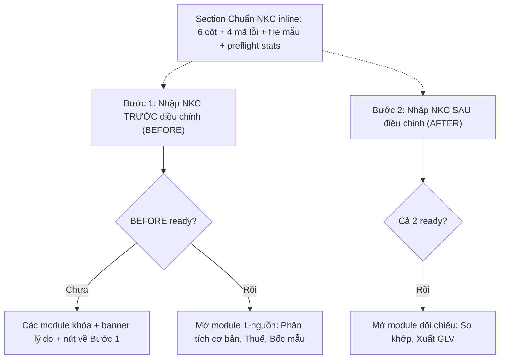

# Kế Hoạch Triển Khai: Flow Hướng Dẫn Theo Bước — Nhập NKC Trước Điều Chỉnh Mở Khóa Module + Chuẩn NKC Inline (Guided NKC Onboarding)

> **Trạng thái:** 🟡 SẴN SÀNG TRIỂN KHAI (READY) — 2026-09-10
> **Hướng đã chốt (brainstorm C):** gate mềm theo module + spec NKC inline + preflight check + file mẫu tải về.

## 1. Tổng Quan

Người dùng mới mở app không nắm được: bước 1 phải nhập NKC trước điều chỉnh ở đâu, các module khác khi nào mới dùng được, và file NKC phải đạt chuẩn gì. Kế hoạch này biến `SetupPage` thành flow theo bước có khóa/mở module rõ ràng, đồng thời đưa chuẩn NKC (hiện chỉ nằm trong `standardizeSource`) ra giao diện kèm kiểm tra preflight trước khi nhận file.

## 2. Kiến Trúc Giải Pháp

Nguồn sự thật duy nhất cho chuẩn NKC: `src/domain/pipeline/standardize.ts` + `src/domain/types.ts` (`ColumnMapping`, `ROW_ERROR_LABELS`). UI chỉ diễn giải lại, không định nghĩa song song.

## 3. Ba Giai Đoạn

- `phase-01-domain-gate-and-nkc-spec.md`: map yêu cầu dữ liệu từng module + module spec NKC trung tâm (`src/domain/nkcRequirements.ts`).
- `phase-02-ui-stepper-gate-and-spec.md`: stepper Bước 1/2/3, banner khóa module, section chuẩn NKC + preflight + file mẫu.
- `phase-03-integration-and-verification.md`: đấu dây toàn app, typecheck + vitest + walkthrough thủ công.

## 4. Nghiệm Thu

1. Mở app chưa nạp → mọi module trừ Nhập liệu khóa kèm lý do + nút về Bước 1.
2. Nạp BEFORE xong → module 1-nguồn mở, module đối chiếu vẫn khóa.
3. Nạp cả 2 → mở toàn bộ.
4. Spec NKC hiển thị đúng 6 cột + 4 mã lỗi (`LOI_NGAY, LOI_TIEN, THIEU_TK_NO, THIEU_TK_CO`); preflight stats khớp `StandardizeStats`.
5. `tsc` web+node 0 lỗi; `vitest run` xanh.
