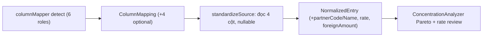

# NKC 10 cột: MÃ KH / TÊN KH / TỶ GIÁ / NGOẠI TỆ

## Overview

File NKC thực tế có 10 cột (`TỶ GIÁ`, `US`, `MÃ KH`, `TÊN KH`) nhưng pipeline
chỉ đọc 6 cột — 4 cột phân tích rơi mất tại `standardizeSource`.
Tầng detector đã sẵn 10 semantics (`aliases.ts:43-46`), tầng analytics đã sẵn
`objectCode/customerName` + Pareto (`ConcentrationAnalyzer`) — chỉ thiếu ống nối.

## Goals

| # | Goal | Priority |
|---|------|----------|
| 1 | 4 mapping optional qua pipeline, file 6 cột cũ chạy y nguyên | P1 |
| 2 | UI ghép cột: 6 thẻ bắt buộc + 4 thẻ optional | P1 |
| 3 | Pareto KH/NCC + flag tỷ giá bất thường dùng được với dữ liệu thật | P1 |

## Phases

| # | Phase | Status | Priority | Effort |
|---|-------|--------|----------|--------|
| 1 | [Phase 1: Pipeline mapping 6→10](./phase-01-pipeline-mapping.md) | Completed | P1 | 0.3h |
| 2 | [Phase 2: UI mapping cards optional](./phase-02-ui-mapping-cards.md) | Completed | P1 | 0.2h |
| 3 | [Phase 3: Analytics wiring + verification](./phase-03-analytics-verification.md) | Completed | P1 | 0.3h |

## Data-flow delta

Khóa so khớp `buildKey` **không đổi** — 4 cột mới là metadata đi kèm.

## Acceptance Criteria

- [x] File 10 cột mẫu: detector gợi ý đúng ≥3/4 cột mới, ghép tay được cột còn lại
- [x] File 6 cột cũ: đối chiếu ra kết quả đồng nhất với trước refactor
- [x] Pareto KH hiện MÃ/TÊN thật; bút toán ngoại tệ có tỷ giá hạch toán để soát
- [x] `typecheck` 0 lỗi, 290 tests xanh (57 files)
