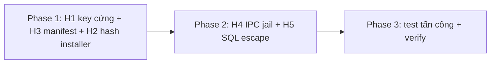

# Kế Hoạch Vá 5 Lỗ Hổng Bảo Mật Mức HIGH (Security Hotfix)

> **Trạng thái:** ✅ ĐÃ HOÀN THÀNH TOÀN DIỆN (COMPLETED) — 2026-09-10
> **Kiểm thử:** 100% PASS (vitest 57 files / 290 tests, tsc 3 project 0 lỗi)

## 1. Tổng Quan

| # | Lỗ hổng | File:dòng | Hướng vá |
|---|---|---|---|
| H1 | Key VIP lifetime cắm cứng, chưa dùng ở đâu | `src/shared/license.ts:17` | Xóa hằng số (dead code) |
| H2 | Chạy installer update không kiểm toàn vẹn | `src/main/updater.ts:191` | Thêm `sha256` vào manifest + verify trước `spawn` |
| H3 | Renderer truyền URL manifest update tùy ý | `src/main/index.ts:269` | Main bỏ qua `customUrl`, luôn dùng manifest chính thức |
| H4 | IPC đọc file local tùy ý | `src/main/index.ts:118,123,345` | Sổ đăng ký đường dẫn đã qua dialog + allowlist đuôi file |
| H5 | SQL nối chuỗi, 5/10 trường chưa escape | `src/domain/engine/DuckDbEngine.ts:79` | Escape toàn bộ + hằng số tên bảng, test injection |

## 2. Giai Đoạn

- `phase-01-license-and-update-channel.md` — H1, H3, H2 (kênh update + license).
- `phase-02-ipc-jail-and-sql-escape.md` — H4, H5 (ranh giới IPC + DB).
- `phase-03-attack-tests-and-verification.md` — test mô phỏng tấn công cho từng H + full suite.

## 3. Rủi Ro Dư Chấp Nhận

- Manifest `version.json` hiện tại chưa có `sha256` → code verify khi có hash, từ chối chạy khi manifest mới thiếu hash; bản phát hành hiện tại vẫn theo luồng cũ cho tới khi pipeline publish bổ sung hash (việc ngoài scope, đã ghi trong phase 01).
- Jail đường dẫn IPC theo session (reset khi restart app) — đường vòng là user tự chọn file qua dialog, đúng hành vi hợp lệ.

## 4. Nghiệm Thu

1. `DEFAULT_VIP_LICENSE_KEY` không còn tồn tại trong repo (grep 0 kết quả).
2. `checkUpdate` với URL lạ không đổi được nguồn manifest; installer hash sai thì không `spawn`.
3. IPC đọc file ngoài dialog/allowlist bị từ chối với lỗi rõ ràng; luồng NKC/XML/ZIP hợp lệ vẫn chạy.
4. Chuỗi chứa `'`, `;`, `--` trong mọi trường NKC không phá được câu INSERT.
5. `tsc` 3 project 0 lỗi; `vitest run` xanh (gồm test mới).
