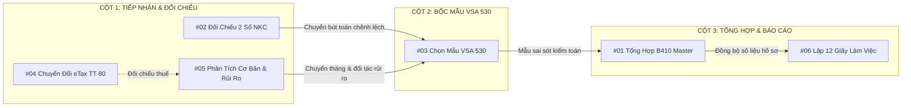

# Tối Ưu & Tinh Giản Sơ Đồ Luồng Nghiệp Vụ AuditSoft (Archify 3-Tier Pipeline)

## Overview

Sơ đồ luồng nghiệp vụ hiện tại trong `ArchitectureDiagramModal.tsx` và `docs/diagrams/auditsoft-architecture-map.json` gồm 4 cột với 12 hộp phân tán:
- **Cột 1:** 4 hộp dữ liệu sổ sách đầu vào rời rạc (NKC, CĐPS, eTax, B410 chi tiết).
- **Cột 2:** 3 module đối chiếu và phân tích (#02, #05, #04).
- **Cột 3:** 2 hộp bốc mẫu (#03 và bước kiểm tra thủ công).
- **Cột 4:** 3 hộp báo cáo tổng hợp (#01, #06, Rủi ro B4).

Sơ đồ này phát sinh các điểm trừ nghiêm trọng về UX/Visual:
1. **Dây nối chằng chịt & bắc cầu qua đầu:** File B410 từ Cột 1 bắn một đường cong dài chui dưới đáy Cột 2 & 3 để sang Cột 4; Mũi tên điều chỉnh từ #02 vồng lên đỉnh Cột 3 đè vào khung tiêu đề.
2. **Hộp thừa:** Hộp *"Thực hiện kiểm tra mẫu"* là hành động kiểm toán thủ công ngoài đời, đưa vào sơ đồ làm phát sinh 2 chặng dây trung gian rối rắm.
3. **Không đồng bộ với Trang chủ:** Người dùng thấy 6 module trên Trang chủ, nhưng vào sơ đồ lại thấy 12 hộp lạ lẫm.

Kế hoạch này thực hiện **Tối ưu hóa toàn diện theo Mô hình 3 Trụ Cột (3-Tier Pipeline)**:
- **Trụ cột 1: Tiếp Nhận & Đối Chiếu Dữ Liệu:** `#02 Đối Chiếu 2 Sổ NKC`, `#05 Phân Tích Cơ Bản & Rủi Ro`, `#04 Chuyển Đổi Tờ Khai eTax`.
- **Trụ cột 2: Bốc Mẫu Chuẩn Mực VSA 530:** `#03 Chọn Mẫu VSA 530` (trung tâm điều hướng rủi ro).
- **Trụ cột 3: Tổng Hợp Sai Sót & Báo Cáo:** `#01 Tổng Hợp B410 Master`, `#06 Lập 12 Giấy Làm Việc`.

Luồng dữ liệu chảy một chiều từ **Trái $\rightarrow$ Giữa $\rightarrow$ Phải**, **100% không có dây nối chéo hay bắc cầu qua đầu cột khác**.

## Goals

| # | Goal | Priority |
|---|------|----------|
| 1 | Viết lại `docs/diagrams/auditsoft-architecture-map.json` với 3 stages rõ ràng và đúng 6 node module cốt lõi | P1 |
| 2 | Biên dịch offline bằng compiler Archify ra file `.html` và `.svg` mới mượt mà | P1 |
| 3 | Cập nhật component `ArchitectureDiagramModal.tsx`: Render SVG 3 cột thoáng đãng, cập nhật 3 chương nghiệp vụ (Chapters) và panel chi tiết | P1 |
| 4 | Đảm bảo 100% typecheck (0 lỗi), 290 tests xanh và build production thành công | P1 |

## Phases

| # | Phase | Status | Priority | Effort |
|---|-------|--------|----------|--------|
| 1 | [Phase 1: Thiết kế lại Typed JSON IR 3 Trụ Cột](./phase-01-redesign-typed-json-ir.md) | Completed | P1 | 0.3h |
| 2 | [Phase 2: Cập nhật Modal Component & Biên dịch Archify](./phase-02-update-modal-and-compile.md) | Completed | P1 | 0.5h |
| 3 | [Phase 3: Kiểm thử Typecheck, Build và Xác thực Trực quan](./phase-03-verification-and-inspection.md) | Completed | P1 | 0.2h |

## Architecture Transformation

## Acceptance Criteria

- [x] Sơ đồ chỉ gồm đúng 3 cột dọc phân minh, mỗi cột rộng rãi, không bị chen chúc.
- [x] Không có bất kỳ đường mũi tên nào đi ngược chiều hoặc bắc cầu qua đầu cột khác.
- [x] 6 hộp trên sơ đồ tương ứng 1-1 với các phân hệ `#01` $\rightarrow$ `#06` trên Trang chủ.
- [x] Nhấp chuột vào bất kỳ node nào vẫn hiển thị đầy đủ thông tin chi tiết: Vai trò, Nguồn dữ liệu nạp vào và Dữ liệu chuyển tiếp.
- [x] Các chương hướng dẫn (Story Chapters) được cập nhật tinh gọn:
  - *Toàn bộ chu trình kiểm toán*
  - *Chương 1: Tiếp nhận & Đối chiếu dữ liệu*
  - *Chương 2: Bốc mẫu kiểm toán VSA 530*
  - *Chương 3: Báo cáo & Tổng hợp hồ sơ*
- [x] `npm run typecheck` 0 lỗi, toàn bộ test suite vượt qua 100%, `npm run build` thành công.
