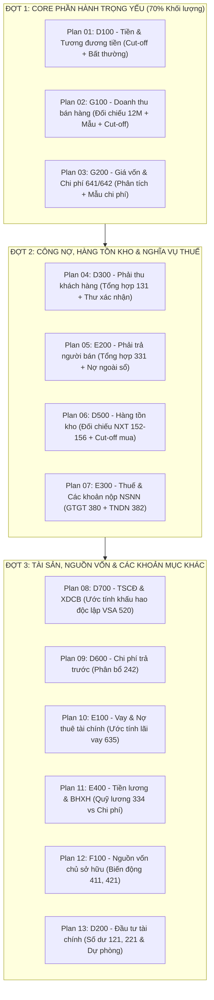

# Kế Hoạch Chuẩn Hóa & Tự Động Hóa 13 Giấy Làm Việc Kiểm Toán (GLV Working Papers Master Plan)

> **Mã kế hoạch:** `plans/260910-1752-wp-automation-master/`
> **Phạm vi:** 13 file GLV thực địa trong `GLV MAU` (D100 -> G200).
> **Nguyên tắc kỹ thuật:** Bảo toàn 100% định dạng, công thức gốc, font chữ Cambria; tận dụng tối đa dữ liệu có sẵn từ Bảng Cân Đối Số Phát Sinh (CDFS) và Sổ Nhật Ký Chung (NKC).

---

## 1. Lộ Trình 3 Đợt Triển Khai (3 Waves Roadmap)

---

## 2. Danh Sách Các File Kế Hoạch Chi Tiết Theo Từng Phase

- `phase-01-wave1-cash-revenue-expenses.md`: Kế hoạch tự động hóa cho **D100, G100, G200** (D190, D191.2, D195, G152, G191.1, G195, G210, G310, G410, G353, G453).
- `phase-02-wave2-receivables-payables-inventory-tax.md`: Kế hoạch tự động hóa cho **D300, E200, D500, E300** (D351, D390, E250, E295, D550, D595, E380, E382).
- `phase-03-wave3-assets-liabilities-equity-investments.md`: Kế hoạch tự động hóa cho **D700, D600, E100, E400, F100, D200** (D790, D792, D690, D693, E190, E191, E490, E491, F148, F190, D210).

---

## 3. Tiêu Chí Nghiệm Thu Chung
1. Tự động hóa điền đúng dữ liệu vào các sheet mục tiêu mà không phá hỏng công thức liên kết sẵn có.
2. Bộ kiểm thử `vitest run tests/workingpaper.test.ts` xuất đủ 12/12 file đạt 100% thành công.
3. Không làm tăng kích thước file bất thường, tốc độ chạy sinh toàn bộ bộ hồ sơ dưới 10 giây.
