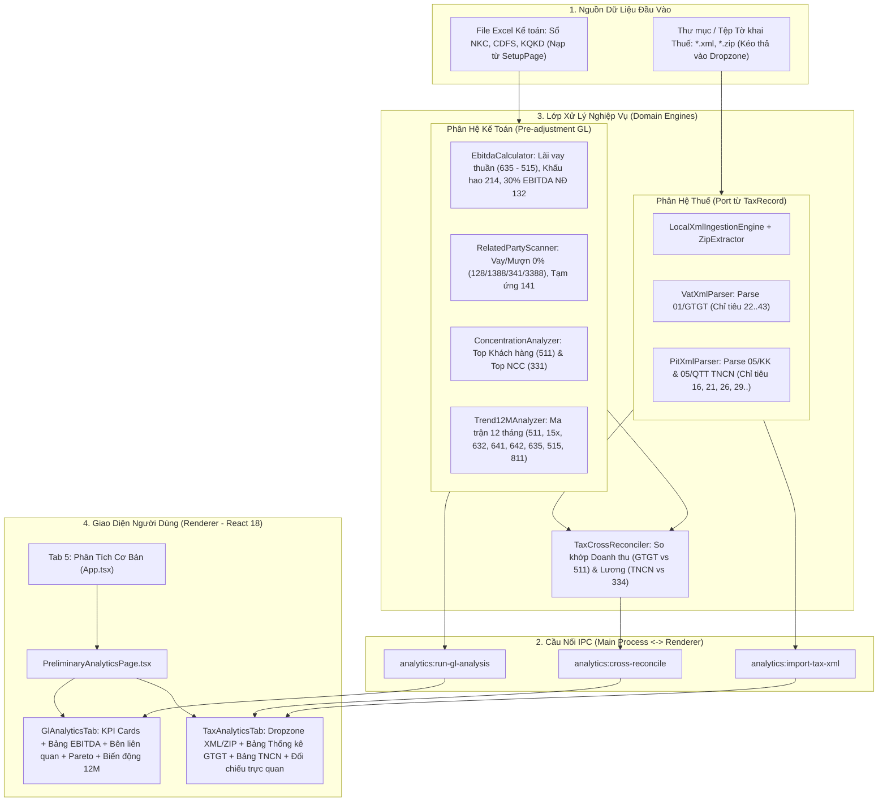

# Module Phân Tích Cơ Bản Sổ NKC & Thống Kê Thuế GTGT/TNCN (Preliminary Analytical Review & Tax Suite)

## Overview & Phạm Vi Điều Chỉnh Theo Yêu Cầu

Trong quy trình kiểm toán Báo cáo tài chính theo Chuẩn mực Kiểm toán Việt Nam (VSA), **Thủ tục phân tích sơ bộ (VSA 520)** là bước bắt buộc trong giai đoạn lập kế hoạch để nhận diện các vùng có rủi ro trọng yếu.

> ⚠️ **ĐIỀU CHỈNH PHẠM VI THEO CHỈ ĐẠO CỦA NGƯỜI DÙNG**:
> **Phần xuất file Excel Giấy làm việc (Working Paper Excel Exporter) TẠM GÁC LẠI** cho đến khi người dùng hoàn tất việc chỉnh sửa cấu trúc file **GLV MẪU** của doanh nghiệp kiểm toán.
> Toàn bộ sự tập trung được dồn 100% vào:
> 1. **Lõi phân tích sổ kế toán (Pre-adjustment GL Engines)** chạy trực tiếp trên NKC đã nạp.
> 2. **Lõi kéo-thả tệp tờ khai thuế XML/ZIP** (01/GTGT, 05/KK, 05/QTT) tái sử dụng từ `TaxRecord`.
> 3. **Lõi đối chiếu chéo (Cross-Reconciliation Engine)** giữa Thuế và Sổ kế toán.
> 4. **Giao diện Dashboard hoàn chỉnh (`PreliminaryAnalyticsPage`)** hiển thị đầy đủ thẻ KPI, bảng biểu, cảnh báo rủi ro trực quan và đối chiếu chéo trực tiếp trên ứng dụng.

---

## Goals

| # | Mục tiêu cốt lõi | Mức độ ưu tiên |
|---|------------------|:--------------:|
| 1 | **Port bộ Parser & Ingestion XML Thuế từ `TaxRecord`**: Đọc trực tiếp file `.xml` hoặc giải nén `.zip` tờ khai 01/GTGT (TT80 & cũ) và 05/KK-TNCN, 05/QTT-TNCN, bảo toàn kiểu dữ liệu tiền tệ `BigInt`. | P1 |
| 2 | **Lõi Tính Toán EBITDA & Khống Chế Lãi Vay (Nghị định 132/2020/NĐ-CP)**: Tự động tính Chi phí lãi vay thuần, Chi phí khấu hao TK 214, Lợi nhuận thuần HĐKD Mã 30, Tỷ lệ Lãi vay / EBITDA và số tiền vượt trần 30% (Chỉ tiêu B4). | P1 |
| 3 | **Lõi Quét Giao Dịch Nghi Ngờ Bên Liên Quan (VSA 550)**: Phát hiện các nghiệp vụ cho vay (128) hoặc mượn vốn (341, 3388) không phát sinh lãi (thiếu 515/635), tạm ứng (141) số dư lớn kéo dài. | P1 |
| 4 | **Lõi Phân Tích Tỷ Trọng Pareto Khách Hàng & Nhà Cung Cấp**: Tổng hợp Top 5/10 Khách hàng (TK 511/131) và Top 5/10 Nhà cung cấp (TK 15x, 632, 641, 642 / 331), tính % tỷ trọng và % tích lũy. | P1 |
| 5 | **Lõi Ma Trận Biến Động 12 Tháng**: Bảng 12 tháng x các tài khoản trọng yếu (511, 15x, 632, 641, 642, 635, 515, 811), tính tốc độ tăng trưởng MoM % và gắn cờ cảnh báo tháng đột biến. | P1 |
| 6 | **Lõi Đối Chiếu Chéo Thuế vs Sổ Kế Toán (Tax Cross-Reconciler)**: So khớp Doanh thu tờ khai GTGT vs Có 511; Thuế GTGT đầu ra vs Có 33311; Thuế đầu vào vs Nợ 1331; Chi phí lương TNCN vs Nợ 334/64x. | P1 |
| 7 | **Giao Diện Trực Quan `PreliminaryAnalyticsPage` (Tab 5 trên Navigation Bar)**: Gồm 2 tab con (Phân tích Sổ NKC & Thống kê Thuế XML), KPI cards nổi bật, bảng dữ liệu lọc mượt mà, hiển thị độ lệch đối chiếu trực quan. | P1 |
| 8 | *(Tạm hoãn)* Xuất file Excel Working Paper: Đã thiết kế sẵn cấu trúc dữ liệu, sẵn sàng kích hoạt filler ngay khi có file GLV MẪU hoàn chỉnh từ người dùng. | Deferred |

---

## Phases Roadmap (Đã Tinh Chỉnh)

| # | Tên Phase | Trọng tâm công việc | Trạng thái | Ước lượng |
|---|-----------|---------------------|:----------:|:---------:|
| 1 | [Phase 1: Port TaxRecord XML Parsers & Data Types](./phase-01-port-taxrecord-xml-parsers-and-types.md) | Port `LocalXmlIngestionEngine`, `ZipExtractor`, `VatXmlParser`, `PitXmlParser` từ TaxRecord, thiết lập kiểu dữ liệu BigInt & unit tests. | Completed | 6h |
| 2 | [Phase 2: Core Accounting Domain Analytics Engines](./phase-02-core-accounting-domain-analytics-engines.md) | Xây dựng `EbitdaCalculator`, `RelatedPartyScanner`, `ConcentrationAnalyzer`, `Trend12MAnalyzer` chạy trên `NormalizedJournal` & `IncomeStatementData`. | Completed | 8h |
| 3 | [Phase 3: Tax Cross-Reconciler Engine (Thuần Logic)](./phase-03-tax-cross-reconciler-engine.md) | Xây dựng `TaxCrossReconciler` đối chiếu Thuế GTGT & TNCN vs Sổ NKC, trả về cấu trúc so khớp dữ liệu chi tiết. | Completed | 4h |
| 4 | [Phase 4: UI Dashboard & PreliminaryAnalyticsPage](./phase-04-ui-dashboard-and-preliminary-analytics-page.md) | Cấu hình IPC channels, Zustand Store, Navigation Tab 5 và các components React (`GlAnalyticsTab`, `TaxAnalyticsTab`, `TaxDropZone`, KPI Cards). | Completed | 8h |
| 5 | [Phase 5: End-to-End Integration, Testing & Verification](./phase-05-e2e-integration-testing-and-verification.md) | Kiểm thử E2E với bộ dữ liệu kiểm toán mẫu (NKC + XML Thuế thật), kiểm tra giao diện và phản hồi tức thời, chạy full Vitest & Lint. | Completed | 3h |

## Architecture & Data Flow

---

## File Ownership & Code Boundaries

### 1. Phân hệ Thuế (Port từ TaxRecord):
- `src/domain/etax/parsers/VatXmlParser.ts`: Parser tờ khai 01/GTGT.
- `src/domain/etax/parsers/PitXmlParser.ts`: Parser tờ khai 05/KK-TNCN và 05/QTT-TNCN.
- `src/domain/etax/ingestion/LocalXmlIngestionEngine.ts`: Quét & nạp file XML/ZIP.
- `src/domain/etax/ingestion/ZipExtractor.ts`: Giải nén zip an toàn vào thư mục tạm.
- `src/shared/types/taxAnalytics.ts`: Types cho thuế GTGT & TNCN (`BigInt`).

### 2. Phân hệ Phân Tích Kế Toán Mới (Domain Analytics):
- `src/domain/analytics/EbitdaCalculator.ts`: Tính toán EBITDA và trần 30% lãi vay.
- `src/domain/analytics/RelatedPartyScanner.ts`: Quét giao dịch nghi ngờ bên liên quan.
- `src/domain/analytics/ConcentrationAnalyzer.ts`: Phân tích Pareto khách hàng/nhà cung cấp.
- `src/domain/analytics/Trend12MAnalyzer.ts`: Ma trận biến động 12 tháng.
- `src/domain/analytics/TaxCrossReconciler.ts`: Đối chiếu số liệu Thuế vs Sổ NKC.
- `src/domain/analytics/types.ts`: Interface hợp đồng dữ liệu phân tích.

### 3. Phân hệ Giao Diện & IPC:
- `src/shared/ipc.ts`: Mở rộng IPC channels `analytics:*`.
- `src/main/ipc/analyticsHandlers.ts`: Đăng ký IPC handlers trong Main process.
- `src/renderer/components/Analytics/PreliminaryAnalyticsPage.tsx`: Màn hình chính.
- `src/renderer/components/Analytics/GlAnalyticsTab.tsx`: Tab phân tích sổ sách.
- `src/renderer/components/Analytics/TaxAnalyticsTab.tsx`: Tab thống kê thuế & đối chiếu chéo.
- `src/renderer/components/Analytics/TaxDropZone.tsx`: Dropzone nhận file XML/ZIP.
- `src/renderer/state/store.ts`: Quản lý state phân tích trong Zustand.
- `src/renderer/App.tsx`: Nút điều hướng Tab 5.

---

## Verification & Acceptance Checklist

1. **Unit Tests (Vitest)**:
   - `tests/vat-pit-xml-parsers.test.ts`: Parse file mẫu 01/GTGT và 05/KK-TNCN/05/QTT-TNCN.
   - `tests/accounting-analytics-engines.test.ts`: Tính EBITDA, quét bên liên quan, tỷ trọng Pareto, biến động 12 tháng.
   - `tests/tax-cross-reconciler.test.ts`: Đối chiếu chéo Thuế vs Sổ NKC.
2. **Giao diện Người dùng (Interactive UI)**:
   - Chuyển sang Tab 5 `Phân Tích Cơ Bản` hiển thị tức thời các KPI và bảng phân tích khi đã nạp NKC.
   - Kéo thả file XML/ZIP tờ khai thuế vào Dropzone hiển thị bảng thống kê các kỳ khai và bảng chênh lệch đối chiếu với NKC mà không bị đơ giật giao diện.
   - Typecheck, Lint, và Vitest suite pass 100%.
