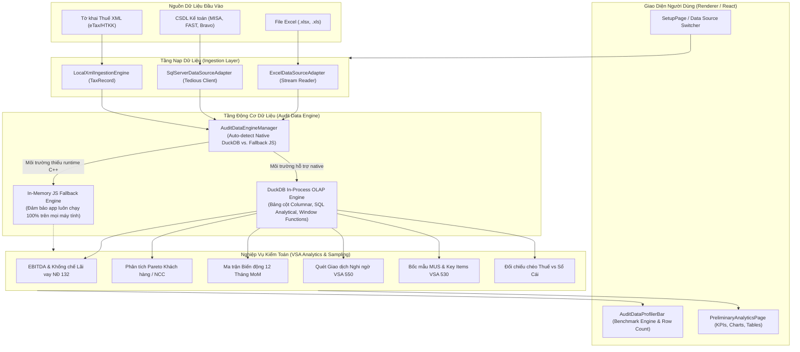

# Kế Hoạch Tích Hợp Embedded OLAP Engine & Accounting Database Connector

## 1. Bối Cảnh & Mục Tiêu (Context & Motivation)

Qua nghiên cứu đối chuẩn với dự án **`t8y2/dbx`** (Universal Database Tool thế hệ mới bằng Rust/Tauri), điểm đột phá lớn nhất mà `AuditSoft` có thể học hỏi và chuyển hóa thành lợi thế cạnh tranh áp đảo chính là:

1. **Nâng cấp từ "Mảng JavaScript in-memory (V8 Heap)" lên "Embedded OLAP Database (DuckDB In-Process)"**:
   - *Vấn đề hiện tại*: Khi kiểm toán các doanh nghiệp có số lượng nghiệp vụ lớn (200.000 đến 1.000.000 dòng NKC), việc nạp toàn bộ vào RAM dưới dạng đối tượng JavaScript gây ngốn 1–2 GB RAM, dễ chạm ngưỡng V8 Out-of-Memory, các hàm duyệt mảng `Array.filter()`, `Array.reduce()`, `RegExp.test()` bị nghẽn CPU.
   - *Giải pháp*: Nhúng **DuckDB** (hoặc SQLite analytical abstraction) vào tầng Worker/Domain. DuckDB là CSDL phân tích dạng cột (Columnar OLAP) chạy in-process, không cần cài đặt server, nạp dữ liệu siêu nén và xử lý các phép tính VSA 520 (EBITDA, Pareto, 12M trend) bằng câu lệnh SQL song song chỉ mất vài chục mili-giây.
   - *Nguyên tắc an toàn (Zero-Breakage)*: Thiết kế tầng trừu tượng `IAuditDataEngine` với **In-Memory Fallback** tự động — nếu môi trường máy người dùng gặp sự cố về native binary, hệ thống tự động fallback về JS engine hiện tại mà không crash ứng dụng.

2. **Mở rộng kênh nạp dữ liệu: Kết nối trực tiếp CSDL Kế toán (MISA / FAST / SQL Server)**:
   - *Vấn đề hiện tại*: 100% dữ liệu phải xuất ra file Excel. Khách hàng xuất Excel thường xuyên bị lỗi format ngày tháng, mất cột mã đối tượng, file vượt quá 1.048.576 dòng bị Excel cắt ngắn.
   - *Giải pháp*: Xây dựng `AccountingDbConnector` (sử dụng thư viện `tedious` cho Microsoft SQL Server) cho phép kiểm toán viên nhập thông tin kết nối LAN/Local để kéo thẳng dữ liệu từ CSDL MISA SME, FAST, BRAVO vào AuditSoft với độ tin cậy 100%.

---

## 2. Mục Tiêu Cốt Lõi (Core Goals)

| # | Mục tiêu cốt lõi | Mức độ ưu tiên | Tiêu chí nghiệm thu (Acceptance Criteria) |
|---|---|:---:|---|
| **G1** | **Embedded OLAP Engine (`DuckDbEngine`)** | P1 | Tích hợp DuckDB in-process (hỗ trợ lưu trữ in-memory hoặc file tạm `.duckdb`), nạp 200.000 dòng NKC trong < 1.5 giây, tiêu tốn < 150MB RAM. |
| **G2** | **Tầng Trừu Tượng & In-Memory Fallback (`IAuditDataEngine`)** | P1 | Đảm bảo 100% code kiểm toán không bị phụ thuộc cứng vào native binary; tự động chuyển sang Fallback JS Engine nếu native load thất bại. |
| **G3** | **Tăng Tốc Toàn Bộ Phân Hệ VSA 520 & VSA 530 bằng SQL** | P1 | Viết lại các phép tính EBITDA (NĐ 132), Pareto Khách/NCC, Ma trận 12 tháng, Bên liên quan (VSA 550) và Bốc mẫu MUS thành các câu query SQL siêu tốc (< 100ms). |
| **G4** | **Accounting Database Connector (SQL Server / MISA Adapter)** | P2 | Hỗ trợ kết nối Microsoft SQL Server qua TCP/IP nội bộ; có sẵn mẫu SQL map bảng chứng từ MISA (`GL_Voucher`, `GL_VoucherDetail`) và FAST. |
| **G5** | **Giao Diện Chọn Nguồn Dữ Liệu & Xem Trước (UI Source Switcher)** | P2 | Giao diện cho phép KTV chọn: `[File Excel .xlsx]` hoặc `[Kết nối CSDL Kế toán]`, có nút kiểm tra kết nối, xem trước 10 dòng và hiển thị benchmark hiệu năng. |

---

## 3. Lộ Trình Triển Khai (Phased Roadmap)

| Phase | Tên Phase | Nội dung công việc chính | Trạng thái | Ước lượng |
| :---: | :--- | :--- | :---: | :---: |
| [**Phase 1**](./phase-01-embedded-olap-engine-foundation.md) | **Embedded OLAP Engine Foundation** | Thiết kế interface `IAuditDataEngine`, tích hợp DuckDB/SQLite native worker, định nghĩa Schema bảng `journal_entries`, `trial_balance`, cơ chế bulk insert theo lô (chunks 10k rows) và fallback an toàn. | **Completed** | 1.0d |
| [**Phase 2**](./phase-02-sql-accelerated-analytical-queries.md) | **SQL-Accelerated Analytical Queries** | Triển khai bộ query SQL phân tích: EBITDA khống chế lãi vay 30%, Pareto 80/20 dùng Window Functions, Ma trận 12 tháng, Quét bên liên quan VSA 550, Bốc mẫu MUS VSA 530. | **Completed** | 1.0d |
| [**Phase 3**](./phase-03-accounting-database-connector-adapter.md) | **Accounting Database Connector (MISA/SQL Server)** | Xây dựng `SqlServerConnector` sử dụng `tedious`, bộ template trích xuất dữ liệu kế toán chuẩn (MISA SME/AMIS, FAST Accounting, BRAVO) và chuyển hóa sang DTO chuẩn của AuditSoft. | **Completed** | 0.8d |
| [**Phase 4**](./phase-04-ui-data-source-switcher-and-preview.md) | **UI Data Source Switcher & Connection Modal** | Thiết kế UI chọn nguồn dữ liệu (Excel vs DB), Connection Modal (Host, Port, User, Pass, DB Name), Test Connection, Preview Data Table, thông số tốc độ Engine. | **Completed** | 0.7d |
| [**Phase 5**](./phase-05-e2e-testing-benchmarking-verification.md) | **E2E Testing, Benchmarking & Stress-Testing** | Bộ test so sánh độ chính xác 100% giữa SQL Engine và Legacy JS Engine, stress-test 500k dòng, kiểm tra đóng gói electron-builder không lỗi. | **Completed** | 0.5d |

---

## 4. Kiến Trúc Hệ Thống (Architecture & Data Flow)

---

## 5. Chiến Lược Quản Trị Rủi Ro & Đóng Gói (Risk & Fallback Strategy)

| Rủi ro kỹ thuật | Mức độ | Biện pháp xử lý & Phòng vệ (Defensive Strategy) |
| :--- | :---: | :--- |
| **Native Dependency Packaging** (Lỗi khi build NSIS/Portable trên Windows do thiếu MSVC Runtime) | Cao | 1. Tầng `IAuditDataEngine` bọc toàn bộ truy vấn trong try/catch lúc khởi tạo. 2. Nếu native DuckDB không nạp được thư viện liên kết động (`.node`), tự động chuyển sang `InMemoryJsEngine` trong suốt mà người dùng không gặp lỗi màn hình trắng. 3. Xem xét phương án WebAssembly (`@duckdb/duckdb-wasm`) nếu cần 0 native dependency. |
| **Bảo mật thông tin đăng nhập CSDL** (Mật khẩu SQL Server của khách hàng) | Cao | 1. Mật khẩu CSDL **chỉ lưu trong RAM của phiên làm việc hiện tại** (In-memory session state), tuyệt đối **không ghi vào ổ cứng hay file config unencrypted**. 2. Đóng kết nối TCP ngay sau khi nạp xong dữ liệu vào AuditSoft. |
| **Sai lệch kết quả số học giữa SQL và JS BigInt** (Làm tròn số tiền trong SQL) | Trung bình | Lưu trữ số tiền trong DuckDB dưới dạng kiểu `BIGINT` hoặc `DECIMAL(18, 0)` tương đương chính xác với kiểu `BigInt` của AuditSoft, bảo toàn từng đồng VNĐ không bị lỗi sai số dấu phẩy động (float precision). |
