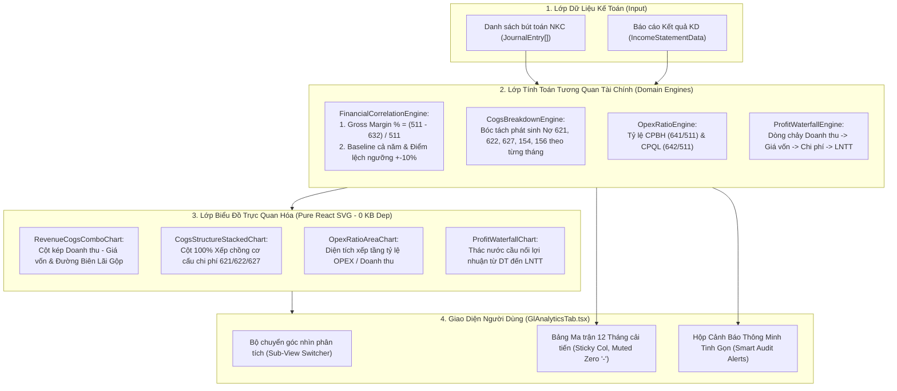

# Phân Hệ Trực Quan Hóa Đồ Thị Tài Chính Nâng Cao & Tối Ưu Bảng Ma Trận 12 Tháng (VSA 520)

## Overview

Trong kiểm toán Báo cáo tài chính theo **Chuẩn mực Kiểm toán Việt Nam VSA 520 (Thủ tục phân tích)**, kiểm toán viên (KTV) không chỉ phân tích các chỉ tiêu đơn lẻ mà bắt buộc phải kiểm tra **mối tương quan nhân quả (Correlation & Cause-Effect)** giữa các nhóm tài khoản đối ứng và cơ cấu chi phí. 

Hiện tại, màn hình phân tích đang hiển thị dưới dạng một bảng ma trận số liệu 13 cột với một số điểm nghẽn:
1. **Thiếu trực quan hóa chiều sâu**: KTV khó phát hiện ngay các tháng có sự lệch pha giữa Doanh thu và Giá vốn, sự biến động tỷ trọng nguyên vật liệu/nhân công trong giá thành sản xuất, hoặc chi phí nào đang bào mòn lợi nhuận ròng.
2. **Trải nghiệm đọc số chưa tối ưu**: Số liệu màu nhạt khó đọc, các ô không phát sinh hiển thị số `0` dày đặc làm loãng mắt, bảng bị tràn mép phải khiến các cột quan trọng cuối năm (T11, T12, CẢ NĂM) bị khuất, và các thanh cảnh báo màu vàng xếp chồng chiếm nhiều diện tích.

Kế hoạch này triển khai trọn bộ **Bộ 4 Đồ Thị Phân Tích Tương Quan Chuyên Sâu** và **Tái cấu trúc Bảng Ma Trận 12 Tháng** theo đúng chuẩn **Enterprise SaaS** (tối giản, sang trọng, độ tương phản cao, triệt tiêu hoàn toàn các icon/emoji trang trí rườm rà).

---

## Goals

| # | Mục tiêu cốt lõi | Chi tiết kỹ thuật | Ưu tiên |
|---|------------------|-------------------|:-------:|
| 1 | **Đồ thị Tương quan Doanh thu — Giá vốn & Biên lãi gộp** | Biểu đồ kép (Dual-Axis Combo): Cột Doanh thu (511) song song với Giá vốn (632), trục phụ hiển thị đường Biên lãi gộp (Gross Margin %) và đường trung bình cả năm. Tự động gắn cờ các tháng biên lãi gộp âm hoặc biến động $\pm 10\%$. | P1 |
| 2 | **Đồ thị Bóc tách Cấu trúc Chi phí Giá vốn** | Biểu đồ cột xếp chồng tỷ trọng 100% (100% Stacked Bar): Phân tích cơ cấu giá thành qua 12 tháng gồm Chi phí NVL trực tiếp (621), Chi phí Nhân công trực tiếp (622), Chi phí Sản xuất chung (627), và Chi phí dở dang (154) / Giá vốn thương mại (156 $\rightarrow$ 632). | P1 |
| 3 | **Đồ thị Tỷ lệ Chi phí Hoạt động trên Doanh thu (OPEX Ratio)** | Biểu đồ diện tích xếp tầng (Stacked Area / Line): Theo dõi tỷ lệ Chi phí bán hàng (641 / 511 %) và Chi phí QLDN (642 / 511 %) trên mỗi 100 đồng doanh thu, phát hiện bất thường về chi phí hoa hồng / quản lý. | P1 |
| 4 | **Đồ thị Cầu nối Lợi nhuận (Waterfall / Bridge Chart)** | Biểu đồ thác nước chuẩn tài chính: Minh họa dòng chảy từ Doanh thu thuần $\rightarrow$ trừ Giá vốn $\rightarrow$ cộng DTTC $\rightarrow$ trừ CPTC $\rightarrow$ trừ CPBH $\rightarrow$ trừ CPQL $\rightarrow$ cộng Thu nhập khác $\rightarrow$ Lợi nhuận trước thuế. | P1 |
| 5 | **Tối ưu Bảng Ma trận 12 Tháng & Triệt tiêu số 0** | Cố định cột đầu tiên (Sticky column Khoản mục), tăng độ đậm nét số liệu (`font-weight: 700`, monospace `#0f172a`), thay toàn bộ số 0 bằng dấu gạch ngang mờ `-` (`#94a3b8`), điều chỉnh padding để hiển thị trọn vẹn T1..T12 và CẢ NĂM. | P1 |
| 6 | **Hộp Cảnh báo Rủi ro Thông minh (Smart Audit Alerts)** | Thu gọn 3-5 thanh cảnh báo vàng xếp chồng thành 1 thẻ tổng hợp tinh gọn dạng lưới (Grid), phân loại rõ theo từng tháng và kèm thủ tục kiểm toán gợi ý (VSA 520). | P1 |
| 7 | **Chuẩn Hóa Enterprise SaaS (Zero Childish Icons)** | Loại bỏ toàn bộ icon/emoji trang trí thừa thãi. Sử dụng typography chuẩn mực, dải màu tương phản cao (Stripe/Linear style), tooltip thông tin chi tiết khi hover chuột. | P1 |

---

## Phases Roadmap

| 1 | [Phase 1: Domain Financial Correlation Engines](./phase-01-domain-financial-correlation-engines.md) | Xây dựng các hàm tính toán nghiệp vụ VSA 520: Biên lãi gộp theo tháng, Bóc tách chi phí giá vốn (621/622/627/154), Tỷ lệ OPEX, Dòng chảy Waterfall từ dữ liệu NKC. | Completed | 5h |
| 2 | [Phase 2: Pure SVG SaaS Chart Suite](./phase-02-pure-svg-saas-chart-suite.md) | Xây dựng 4 component biểu đồ Pure React SVG (Combo Chart, 100% Stacked Bar, OPEX Area Chart, Waterfall Chart) với hover tooltip, crosshairs và series toggles. | Completed | 8h |
| 3 | [Phase 3: Refactor GlAnalyticsTab & 12M Matrix](./phase-03-refactor-gl-analytics-tab-and-matrix.md) | Tích hợp bộ chuyển tab trực quan hóa, áp dụng sticky column cho bảng ma trận, thay thế số 0 bằng `-`, thu gọn hộp cảnh báo vàng thành Smart Alerts Card. | Completed | 5h |
| 4 | [Phase 4: Unit Testing, Typecheck & Verification](./phase-04-unit-testing-typecheck-verification.md) | Viết unit tests cho các engine tương quan mới, kiểm tra typecheck toàn dự án, linting và chạy full test suite 100% Pass. | Completed | 3h |

---

## Architecture & Data Flow

---

## File Ownership & Code Boundaries

### 1. Phân hệ Tính toán Domain Mới:
- `src/domain/analytics/FinancialCorrelationEngine.ts`: Tính toán toàn bộ các tỷ số tương quan: Biên lãi gộp 12 tháng, cơ cấu chi phí giá vốn (621/622/627/154), tỷ lệ OPEX, cấu trúc dòng tiền Waterfall.
- `src/domain/analytics/types.ts`: Bổ sung các interface kết quả: `GrossMarginPoint`, `CogsStructureMonth`, `OpexRatioPoint`, `WaterfallStep`, `CorrelationAnalysisResult`.

### 2. Phân hệ Biểu đồ Pure SVG (SaaS Grade):
- `src/renderer/components/Analytics/charts/RevenueCogsComboChart.tsx`: Biểu đồ cột kép + đường biên lãi gộp.
- `src/renderer/components/Analytics/charts/CogsStructureStackedChart.tsx`: Biểu đồ 100% stacked bar cơ cấu chi phí sản xuất/giá vốn.
- `src/renderer/components/Analytics/charts/OpexRatioAreaChart.tsx`: Biểu đồ diện tích tỷ lệ chi phí bán hàng/quản lý.
- `src/renderer/components/Analytics/charts/ProfitWaterfallChart.tsx`: Biểu đồ thác nước cầu nối lợi nhuận.
- `src/renderer/components/Analytics/charts/ChartTooltip.tsx`: Component tooltip popover tái sử dụng.

### 3. Phân hệ Giao diện Cải tiến:
- `src/renderer/components/Analytics/GlAnalyticsTab.tsx`: Tích hợp các biểu đồ, cấu trúc lại bảng ma trận (cố định cột, đổi 0 thành `-`, tăng tương phản font chữ), thu gọn khối cảnh báo rủi ro.
- `src/renderer/components/Analytics/SmartAuditAlerts.tsx`: Thẻ tổng hợp cảnh báo rủi ro gọn gàng.

---

## Verification & Acceptance Checklist

1. **Unit Tests (Vitest)**:
   - `tests/financial-correlation-engine.test.ts`: Kiểm tra độ chính xác công thức Biên lãi gộp, bóc tách 621/622/627, tỷ lệ OPEX và các bước cầu nối Waterfall.
2. **Giao diện & Trải nghiệm Người dùng**:
   - Biểu đồ hiển thị sắc nét trên cả màn hình laptop và màn hình ngoài độ phân giải cao.
   - Khi hover chuột vào từng tháng trên biểu đồ, tooltip hiển thị số tiền chính xác từng dòng.
   - Bảng ma trận 12 tháng có thể cuộn ngang mượt mà, cột "Khoản Mục" đứng yên không bị trôi.
   - Toàn bộ số 0 biến thành dấu `-` màu xám nhạt, số phát sinh đậm màu đen `#0f172a`.
   - Toàn bộ emoji/icon rườm rà được loại bỏ, thay bằng phong cách SaaS chuyên nghiệp.
3. **Build & Quality Gates**:
   - `npm run typecheck` kết thúc với 0 errors.
   - `npm run lint` kết thúc với 0 errors, 0 warnings.
   - `npm test` toàn bộ 46+ test suites pass 100%.
   - `npm run build` hoàn thành không có lỗi đóng gói.
