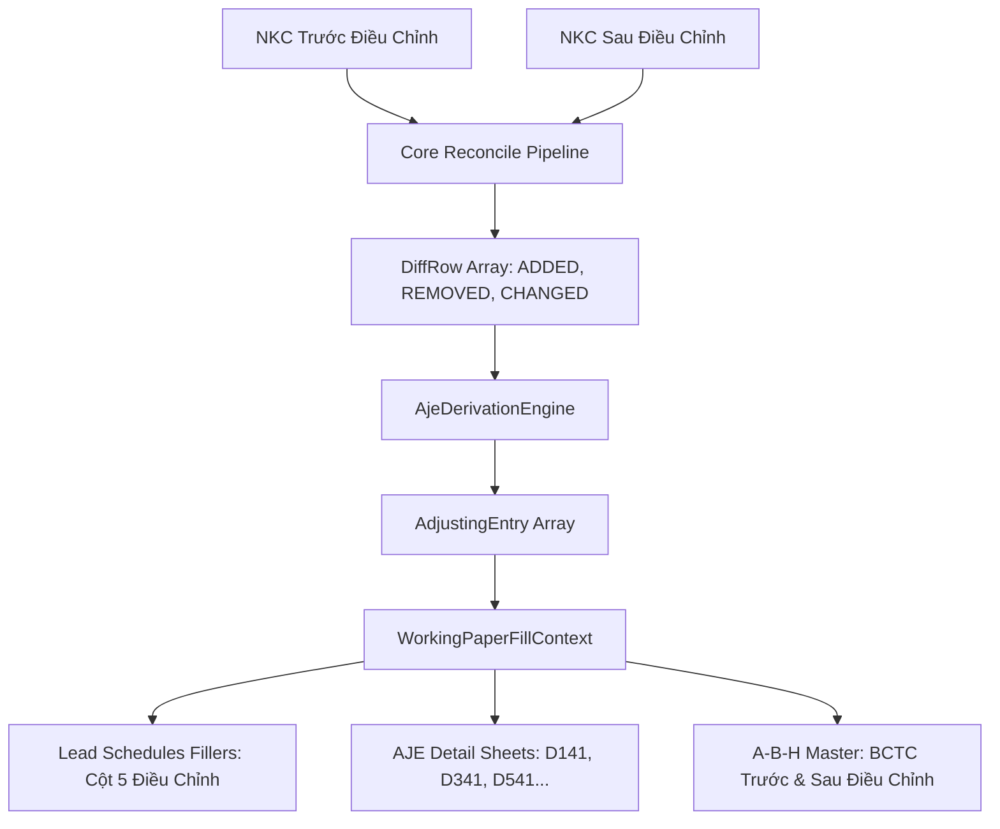

# KẾ HOẠCH TRIỂN KHAI: TỰ ĐỘNG LẬP BÚT TOÁN ĐIỀU CHỈNH AJE TỪ NKC SAU ĐIỀU CHỈNH

## 1. Bối cảnh & Vấn đề

Trong quy trình kiểm toán thực tế:
1. Ban đầu, kiểm toán viên nhận được file **NKC Trước Điều Chỉnh** từ doanh nghiệp.
2. Qua quá trình kiểm tra, kiểm toán viên phát hiện các sai sót (chưa trích khấu hao, sai sót giá vốn, chưa trích lập dự phòng, hóa đơn về muộn...) và đưa ra kiến nghị điều chỉnh.
3. Doanh nghiệp thực hiện hạch toán điều chỉnh vào sổ sách và cung cấp lại file **NKC Sau Điều Chỉnh** (hoặc BCTC phát hành chính thức).
4. Hiện tại, kiểm toán viên phải **tự dò tay từng bút toán** hoặc chỉ nhìn bảng chênh lệch đối chiếu, sau đó phải gõ thủ công từng số tiền điều chỉnh vào Cột 5 (Cột Điều Chỉnh) trên từng file Leadsheet (`D110`, `D310`, `D510`, `E110`, `E210`, `G110`, `G210`...) và lập sheet `D141` / `B140` bằng tay.

## 2. Mục tiêu đạt được

* **Tự động bóc tách AJE thông minh:** Khi người dùng cung cấp thêm file **NKC Sau Điều Chỉnh** (hoặc có sẵn kết quả từ tab Đối Chiếu NKC), hệ thống tự động bóc tách các dòng chênh lệch (`ADDED_AFTER`, `REMOVED_AFTER`, `AMOUNT_CHANGED`) thành danh sách các bút toán điều chỉnh `AdjustingEntry[]`.
* **Gán tự động mã tham chiếu Giấy làm việc (GLV Ref):**
  * Liên quan đến Tiền (TK 111, 112) ➔ `D141`
  * Liên quan đến Phải thu (TK 131, 2293) ➔ `D341`
  * Liên quan đến Hàng tồn kho (TK 152, 156, 155, 632) ➔ `D541`
  * Liên quan đến Phải trả (TK 331, 338) ➔ `E241`
  * Liên quan đến Thuế (TK 133, 333) ➔ `E341`
  * Liên quan đến Chi phí / Doanh thu (TK 511, 641, 642) ➔ `G141` / `G241`
* **Tự động điền Cột Điều Chỉnh (Cột 5) trên tất cả các Leadsheet:** Số tiền điều chỉnh sẽ tự động được bù trừ `Nợ - Có` hoặc `Có - Nợ` theo chiều số dư thông thường của tài khoản, làm cho Cột 6 (Sau kiểm toán = Cột 4 + Cột 5) tự động khớp 100% với số liệu trên NKC Sau Điều Chỉnh!
* **Tự động điền Sheet Bút toán điều chỉnh chi tiết (D141, E241...):** Liệt kê chi tiết `STT | Mã Ref | Diễn giải | TK Nợ | TK Có | Số tiền điều chỉnh`.

---

## 3. Kiến trúc luồng dữ liệu (Data Pipeline Architecture)

---

## 4. Lộ trình triển khai 3 Phase

### Phase 1: AJE Derivation Engine
* **File tạo mới:** `src/domain/workingpaper/AjeDerivationEngine.ts`
* **Nhiệm vụ:**
  1. Hàm `deriveAdjustingEntriesFromDiffRows(diffRows: DiffRow[], materialityThreshold?: number): AdjustingEntry[]`
  2. Bóc tách `ADDED_AFTER` ➔ Bút toán điều chỉnh tăng/bổ sung.
  3. Bóc tách `REMOVED_AFTER` ➔ Bút toán điều chỉnh hủy/đảo ngược (`Nợ <-> Có`).
  4. Bóc tách `AMOUNT_CHANGED` ➔ Bút toán chênh lệch giá trị.
  5. Tự động xác định mã GLV Ref (`D141`, `D341`, `D541`, `E241`...).

### Phase 2: Pipeline & Working Paper Fillers Integration
* **Files:** `src/domain/workingpaper/WorkingPaperGenerator.ts`, `src/domain/workingpaper/fillers/*.ts`, `src/shared/ipc.ts`, `src/main/index.ts`
* **Nhiệm vụ:**
  1. Mở rộng `GenerateWorkingPapersRequest` thêm `adjustedSourcePath?: string` (Đường dẫn file NKC Sau Điều Chỉnh).
  2. Nếu có `adjustedSourcePath`, `extractAccountingContext` tự động chạy pipeline đối chiếu và nạp `ctx.adjustingEntries`.
  3. Cập nhật các bộ filler còn thiếu AJE (`D600`, `D700`, `E300`, `E400`, `G200`) để Cột 5 trên toàn bộ 15 bộ GLV đều nhận diện số tiền điều chỉnh AJE.

### Phase 3: UI & Verification
* **Files:** `src/renderer/pages/WorkingPaperPage.tsx`, `tests/ajeDerivationEngine.test.ts`
* **Nhiệm vụ:**
  1. Trên `WorkingPaperPage.tsx`: Thêm ô chọn tùy chọn `File NKC Sau Điều Chỉnh (Tùy chọn)`.
  2. Hiển thị badge: `✨ Đã phát hiện N bút toán điều chỉnh AJE -> Tự động điền vào GLV`.
  3. Viết unit test tự động xác thực tính chính xác của số tiền và chiều hạch toán Nợ/Có.

---

## 5. Tiêu chuẩn nghiệm thu (Success Criteria)

1. Khi nạp cả 2 file NKC (Trước và Sau ĐC):
   - Không cần gõ tay bất kỳ số liệu nào.
   - Cột 5 (Điều chỉnh) trên Leadsheet tự động hiển thị số tiền chênh lệch tương ứng cho từng tài khoản.
   - Cột 6 (Sau kiểm toán) tự động bằng Cột 4 (Trước kiểm toán) + Cột 5 (Điều chỉnh).
   - Sheet `D141` tự động liệt kê danh sách các bút toán điều chỉnh tiền mặt/tiền gửi.
2. `npm test` và `npm run typecheck` đạt 100% pass.
