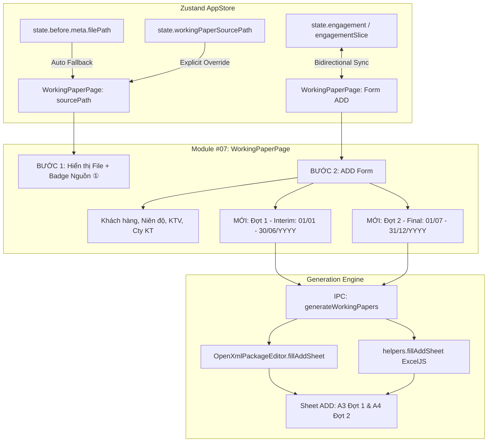

# Kế Hoạch: Tự Động Nhận Diện NKC Trước Điều Chỉnh & Bổ Sung 2 Đợt Kiểm Toán (Sheet ADD)

## 1. Bối Cảnh & Vấn Đề Thực Tế
1. **Chưa tự nhận diện NKC Trước Điều Chỉnh:**
   - Người dùng đã nạp file NKC ở **Bước 1 (Setup/Nhập liệu)** hoặc đã chạy phân tích ở các module trước (dữ liệu lưu trong `state.before.meta.filePath` hoặc `state.before.cfg.filePath`).
   - Tuy nhiên khi mở **Module #07 (Lập 15 Giấy Làm Việc)**, ô nạp file kế toán vẫn trống trơn, buộc kiểm toán viên phải bấm chọn file từ đầu từ máy tính.
   - Nguyên nhân: `WorkingPaperPage.tsx` chỉ đọc `state.workingPaperSourcePath` (vốn chỉ set khi đi qua một nút tắt cũ đã ẩn), thiếu cơ chế fallback tự động lấy `state.before.meta?.filePath`.

2. **Thiếu thông tin 2 Đợt kiểm toán trên giao diện Sheet ADD:**
   - Trong chuẩn mực kiểm toán và template Giấy làm việc VACPA, sheet `ADD` luôn có **2 đợt**: Ô `A3` (Đợt 1) và Ô `A4` (Đợt 2).
   - Tại backend (`OpenXmlPackageEditor.ts` & `helpers.ts`), hệ thống đang tự động sinh cố định:
     - `A3`: `Đợt 1: 01/01 - 30/06/{Năm}`
     - `A4`: `Đợt 2: 01/07 - 31/12/{Năm}`
   - Nhưng trên giao diện **BƯỚC 2: Thông Tin Hồ Sơ Kiểm Toán (ADD)**, không có 2 ô này khiến KTV tưởng hệ thống không hỗ trợ 2 đợt, đồng thời không thể chỉnh sửa khi khách hàng có kỳ soát xét khác (ví dụ: 9 tháng, hoặc năm tài chính lệch).
   - Hơn nữa, `WorkingPaperPage.tsx` đang dùng các `useState` cục bộ thay vì đồng bộ 2 chiều với `engagementSlice` (vốn đã hiển thị trên thanh Header của toàn app).

---

## 2. Kiến Trúc & Luồng Dữ Liệu

---

## 3. Lộ Trình Triển Khai

| Phase | Trọng Tâm | Files Tác Động | Thời Gian |
|---|---|---|---|
| [**Phase 01**](./phase-01-auto-load-nkc-source.md) | Tự động nhận diện file NKC Trước điều chỉnh từ `store.before` & badge UI | `src/renderer/pages/WorkingPaperPage.tsx` | 25m |
| [**Phase 02**](./phase-02-engagement-two-periods-sync.md) | Bổ sung 2 trường Đợt 1 & Đợt 2 vào BƯỚC 2, sync với `engagementSlice` | `src/renderer/pages/WorkingPaperPage.tsx` `src/renderer/components/EngagementModal.tsx` | 30m |
| [**Phase 03**](./phase-03-backend-openxml-add-filler-and-testing.md) | Tích hợp backend OpenXML/ExcelJS ghi nhận `auditPeriod1` & `auditPeriod2` + Unit tests | `src/domain/workingpaper/openxml/OpenXmlPackageEditor.ts` `src/domain/workingpaper/helpers.ts` `tests/workingpaper-add-periods.test.ts` | 35m |

---

## 4. Tiêu Chuẩn Nghiệm Thu (Acceptance Criteria)
1. **Tự động nhận diện file:** Khi đã nạp file NKC ở Nguồn ① (Setup/Nhập liệu), mở Module #07 thì file tự động được nạp vào BƯỚC 1, hiển thị tên file và badge màu xanh: *"Đã tự động nhận diện từ NKC Trước điều chỉnh (Nguồn ①)"*.
2. **Khả năng đổi file:** KTV vẫn có thể bấm *"Đổi file khác"* hoặc kéo thả file khác vào BƯỚC 1 bình thường.
3. **Hiển thị 2 Đợt kiểm toán:** BƯỚC 2 hiển thị rõ ràng 2 ô nhập liệu:
   - `Đợt 1 (Interim):` (mặc định `01/01 - 30/06/YYYY` theo niên độ)
   - `Đợt 2 (Final):` (mặc định `01/07 - 31/12/YYYY` theo niên độ)
4. **Đồng bộ Niên độ & Đợt:** Khi đổi niên độ (ví dụ `31/12/2025`), 2 ô đợt tự động cập nhật năm tương ứng nếu KTV chưa chỉnh tay.
5. **Ghi đúng vào Sheet ADD:** File Excel xuất ra có ô `A3` và `A4` ghi chính xác giá trị Đợt 1 và Đợt 2 mà KTV đã cấu hình.
6. **Không phát sinh hồi quy:** 100% test suite pass (`npx vitest run`) và `npm run typecheck` sạch lỗi.
