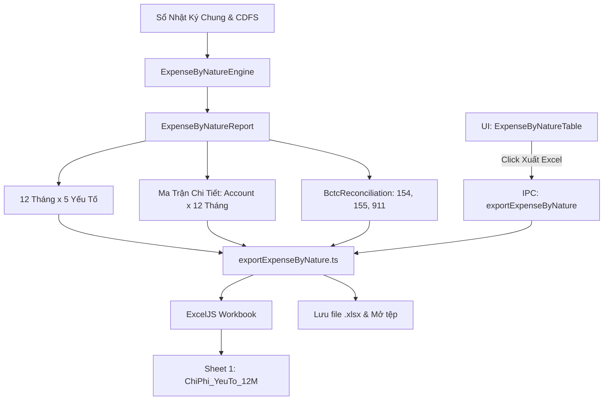

# Kế Hoạch: Xuất Excel Ma Trận Chi Phí Theo Yếu Tố (Bố Cục Dọc - Ngang & Chi Tiết Tài Khoản)

## 1. Bối Cảnh & Yêu Cầu Người Dùng
- **Hiện trạng:** Phân hệ *Phân Tích Sổ NKC (VSA 520)* đã có bảng *Ma Trận Chi Phí Theo Yếu Tố 12 Tháng & Cân Đối Thuyết Minh BCTC* hiển thị trên giao diện nhưng **chưa có nút xuất Excel**.
- **Yêu cầu cụ thể của kiểm toán viên:**
  1. **Bố cục chuẩn:** Xuất theo dạng dọc (Tháng theo hàng dọc từ Tháng 01 $\rightarrow$ Tháng 12 và CẢ NĂM), chi tiết tài khoản theo hàng ngang (các cột tài khoản chi tiết gom theo 5 cụm yếu tố chi phí).
  2. **Minh bạch tài khoản:** Thể hiện rõ ràng từng tài khoản chi tiết thực tế có phát sinh trong kỳ (`621`, `6272`, `622`, `6271`, `6274`, `6277`, `6278`, `641x`, `642x`...) để KTV phục vụ công tác giải trình và lưu trữ hồ sơ kiểm toán.
  3. **Tích hợp bảng Thuyết minh BCTC:** Đặt song song hoặc đi kèm bảng cân đối luân chuyển kho 154, 155 và kết chuyển 911 kèm số chênh lệch kiểm tra.

---

## 2. Kiến Trúc & Bố Cục Tệp Excel

### 2.1. Cấu Trúc Bảng Dọc - Ngang (Worksheet `ChiPhi_YeuTo_12M`)
- **Hàng (Trục dọc):**
  - Hàng 1-5: Tiêu đề công ty, niên độ, tên báo cáo chuẩn VAS 01 / Thông tư 200 Mục 28.
  - Hàng 6-7: Tiêu đề cột 2 tầng (Tầng 1: Tên yếu tố chi phí; Tầng 2: Mã TK & Tên TK con).
  - Hàng 8-19: 12 dòng tương ứng `Tháng 01` $\rightarrow$ `Tháng 12`.
  - Hàng 20: Dòng tổng cộng `CẢ NĂM` (dùng công thức Excel `=SUM()`).
- **Cột (Trục ngang 2 tầng):**
  - Cột A: `KỲ KẾ TOÁN` (`Tháng 01` .. `Tháng 12`, `CẢ NĂM`).
  - Cụm 1: `I. NGUYÊN VẬT LIỆU` $\rightarrow$ Cột con: `621`, `6272`, `6412`, `6422`... $\rightarrow$ Cột `TỔNG NVL`.
  - Cụm 2: `II. NHÂN CÔNG` $\rightarrow$ Cột con: `622`, `6271`, `6411`, `6421`, `338`... $\rightarrow$ Cột `TỔNG NHÂN CÔNG`.
  - Cụm 3: `III. KHẤU HAO TSCĐ` $\rightarrow$ Cột con: `6274`, `6414`, `6424`... $\rightarrow$ Cột `TỔNG KHẤU HAO`.
  - Cụm 4: `IV. DỊCH VỤ MUA NGOÀI` $\rightarrow$ Cột con: `6277`, `6417`, `6427`... $\rightarrow$ Cột `TỔNG DỊCH VỤ`.
  - Cụm 5: `V. CHI PHÍ KHÁC BẰNG TIỀN` $\rightarrow$ Cột con: `6278`, `6418`, `6428`... $\rightarrow$ Cột `TỔNG KHÁC`.
  - Cột Tổng: `TỔNG 5 YẾU TỐ CHI PHÍ` (công thức `=SUM()` các cột tổng nhóm).
  - Cột Spacer (trống) ngăn cách.
  - Khối Cân Đối: `BẢNG ĐỐI CHIẾU THUYẾT MINH BCTC` (Cộng 5 yếu tố, $\pm 154, \pm 155$, đối ứng Nợ 911, và Độ lệch kiểm tra).

---

## 3. Lộ Trình Triển Khai

| Phase | Trọng Tâm | Files Tác Động | Thời Gian |
|---|---|---|---|
| [**Phase 01**](./phase-01-engine-account-matrix-breakdown.md) | Mở rộng `ExpenseByNatureEngine` bóc tách ma trận tài khoản con $\times$ 12 tháng | `src/domain/analytics/ExpenseByNatureEngine.ts` `src/domain/analytics/types.ts` | 30m |
| [**Phase 02**](./phase-02-exceljs-exporter-vertical-layout.md) | Xây dựng bộ tạo file ExcelJS `exportExpenseByNature.ts` bố cục dọc-ngang chuyên nghiệp | `src/infrastructure/excel/exportExpenseByNature.ts` | 45m |
| [**Phase 03**](./phase-03-ui-button-and-ipc-bridge.md) | Đấu nối IPC qua main/preload & thêm nút xuất Excel trên `ExpenseByNatureTable.tsx` | `src/shared/ipc.ts` `src/preload/index.ts` `src/main/index.ts` `src/renderer/components/Analytics/ExpenseByNatureTable.tsx` | 35m |

---

## 4. Tiêu Chuẩn Nghiệm Thu (Acceptance Criteria)
1. **Nút bấm trực quan:** Trên thanh tiêu đề của component `ExpenseByNatureTable.tsx` có nút **`[📥 Xuất Excel Ma Trận Chi Tiết]`** nổi bật, kèm icon spreadsheet.
2. **Bố cục file Excel chuẩn 100%:**
   - Trục dọc: Đủ 12 dòng `Tháng 01` $\rightarrow$ `Tháng 12` và dòng `CẢ NĂM`.
   - Trục ngang: Hiển thị đầy đủ từng tài khoản con thực tế có phát sinh trong sổ sách (ví dụ: `621`, `6272`, `622`, `6271`, `6274`, `6277`, `6278`...) gom theo đúng 5 khối yếu tố.
   - Bảng đối chiếu Thuyết minh BCTC nằm ngay cạnh bảng ma trận với công thức `=SUM`, tính đúng độ lệch với số kết chuyển Nợ 911.
3. **Định dạng số và thẩm mỹ:** Số tiền có phân cách hàng nghìn (`#,##0`), tiêu đề tô màu nhận diện 5 khối kiểm toán, viền bảng nét mảnh chuẩn mực.
4. **Kiểm thử:** Unit test cho engine và exporter pass 100%, `npm run typecheck` sạch lỗi.
