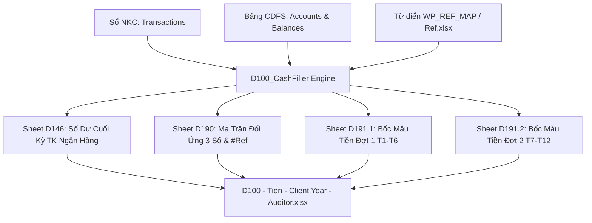

# KẾ HOẠCH NÂNG CẤP TỰ ĐỘNG HÓA GIẤY LÀM VIỆC D100 (TIỀN & TƯƠNG ĐƯƠNG TIỀN)

## 1. Tổng Quan & Mục Tiêu
Nâng cấp logic trong `D100_CashFiller.ts` để tự động bóc tách số liệu từ **Sổ Nhật Ký Chung (NKC)** và **Bảng Cân Đối Số Phát Sinh (CDFS)**, hoàn thiện trọn vẹn 4 sheet nghiệp vụ cốt lõi của Giấy làm việc `D100 - Tien - Mau 2024 - Thinh.xlsx`:
1. **Sheet `D146`**: Tự động đổ danh mục tài khoản ngân hàng chi tiết (`1121x`, `1122x`, `1281x`), tên tài khoản và số dư cuối kỳ (VND) vào **Cột C**.
2. **Sheet `D 190`**: Tổng hợp phát sinh Nợ/Có theo tài khoản đối ứng rút gọn về **3 chữ số**, tính số tiền, tỷ lệ % và tự động gán mã tham chiếu kiểm toán **`#Ref` (TC)** chuẩn mực lấy từ `Ref.xlsx`.
3. **Sheet `D 191.1`**: Bốc mẫu kiểm tra chi tiết các giao dịch **Đợt 1 (01/01 đến 30/06)**.
4. **Sheet `D 191.2`**: Bốc mẫu kiểm tra chi tiết các giao dịch **Đợt 2 (01/07 đến 31/12)**.

## 2. Kiến Trúc & Sơ Đồ Luồng Dữ Liệu

## 3. Danh Sách Các Pha Thực Hiện
- **[Pha 1: Sheet D146](phase-01-d146-bank-balances.md)**: Đổ danh sách tài khoản 112, 128 và số dư cuối kỳ vào Cột C (Row 22-31 và Row 42-51).
- **[Pha 2: Sheet D190](phase-02-d190-3digit-counterparts.md)**: Thuật toán gom nhóm đối ứng 3 chữ số, tính tỷ trọng và ánh xạ mã `#Ref` tham chiếu.
- **[Pha 3: Sheet D191.1 & D191.2](phase-03-d191-sample-selection.md)**: Phân tách dữ liệu theo mốc thời gian Đợt 1 (tháng 1..6) và Đợt 2 (tháng 7..12), bốc mẫu giao dịch lớn và điền vào form mẫu.
- **[Pha 4: Kiểm thử & Nghiệm thu](phase-04-verification.md)**: Chạy test sinh file thực tế, kiểm tra định dạng cell `value = null`, đảm bảo mở bằng MS Excel không phát sinh lỗi.
