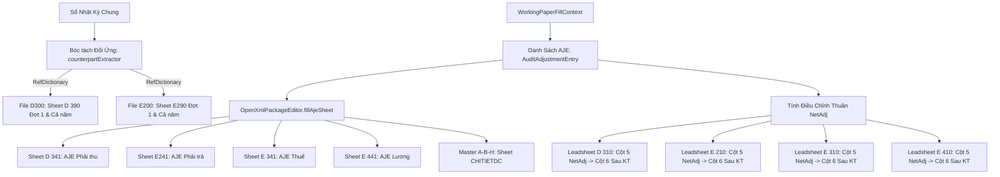

# Kế Hoạch: Bảng Phân Tích Đối Ứng (D390, E290) & Tự Động Hóa Toàn Diện AJE (x41 & CHITIETDC)

## 1. Bối Cảnh & Mục Tiêu

Hệ thống sinh Giấy làm việc (GLV) của AuditSoft hiện đã tự động hóa thành công **15 bộ hồ sơ kiểm toán VACPA** và đang hoạt động ổn định trên môi trường thực tế (production). Để tiếp tục hoàn thiện tính năng này theo chuẩn mực kiểm toán Việt Nam (VSA) mà **không làm gián đoạn hay ảnh hưởng đến tính khả dụng hiện tại**, kế hoạch này tập trung vào 3 mắt xích nghiệp vụ quan trọng nhất:

1. **Bảng phân tích đối ứng 3 số chuyên sâu (`D 390` & `E 290`):**
   - Tự động bóc tách cơ cấu tài khoản đối ứng cho 2 khoản mục trọng yếu nhất: Phải thu khách hàng (TK 131) và Phải trả người bán (TK 331).
   - Tách biệt rõ ràng 2 kỳ: **Đợt 1** (Tháng 01 - 06) và **Cả năm** (Tháng 01 - 12).
   - Phân tách vế **Phát sinh Nợ** và **Phát sinh Có**, tự động liên kết mã tham chiếu W/P Ref (`RefDictionary.ts`).
2. **Tự động đổ bút toán AJE vào toàn bộ các sheet `x41`:**
   - Xây dựng phương thức dùng chung `OpenXmlPackageEditor.fillAjeSheet`.
   - Điền tự động vào `D341` (TK 131, 2293), `E241` (TK 331, 338, 352), `E341` (TK 133, 333), `E441` (TK 334, 335, 338).
   - Điền `"Không phát sinh."` nếu danh sách điều chỉnh rỗng để đáp ứng chuẩn hồ sơ kiểm toán.
3. **Đổ toàn bộ AJE vào Master `CHITIETDC` và cập nhật Cột 5/6 trên các Leadsheet `*10`:**
   - Tập hợp 100% bút toán AJE vào sheet `CHITIETDC` của file Master `A - B - H`.
   - Tính số điều chỉnh thuần (Net Adjustment) theo từng tài khoản và điền vào Cột 5 của các bảng Leadsheet `*10` (`D 310`, `E 210`, `E 310`, `E 410`).

---

## 2. Kiến Trúc Hệ Thống & Luồng Dữ Liệu

---

## 3. Danh Sách Các Pha Thực Hiện

| Pha | Tiêu Đề & Nội Dung | File Chi Tiết | Ước Lượng |
|---|---|---|---|
| **Pha 1** | Bóc tách đối ứng và gán W/P Ref cho `D 390` (TK 131) và `E 290` (TK 331) cho cả Đợt 1 và Cả năm | [phase-01-d390-e290-counterparts.md](./phase-01-d390-e290-counterparts.md) | 45m |
| **Pha 2** | Xây dựng `fillAjeSheet` trong `OpenXmlPackageEditor` và đổ AJE vào `D341`, `E241`, `E341`, `E441` | [phase-02-fill-aje-sheets.md](./phase-02-fill-aje-sheets.md) | 45m |
| **Pha 3** | Đổ 100% AJE vào Master `CHITIETDC` và tính điều chỉnh thuần Cột 5/6 cho các Leadsheet `*10` | [phase-03-master-chitietdc-and-leadsheet-adj.md](./phase-03-master-chitietdc-and-leadsheet-adj.md) | 45m |
| **Pha 4** | Kiểm thử tự động Vitest & kiểm thử mở thực tế qua Microsoft Excel COM trên Windows | [phase-04-verification-and-testing.md](./phase-04-verification-and-testing.md) | 30m |

---

## 4. Quản Lý Rủi Ro & Nguyên Tắc Bảo Vệ Tính Khả Dụng (Non-Regression)

1. **Rủi ro lỗi XML khi chèn dòng điều chỉnh:**
   - *Biện pháp:* Sử dụng cơ chế ghi đè ô của `OpenXmlPackageEditor` thay vì chèn node XML mới gây lệch tham chiếu `sheetData`. Giữ nguyên các hàng công thức tổng và định dạng có điều kiện.
2. **Rủi ro không có dữ liệu AJE trong các cuộc kiểm toán sơ bộ:**
   - *Biện pháp:* Khi danh sách AJE rỗng, hệ thống tự động ghi `"Không phát sinh."` vào dòng đầu tiên, không để ô lỗi hoặc bảng biểu trống trơn.
3. **Bảo tồn 100% tính năng sinh GLV đang chạy:**
   - Mọi thay đổi code đều tuân thủ nguyên tắc Additive (bổ sung có điều kiện), không làm thay đổi luồng sinh của 13 file GLV khác.
