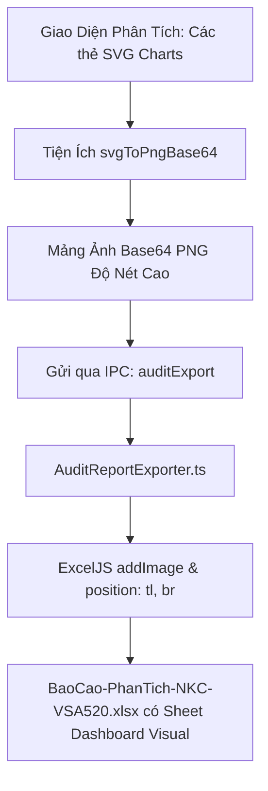

# KẾ HOẠCH NHÚNG TOÀN BỘ BIỂU ĐỒ (CHARTS) VÀO BÁO CÁO EXCEL PHÂN TÍCH

## 1. Mục Tiêu
Giải quyết dứt điểm phản hồi *"File Excel xuất ra không giống giao diện, thiếu biểu đồ chart"*. Sau khi hoàn thành, file Excel xuất ra từ phân hệ Phân Tích Sổ NKC (VSA 520) sẽ có thêm Sheet **`00_Dashboard_Visual`** chứa đầy đủ hình ảnh các biểu đồ tài chính sắc nét giống 100% trên màn hình phần mềm:
1. **Biểu đồ 1**: Combo Doanh thu & Biên lãi gộp 12 tháng (`RevenueCogsComboChart`).
2. **Biểu đồ 2**: Thác nước Lợi nhuận (`ProfitWaterfallChart`).
3. **Biểu đồ 3**: Cơ cấu chi phí sản xuất & giá vốn Stacked Bar (`CogsStructureStackedChart`).
4. **Biểu đồ 4**: Tỷ trọng chi phí hoạt động OPEX / Doanh thu (`OpexRatioAreaChart`).
5. **Biểu đồ 5**: Biến động các chỉ tiêu trọng yếu YoY (`KqkdYoYChart`).

## 2. Kiến Trúc Luồng Dữ Liệu

## 3. Danh Sách Các Pha
- **[Pha 1: Converter SVG sang PNG](phase-01-svg-to-png-converter.md)**: Xây dựng hàm chụp thẻ `<svg>` của các component Chart qua HTML5 Canvas và xuất ra buffer/base64.
- **[Pha 2: Mở rộng IPC](phase-02-ipc-chart-payload.md)**: Cập nhật `AuditExportRequest` và `auditExportSchema` để nhận thêm trường `chartImages?: Array<{ id: string; title: string; pngBase64: string }>`.
- **[Pha 3: Nhúng ảnh vào Excel](phase-03-embed-charts-in-excel.md)**: Dựng sheet `00_Dashboard_Visual` trong `AuditReportExporter.ts`, dùng `wb.addImage()` và tính toán tọa độ lưới ô (row, col) để xếp các biểu đồ thành 2 cột cân đối.
- **[Pha 4: Kiểm thử & Hoàn tất](phase-04-verification.md)**: Kiểm thử xuất file thực tế, kiểm tra độ sắc nét của hình ảnh và biên dịch `npm run build`.
