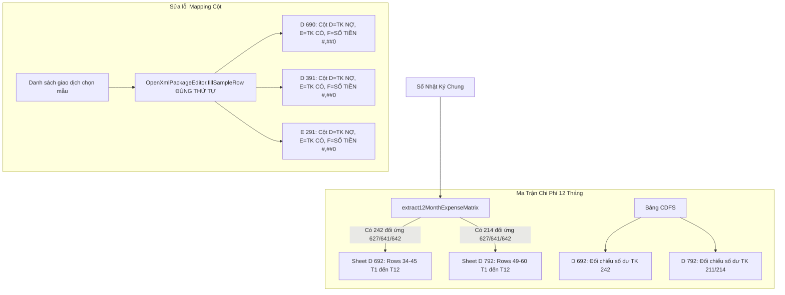

# Kế Hoạch: Khắc Phục Lỗi Format Mapping Cột & Tự Động Hóa Ma Trận Chi Phí 12 Tháng (D692, D792)

## 1. Bối Cảnh & Chẩn Đoán Hai Lỗi Nghiêm Trọng

Dựa trên 2 hình ảnh chụp từ thực tế của người dùng:
1. **Lỗi format mapping cột tại các sheet chọn mẫu (`D 690`, `D 391`, `E 291`...):**
   - Hàm `fillSampleRow` trong `OpenXmlPackageEditor` đang gán nhầm: Cột 4 nhận Số tiền, Cột 5 nhận TK Nợ, Cột 6 nhận TK Có.
   - Khiến số tiền hàng tỷ đồng nhảy vào cột `TK NỢ`, mã tài khoản `2422` nhảy vào cột `TK CÓ`, và `331104` nhảy vào cột `Số PS`.
   - Cột Ngày tháng bị cắt cụt ký tự năm (`29/04/202`) do độ rộng cột A hẹp.
2. **Sheet `D 692` và `D 792` hoàn toàn trống trơn bảng ma trận 12 tháng:**
   - Cả hai filler `D600_PrepaidFiller` và `D700_FixedAssetFiller` chưa bóc tách phát sinh theo 12 tháng của chi phí phân bổ (Có 242) và chi phí khấu hao (Có 214) đối ứng Nợ 627, 641, 642.
   - Khiến bảng đối chiếu 12 tháng không có số liệu, chênh lệch không được tính toán.

---

## 2. Kiến Trúc & Luồng Xử Lý

---

## 3. Danh Sách Các Pha Triển Khai

| Pha | Tiêu Đề | File Tác Động | Ước Lượng |
|---|---|---|---|
| **Pha 1** | Sửa triệt để hàm cốt lõi `fillSampleRow` (Cột D: TK Nợ, E: TK Có, F: Số tiền) và chống cắt cụt ngày tháng | `src/domain/workingpaper/openxml/OpenXmlPackageEditor.ts` | 30m |
| **Pha 2** | Xây dựng engine bóc tách ma trận chi phí 12 tháng `extract12MonthExpenseMatrix` cho TK 242 và 214 | `src/domain/workingpaper/counterpartExtractor.ts` `tests/unit/counterpartExtractor.test.ts` | 30m |
| **Pha 3** | Tự động hóa hoàn toàn Sheet `D 692` (Đối chiếu số dư & Ma trận 12 tháng TK 242) | `src/domain/workingpaper/fillers/D600_PrepaidFiller.ts` | 40m |
| **Pha 4** | Tự động hóa hoàn toàn Sheet `D 792` (Đối chiếu số dư 211/214 & Ma trận khấu hao 12 tháng) | `src/domain/workingpaper/fillers/D700_FixedAssetFiller.ts` | 40m |
| **Pha 5** | Kiểm thử tự động Vitest & kiểm thử trực quan trên Microsoft Excel COM (Windows) | `tests/unit/counterpartExtractor.test.ts` `scripts/verify-d690-d692-d792-com.ts` | 30m |

---

## 4. Quản Lý Rủi Ro & Đảm Bảo Tính Toàn Vẹn

1. **Bảo tồn công thức Excel trên mẫu:**
   - Cột E trên `D 692` và `D 792` (`=SUM(B...:D...)`) và các cột chênh lệch (`=E...-G...`) không bị ghi đè, để Excel tự động tính toán.
2. **Khớp số 100% với Sổ cái:**
   - Tổng 12 tháng của ma trận chi phí luôn được kiểm chứng chéo với số phát sinh Có trên Bảng cân đối số phát sinh (CDFS).
