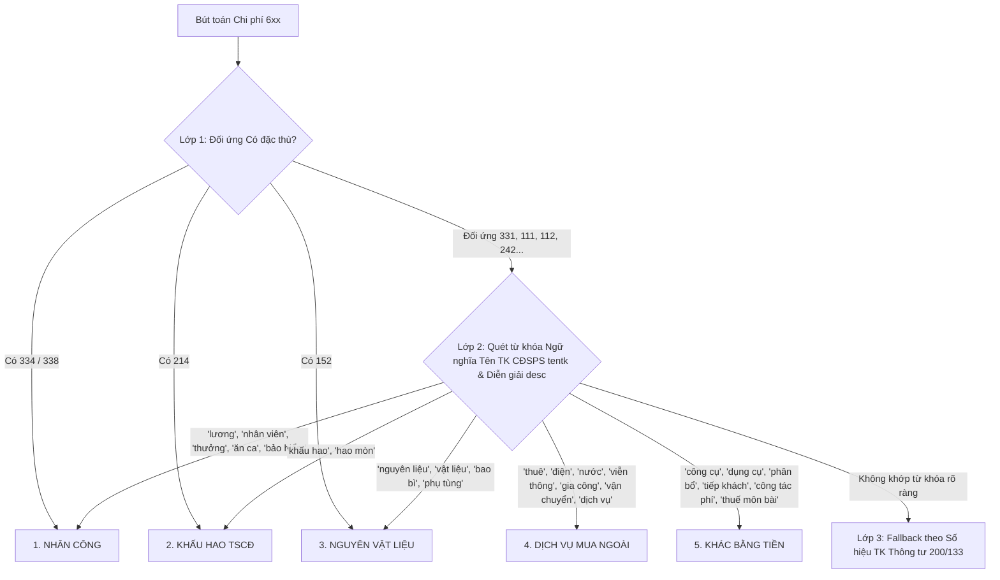

# Kế Hoạch Nâng Cấp Bóc Chi Phí Theo Yếu Tố Bằng Ngữ Nghĩa Tên TK CĐSPS (Semantic Expense-By-Nature)

## 1. Bối Cảnh & Vấn Đề (Problem Statement)
- Hiện tại, `ExpenseByNatureEngine.ts` bóc tách 5 yếu tố chi phí (NVL, Nhân công, Khấu hao, Dịch vụ mua ngoài, Khác bằng tiền) chủ yếu dựa trên:
  1. Số hiệu tài khoản cố định theo Thông tư 200 (Prefix: `621`, `622`, `6271`, `6272`, `6411`, `6421`...).
  2. Tài khoản đối ứng dòng tiền/tài sản (`Có 334/338`, `Có 214`, `Có 152`).
- **Hạn chế thực tế:** Dù `cdfsAccounts` (dữ liệu CĐSPS) đã được truyền vào engine, hệ thống chỉ dùng trường `tentk` để làm nhãn in ra bảng hiển thị, **chưa hề tham gia vào thuật toán bóc tách phân loại**.
- Do mỗi doanh nghiệp (dùng MISA, FAST, BRAVO, SAP...) mở tiểu khoản và đặt tên rất khác nhau:
  - Công ty mở `64281` đặt tên là *"Chi phí ăn ca, khám sức khỏe nhân viên"* $\rightarrow$ Máy móc xếp vào **Khác bằng tiền** (sai bản chất Nhân công).
  - Công ty may mặc mở `6422` đặt tên là *"Chi phí gia công in thêu thuê ngoài"* $\rightarrow$ Máy móc xếp vào **Nguyên vật liệu** (sai bản chất Dịch vụ ngoài).
  - Công ty mở `6423` đặt tên là *"Sửa chữa máy photocopy văn phòng"* $\rightarrow$ Máy móc xếp vào **Khác bằng tiền** (sai bản chất Dịch vụ ngoài).

## 2. Giải Pháp: Bộ Phân Loại Chi Phí 3 Lớp (Semantic Hybrid Engine)

## 3. Lộ Trình Triển Khai (Phased Roadmap)

| Phase | Mục tiêu | File chính |
| :--- | :--- | :--- |
| **Phase 1** | Xây dựng Bộ Từ Điển Ngữ Nghĩa Kiểm Toán Tiếng Việt & Hàm Chuẩn Hóa Chuỗi | `src/domain/analytics/ExpenseByNatureEngine.ts` |
| **Phase 2** | Tích hợp Tên TK CĐSPS (`tentk`) & Diễn giải NKC (`desc`) vào Cây Quyết Định 3 Lớp | `src/domain/analytics/ExpenseByNatureEngine.ts` |
| **Phase 3** | Viết Unit Test cho các case thực tế dị biệt, kiểm thử cân đối BCTC Thuyết minh & Nghiệm thu | `tests/expense-by-nature.test.ts` |

## 4. Tiêu Chí Nghiệm Thu
- [ ] Mọi tiểu khoản mở dị biệt có tên rõ ràng (ví dụ: `64281` có chữ *nhân viên / ăn ca*) được xếp chính xác vào **Nhân công** thay vì Khác bằng tiền.
- [ ] Các tiểu khoản gia công ngoài / thuê ngoài đặt ở `6422`, `6272` được xếp chính xác vào **Dịch vụ mua ngoài** thay vì Nguyên vật liệu.
- [ ] Đối với doanh nghiệp chuẩn Thông tư 200 không có tên đặc biệt, hệ thống hoạt động chính xác 100% theo quy tắc fallback.
- [ ] Bảng kiểm tra cân đối Thuyết minh BCTC (`bctcReconciliation.isBalanced`) vẫn đảm bảo cân bằng tuyệt đối giữa Chi phí yếu tố và Tổng phát sinh P&L.
- [ ] 100% test suite và typecheck vượt qua không lỗi.
