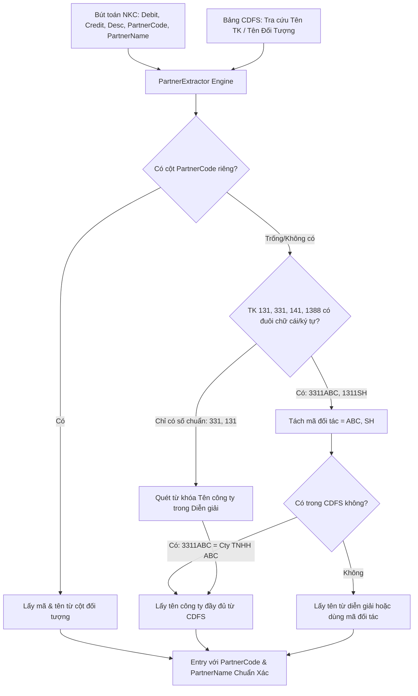

# KẾ HOẠCH BÓC TÁCH MÃ & TÊN ĐỐI TƯỢNG TỰ ĐỘNG TỪ TÀI KHOẢN KẾ TOÁN

## 1. Bối Cảnh & Vấn Đề Thực Tế
Trong thực tế kế toán doanh nghiệp tại Việt Nam:
- Rất nhiều doanh nghiệp **không theo dõi cột "Mã đối tượng" riêng** trong Sổ Nhật Ký Chung (cột Mã KH/Mã NCC bị để trống hoặc không tồn tại trong file Excel).
- Thay vào đó, kế toán gắn trực tiếp mã định danh đối tác vào đuôi của tài khoản công nợ:
  * Ví dụ: `3311ABC` (NCC ABC), `3311DBL` (Công ty Đông Bảo Lực), `3311HTK` (Hưng Thịnh Khang)...
  * Ví dụ: `1311SH` (Khách hàng Sheng Huei), `1311HLVT` (Thực Nghiệp HL-VT), `1311DBL`...
  * Ví dụ: `1411NGUYEN_A`, `1388_CTYB`...
- Hậu quả trước đây: Các phân hệ **Phân tích Pareto (Top KH & Top NCC)**, **Rà soát chi tiền mặt chia nhỏ cùng ngày cùng NCC (NĐ 181)** và **Giấy làm việc công nợ D351/E250** không nhận diện được đối tượng, dẫn đến bị dồn chung vào nhãn *"Khách hàng vãng lai"* hoặc *"Nhà cung cấp khác"*.

## 2. Kiến Trúc Giải Pháp 3 Tầng Nhận Diện

## 3. Danh Sách Các Pha Thực Hiện
- **[Pha 1: Thuật toán PartnerExtractor](phase-01-partner-extractor-engine.md)**: Xây dựng hàm `extractPartnerFromAccount` và `extractPartnerNameFromCdfsOrDesc`.
- **[Pha 2: Tích hợp Pipeline](phase-02-integrate-pipeline.md)**: Nối vào `standardizeSource` (Frontend/Clipboard) và `JournalNormalizer` (Backend/Main Process).
- **[Pha 3: Nâng cấp Analytics & Tax Risk](phase-03-update-analytics-and-taxrisk.md)**: Cập nhật `ConcentrationAnalyzer` (Pareto) và `CashTaxRiskScanner` (NĐ 181) để tận dụng mã đối tác mới bóc tách.
- **[Pha 4: Kiểm thử & Nghiệm thu](phase-04-verification.md)**: Viết script test với các mẫu tài khoản `3311ABC`, `1311XYZ`, `1411NAM` và chạy `npm run build`.
