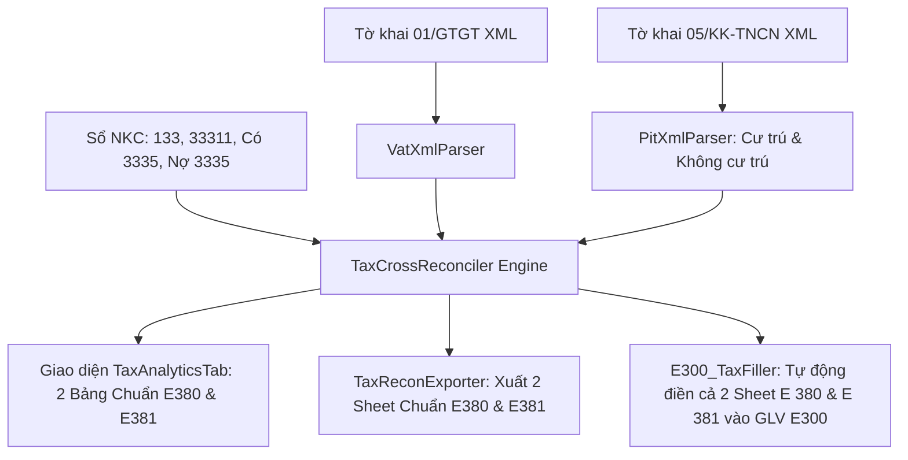

# CHUẨN HÓA 2 MẪU ĐỐI CHIẾU THUẾ: GTGT (MẪU E380) & TNCN (MẪU E381)

## 1. Tổng Quan & Bối Cảnh Nghiệp Vụ
Người dùng (Kiểm toán viên) phản hồi chính xác về chuẩn mực kiểm toán VACPA:
- **Bảng Thuế TNCN trước đây:** Đang đối chiếu chỉ tiêu [21] với Chi phí lương (Có 334). Điều này không đúng với mẫu hồ sơ kiểm toán chuẩn mực VACPA, vì [21] chỉ là phần thu nhập chịu thuế (loại trừ các khoản phụ cấp miễn thuế), không đại diện cho toàn bộ quỹ lương và không nằm trong mẫu đối chiếu thuế TNCN.
- **Hai Mẫu Chuẩn Được Cung Cấp:**
  1. **Mẫu E380 (Ảnh 2 - Thuế GTGT):** Đối chiếu 12 tháng đầy đủ (Đầu kỳ, Tháng 1..12, CỘNG) giữa Tờ khai 01/GTGT (Đầu vào [25], Đầu ra [35], Điều chỉnh Tăng [38], Giảm [37], Xin hoàn [42], Phải nộp [40], Số dư [43]) với Sổ kế toán (PS Nợ 133*, CL, PS Có 33311, CL).
  2. **Mẫu E381 (Ảnh 3 - Thuế TNCN):** Đối chiếu nghĩa vụ thuế TNCN TK 3335 theo kỳ (Đk, Tháng 1..12 / Quý, TC):
     - **Tờ khai:** Thuế khấu trừ cá nhân cư trú + Cá nhân không cư trú = Tổng thuế khấu trừ (1)
     - **Sổ sách:** Thuế khấu trừ (2) (Phát sinh Có TK 3335)
     - **Chênh lệch:** (1) - (2)
     - **Đã nộp:** Phát sinh Nợ TK 3335 (nộp vào NSNN)
     - **Còn phải nộp:** Số dư Có TK 3335 cuối kỳ (Lũy kế: Dư Đk + Khấu trừ Có 3335 - Đã nộp Nợ 3335).

---

## 2. Kiến Trúc & Luồng Dữ Liệu Đồng Bộ

---

## 3. Danh Sách Các Pha Thực Hiện
- **[Pha 1: Types & PitXmlParser](phase-01-tax-types-and-pit-xml-parser.md)**: Mở rộng `PitDeclarationSnapshot` với thuế khấu trừ cá nhân cư trú và không cư trú.
- **[Pha 2: TaxCrossReconciler Engine](phase-02-reconciliation-engine-gtgt-and-tncn.md)**: Bóc tách Nợ 3335 (Đã nộp), tính lũy kế Còn phải nộp, chuẩn hóa VAT 12 tháng E380 và TNCN E381.
- **[Pha 3: Giao diện TaxAnalyticsTab](phase-03-ui-redesign-tax-analytics-tab.md)**: Bỏ quỹ lương 334, tái cấu trúc bảng TNCN chuẩn 8 cột theo Ảnh 3 và bảng GTGT theo Ảnh 2.
- **[Pha 4: Xuất Excel & GLV E300](phase-04-excel-export-and-glv-e381-filler.md)**: Xuất Excel 2 sheet `E380_GTGT` & `E381_TNCN`, tự động điền sheet `E 381` trong GLV `E300 - Thue`.
- **[Pha 5: Kiểm thử Vitest](phase-05-verification-and-tests.md)**: Cập nhật và bổ sung unit tests đảm bảo 100% test pass.
