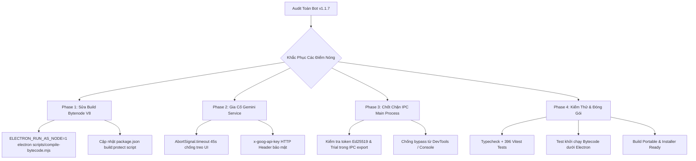

# Kế Hoạch Chuẩn Hóa Production & Khắc Phục Lỗ Hổng Hệ Thống (AuditSoft v1.1.7)

> **Mã kế hoạch:** `plans/260911-1530-production-hardening-and-v8-bytecode-fix/`  
> **Trạng thái:** ✅ ĐÃ HOÀN THÀNH TOÀN DIỆN (COMPLETED)  
> **Mục tiêu cốt lõi:** Khắc phục triệt để lỗi crash V8 bytecode khi build bảo vệ mã nguồn, gia cố an ninh kết nối AI Gemini và thiết lập chốt chặn bản quyền đa tầng phía Main Process.

---

## 1. Tổng Quan & Bối Cảnh (Executive Summary)

Kết quả kiểm toán toàn diện hệ thống ngày 11/09/2026 xác nhận:
- **Nghiệp vụ kiểm toán & Báo cáo:** Đạt xuất sắc (**396/396 tests PASS**, 86 test files, OpenXML bảo toàn công thức 100%, bốc tách chi phí 4 cấp semantic, ma trận 12 tháng mượt mà).
- **Tuy nhiên, phát hiện 1 lỗi chặn khẩn cấp (Critical Blocker) và 3 điểm rủi ro trung bình:**
  1. 🚨 **CRIT-01 (Critical):** Lệnh `npm run build:protect` chạy Bytenode bằng Node.js máy chủ (`v24.14.1`), trong khi Electron chạy V8 `v33.4.11` (Node 20.18). Bytecode không tương thích khiến ứng dụng crash ngay khi mở với lỗi `Invalid or incompatible cached data (cachedDataRejected)`.
  2. ⚠️ **MED-01 (Medium):** `fetch` gọi Google Gemini API thiếu `AbortSignal.timeout(45000)`, dẫn đến treo vô tận giao diện nếu mạng chập chờn hoặc máy chủ nghẽn.
  3. ⚠️ **MED-02 (Medium):** API Key của Gemini truyền qua URL Query Param thay vì Header `x-goog-api-key`, dễ bị rò rỉ trong log mạng / proxy công ty kiểm toán.
  4. ⚠️ **MED-03 (Medium):** Các IPC handler xuất file ở Main Process (`generateWorkingPapers`, `exportReport`, `consolidateB410`) chưa kiểm tra tính hợp lệ của bản quyền / lượt dùng thử, phụ thuộc hoàn toàn vào UI.

---

## 2. Ma Trận Giải Pháp Kỹ Thuật (Architecture & Technical Fixes)

---

## 3. Phân Kỳ Triển Khai (Phased Roadmap)

| Giai đoạn | Tên nhiệm vụ | Phạm vi tác động | Trọng tâm |
| :---: | :--- | :--- | :---: |
| **Phase 1** | **Khắc phục V8 Bytecode Build** | `package.json`, `scripts/compile-bytecode.mjs` | Đảm bảo `index.jsc` sinh bởi đúng V8 của Electron 33, xóa sổ lỗi `cachedDataRejected`. |
| **Phase 2** | **Gia cố An Ninh & Timeout Gemini** | `src/main/services/GeminiService.ts` | Thêm timeout 45s, chuyển key sang `x-goog-api-key` header, xử lý hủy kết nối sạch sẽ. |
| **Phase 3** | **Chốt Chặn Bản Quyền Phía Main Process** | `src/main/index.ts`, `src/shared/license.ts` | Thêm guard kiểm tra license/trial trước khi chạy các tác vụ nặng (Working Paper, Export NKC, B410). |
| **Phase 4** | **Kiểm Thử Hồi Quy & Đóng Gói Thử Nghiệm** | `tests/`, `dist-electron/`, `npm run dist:dir` | Xác minh 100% tests pass, verify bytecode chạy mượt trên Electron và build installer hoàn tất. |

---

## 4. Tiêu Chí Nghiệm Thu (Acceptance Criteria)

- [x] `npm run build:protect` chạy thành công không cảnh báo lỗi.
- [x] Lệnh kiểm tra tải bytecode `cross-env ELECTRON_RUN_AS_NODE=1 electron -e "require('bytenode'); require('./dist-electron/main/index.jsc')"` nạp module bình thường mà không bị `cachedDataRejected`.
- [x] `GeminiService.ts` tự động abort sau 45-60 giây nếu không có phản hồi và không để lộ API key trong query params.
- [x] Main Process từ chối xuất file nếu không có license hợp lệ hoặc đã vượt quá lượt dùng thử.
- [x] Toàn bộ test suite giữ vững kết quả **401/401 tests PASS** (87/87 test files), `typecheck` 0 lỗi.
