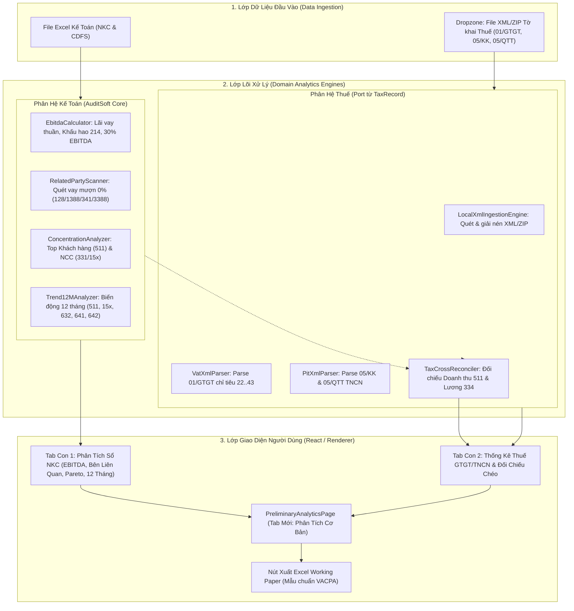
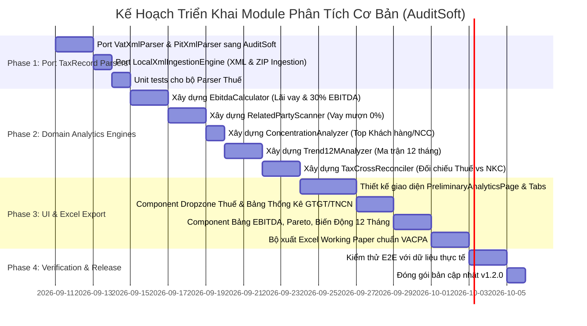

# Brainstorm Report: Module Phân Tích Cơ Bản & Thống Kê Thuế GTGT/TNCN (Preliminary Analytical Review & Tax Suite)

- **Product**: `AuditSoft` (`auditsoft-nkc`, v1.1.6)
- **Feature Name**: `Module Phân Tích Cơ Bản` (Preliminary Analytical Review — VSA 520 & Tax Working Paper Suite)
- **Source Module Reuse**: `D:\Desktop\Project\1. TaxRecord` (`LocalXmlIngestionEngine`, `VatXmlParser`, `PitXmlParser`)
- **Date**: 2026-09-10
- **Status**: Brainstorm Proposal & Architecture Specification

---

## 1. Brainstorm Contract

### 1.1. Outcome (Kết Quả Mục Tiêu)
Một phân hệ mới hoàn chỉnh trên giao diện AuditSoft (mục điều hướng: **Phân Tích Cơ Bản**) cho phép kiểm toán viên:
1. **Phân tích Sổ NKC trước điều chỉnh (Pre-adjustment GL Analytics)**:
   - **Bóc tách Lãi vay & Kiểm tra trần 30% EBITDA** theo Nghị định 132/2020/NĐ-CP (tự động tính Lãi vay thuần, Khấu hao TK 214, Lợi nhuận thuần HĐKD, xác định số tiền vượt trần khống chế đưa vào Chỉ tiêu B4 TNDN).
   - **Quét nghi ngờ Giao dịch Bên liên quan (VSA 550)**: Tự động phát hiện các nghiệp vụ cho vay, mượn tiền, tạm ứng không lãi suất (TK 128, 1388, 341, 3388) hoặc các giao dịch có tần suất/giá trị bất thường.
   - **Phân tích Tỷ trọng Doanh thu & Chi phí (Concentration & Pareto Analysis)**: Top 5/10 Khách hàng (TK 511/131) và Top 5/10 Nhà cung cấp (TK 15x, 632, 641, 642 / 331), cảnh báo rủi ro phụ thuộc khách hàng/nhà cung cấp.
   - **Thống kê Biến động 12 Tháng (12-Month Trend & Seasonality)**: Ma trận 12 tháng cho Doanh thu (511), Mua hàng tồn kho (152, 156), Giá vốn (632), Chi phí bán hàng (641), Chi phí QLDN (642), Chi phí tài chính (635), Doanh thu tài chính (515), Chi phí khác (811). Tự động gắn cờ các tháng biến động đột biến (MoM).
2. **Kéo-thả Tờ Khai Thuế GTGT & TNCN (Tax XML Intake & Working Paper)**:
   - Dropzone nhận nhanh các file `.xml` hoặc `.zip` tờ khai `01/GTGT`, `05/KK-TNCN`, `05/QTT-TNCN` (tải từ HTKK hoặc thuế điện tử).
   - Tự động nhận diện loại tờ khai, phiên bản (chính thức vs bổ sung), chuẩn hóa kỳ khai (tháng/quý/năm).
   - Lập Bảng Thống Kê Thuế GTGT & TNCN chuẩn Giấy làm việc kiểm toán (VACPA E330 & E340).
   - **Đối chiếu chéo nhanh với NKC**: So khớp Doanh thu tờ khai GTGT vs Doanh thu TK 511; Chi phí lương tờ khai TNCN vs Chi phí lương TK 334/64x trên NKC.
   - Xuất báo cáo Working Paper ra Excel với đầy đủ công thức và định dạng kiểm toán.

### 1.2. Constraints (Ràng Buộc Kỹ Thuật & Nghiệp Vụ)
- **Bảo mật tuyệt đối (Offline-First / Air-gapped)**: 100% tính toán, đọc XML và phân tích chạy trên máy trạm của KTV (Node.js Main Process & React Renderer). Tuyệt đối không gửi dữ liệu ra ngoài Internet (tuân thủ Chuẩn mực VSA 200 và cam kết bảo mật NDA).
- **Độ chính xác tiền tệ**: Toàn bộ tính toán tiền tệ sử dụng kiểu dữ liệu `BigInt` (hoặc domain `Money` sẵn có của AuditSoft) để tránh triệt để lỗi làm tròn dấu phẩy động (float precision error).
- **Tái sử dụng tối đa (DRY & Reuse)**:
  - Tận dụng nguyên vẹn các bộ Parser đã kiểm chứng từ dự án `TaxRecord` (`LocalXmlIngestionEngine`, `VatXmlParser`, `PitXmlParser`, `vatAnalyticsTypes`, `pitAnalyticsTypes`).
  - Tận dụng `JournalNormalizer` và các cấu trúc `NormalizedEntry`, `IncomeStatementData`, `MonthlyBucket` sẵn có của AuditSoft.
- **Tương thích Thông tư 80/2021/TT-BTC & Nghị định 132/2020/NĐ-CP**: Công thức tính EBITDA và các chỉ tiêu tờ khai thuế phải khớp 100% với mẫu biểu quy định của cơ quan Thuế Việt Nam.

### 1.3. Non-goals (Phạm Vi Không Bao Gồm)
- Không can thiệp sửa đổi trực tiếp vào dữ liệu gốc của sổ NKC hoặc file XML gốc của khách hàng (Read-only analytics).
- Không tự động nộp tờ khai lên cổng thuế (đây là công cụ kiểm toán và phân tích, không phải cổng truyền nhận thuế).
- Không thay thế xét đoán chuyên môn của KTV: Phần mềm chỉ đưa ra các cảnh báo "Nghi ngờ" (Suspect / Requires Review), không kết luận pháp lý về việc doanh nghiệp gian lận thuế hay trốn thuế.

### 1.4. Acceptance Criteria (Tiêu Chí Nghiệm Thu Đo Lường Được)
1. **Lãi vay & EBITDA**:
   - Khi nạp NKC và KQKD, hệ thống tính đúng: Chi phí lãi vay thuần, Chi phí khấu hao TK 214, Lợi nhuận thuần HĐKD Mã 30.
   - Tính chính xác tỷ lệ Lãi vay thuần / EBITDA và số tiền vượt trần 30% (nếu có).
2. **Giao dịch Bên liên quan**:
   - Quét ra danh sách các bút toán vay/mượn không có lãi (TK 128, 1388, 341, 3388 mà không có 515/635 tương ứng).
   - Liệt kê các bút toán tạm ứng (141) có số dư lũy kế lớn hơn ngưỡng trọng yếu.
3. **Tỷ trọng Khách hàng / Nhà cung cấp**:
   - Tính đúng Top 5 và Top 10 khách hàng theo doanh số TK 511 và tỷ lệ % trên tổng doanh thu.
   - Tính đúng Top 5 và Top 10 nhà cung cấp theo doanh số mua hàng/chi phí và tỷ lệ % trên tổng chi phí.
4. **Biến động 12 tháng**:
   - Bảng 12 tháng hiển thị đầy đủ phát sinh của các tài khoản: 511, 15x, 632, 641, 642, 635, 515, 811.
   - Tổng cộng 12 tháng phải bằng 100% số phát sinh cả năm trên bảng CDFS.
5. **Kéo thả XML Thuế**:
   - Kéo thả đồng thời nhiều file XML/ZIP thuế GTGT (01/GTGT) và TNCN (05/KK, 05/QTT).
   - Tự động nhận diện loại tờ khai, kỳ khai, phiên bản bổ sung mà không báo lỗi.
   - Hiển thị bảng tổng hợp thuế GTGT (chỉ tiêu [22] -> [43]) và thuế TNCN (chỉ tiêu [16], [21], [26], [29], [31]...).
   - Hiển thị độ lệch giữa Doanh thu trên tờ khai GTGT vs Doanh thu TK 511 trên NKC.
   - Xuất thành công file Excel Working Paper theo định dạng bảng biểu chuẩn kiểm toán.

---

## 2. Phân Tích Cơ Sở Pháp Lý & Công Thức Chuyên Môn

### 2.1. Công thức Khống chế Lãi vay theo Nghị định 132/2020/NĐ-CP (Khoản 3 Điều 16)
$$\text{Chi phí lãi vay thuần} = \text{Chi phí lãi vay phát sinh (TK 635 chi tiết)} - \text{Doanh thu lãi tiền gửi, lãi cho vay (TK 515 chi tiết)}$$

$$\text{EBITDA} = \text{Lợi nhuận thuần từ HĐKD (Mã 30 KQKD)} + \text{Chi phí lãi vay thuần} + \text{Chi phí khấu hao trong kỳ (Phát sinh Có TK 214)}$$

$$\text{Mức trần lãi vay được trừ} = 30\% \times \text{EBITDA} \quad (\text{nếu } \text{EBITDA} > 0)$$

$$\text{Chi phí lãi vay không được trừ (Chỉ tiêu B4 QTT 03)} = \max(0, \text{Chi phí lãi vay thuần} - 30\% \times \text{EBITDA})$$
*(Lưu ý: Nếu EBITDA $\le 0$, toàn bộ Chi phí lãi vay thuần phát sinh trong kỳ không được trừ và được chuyển sang kỳ sau).*

### 2.2. Dấu hiệu Nghi ngờ Giao dịch Bên liên quan (VSA 550)
- **Cho vay / Mượn vốn không lãi suất**:
  - Giao dịch phát sinh Nợ 128 (Cho vay), Nợ 1388 (Cho mượn tiền) nhưng không có dòng ghi nhận lãi Nợ 112, 138 / Có 515 trong cả năm.
  - Giao dịch nhận tiền đi vay Nợ 112 / Có 341 hoặc mượn Nợ 112 / Có 3388 nhưng không có chi phí lãi vay Nợ 635.
- **Rủi ro chuyển giá / Ấn định thuế**: Theo Luật Quản lý Thuế số 38/2019/QH14, doanh nghiệp cho vay 0% hoặc mượn vốn không tính lãi đối với các bên liên kết sẽ bị cơ quan thuế ấn định doanh thu lãi vay theo lãi suất thị trường.

### 2.3. Các Chỉ tiêu Thuế Trọng yếu (Thông tư 80/2021/TT-BTC)
- **Tờ khai 01/GTGT**:
  - `[22]`: Thuế GTGT còn được khấu trừ kỳ trước chuyển sang
  - `[23]`, `[24]`, `[25]`: Giá trị và thuế GTGT mua vào, thuế được khấu trừ kỳ này
  - `[26]`: Hàng hóa dịch vụ bán ra không chịu thuế
  - `[27]`, `[28]`, `[29]`: Doanh thu bán ra chịu thuế 0%, 5%, 10%
  - `[34]`, `[35]`: Tổng doanh thu bán ra & Tổng thuế GTGT đầu ra
  - `[40]`: Thuế GTGT phải nộp trong kỳ
  - `[43]`: Thuế GTGT còn được khấu trừ chuyển kỳ sau
- **Tờ khai TNCN (05/KK-TNCN & 05/QTT-TNCN)**:
  - `[16]`: Tổng số người lao động
  - `[21]`: Tổng thu nhập chịu thuế trả cho cá nhân
  - `[26]`: Tổng thu nhập chịu thuế trả cho cá nhân thuộc diện phải khấu trừ thuế
  - `[29]`: Tổng số thuế TNCN đã khấu trừ

---

## 3. Kiến Trúc Kỹ Thuật & Tái Sử Dụng Codebase



### 3.1. Các Tệp Được Port Từ `TaxRecord` Sang `AuditSoft`
1. **`src/main/scanner/VatXmlParser.ts`**:
   - Trích xuất toàn bộ chỉ tiêu `[22]` đến `[43]` của tờ khai `01/GTGT` (hỗ trợ cả chuẩn TT80 và các thông tư trước).
   - Trả về đối tượng `VatDeclarationSnapshot` với số tiền `bigint`.
2. **`src/main/scanner/PitXmlParser.ts`**:
   - Trích xuất các chỉ tiêu của `05/KK-TNCN`, `02/KK-TNCN`, `05/QTT-TNCN`.
   - Trả về đối tượng `PitDeclarationSnapshot`.
3. **`src/main/files/LocalXmlIngestionEngine.ts`**:
   - Nhận diện file `.xml` hoặc giải nén `.zip` tự động trong bộ nhớ tạm để đọc toàn bộ tờ khai thuế mà người dùng kéo thả.
4. **`src/shared/types/taxAnalytics.ts`**:
   - Định nghĩa kiểu dữ liệu `VatDeclarationSnapshot`, `PitDeclarationSnapshot`, `TaxCrossReconciliationResult`.

### 3.2. Các Engine Mới Xây Dựng Trong `AuditSoft`
1. **`src/domain/analytics/EbitdaCalculator.ts`**:
   - Quét phát sinh tài khoản 635 (chi phí lãi vay) và 515 (lãi tiền gửi/cho vay).
   - Quét phát sinh Có TK 214 (chi phí khấu hao).
   - Đọc Mã số 30 (Lợi nhuận thuần từ HĐKD) từ `IncomeStatementData`.
   - Tính tỷ lệ Lãi vay thuần / EBITDA và số tiền vượt 30%.
2. **`src/domain/analytics/RelatedPartyScanner.ts`**:
   - Tìm kiếm các giao dịch vay/mượn tiền giữa doanh nghiệp và cá nhân/tổ chức.
   - Nhận diện các cặp đối ứng không có lãi suất (128/1388 không có 515, 341/3388 không có 635).
   - Thống kê các khoản tạm ứng (141) tồn đọng trên ngưỡng trọng yếu.
3. **`src/domain/analytics/ConcentrationAnalyzer.ts`**:
   - Gom nhóm NKC theo khách hàng (TK đối ứng 511 / 131) -> Tính Top 5, Top 10 doanh số và % tỷ trọng.
   - Gom nhóm NKC theo nhà cung cấp (TK đối ứng 15x, 632, 641, 642 / 331) -> Tính Top 5, Top 10 mua hàng và % tỷ trọng.
4. **`src/domain/analytics/Trend12MAnalyzer.ts`**:
   - Gom nhóm dữ liệu theo cột `month` (1 đến 12) của `JournalEntry`.
   - Xây dựng ma trận 12 tháng cho các khoản mục doanh thu, mua hàng tồn kho, giá vốn, chi phí bán hàng, chi phí quản lý.
   - Tính toán tỷ lệ biến động theo tháng (MoM %) và đánh dấu cảnh báo nếu tháng có độ lệch $> 50\%$ so với mức trung bình.
5. **`src/domain/analytics/TaxCrossReconciler.ts`**:
   - Nhận dữ liệu từ `VatXmlParser` + `PitXmlParser` và so khớp với `NormalizedJournal`:
     + So sánh Doanh thu chịu thuế trên 4 Quý tờ khai GTGT vs Phát sinh Có TK 511 trên NKC.
     + So sánh Thu nhập chịu thuế trên 4 Quý tờ khai TNCN vs Phát sinh Nợ TK 334 / Chi phí lương (6411, 6421).
6. **`src/domain/workingpaper/fillers/AnalyticsWorkingPaperFiller.ts`**:
   - Sinh file Excel Giấy làm việc kiểm toán hoàn chỉnh gồm các Sheet:
     - `WP_EBITDA`: Bảng tính khống chế lãi vay 30% EBITDA.
     - `WP_RELATED_PARTIES`: Bảng kê nghi ngờ giao dịch bên liên quan.
     - `WP_PARETO`: Bảng phân tích tỷ trọng Top khách hàng & Nhà cung cấp.
     - `WP_TREND_12M`: Bảng phân tích biến động 12 tháng.
     - `WP_TAX_GTGT`: Bảng tổng hợp tờ khai GTGT & Đối chiếu Doanh thu.
     - `WP_TAX_TNCN`: Bảng tổng hợp tờ khai TNCN & Đối chiếu Chi phí lương.

---

## 4. Thiết Kế Giao Diện Người Dùng (UI/UX Mockup)

Thêm một nút mới vào thanh điều hướng trên cùng của `App.tsx`:
```
[1. Tổng Hợp B410]  [2. Đối Chiếu NKC]  [3. Chọn Mẫu VSA 530]  [4. Chuyển Đổi eTax]  [★ 5. Phân Tích Cơ Bản]
```

### 4.1. Bố cục Màn hình `PreliminaryAnalyticsPage.tsx`
Màn hình chia làm 2 Tab nội dung rõ ràng:

#### Tab A: 📊 Phân Tích Sổ Sách & BCTC (GL & Financial Analytics)
- **Hàng 1: Thẻ KPI Tổng quan**:
  + Thẻ 1: **Chi phí Lãi vay thuần** (Vd: `2.450.000.000 đ`).
  + Thẻ 2: **EBITDA ước tính** (Vd: `6.800.000.000 đ`).
  + Thẻ 3: **Tỷ lệ Lãi vay / EBITDA** (Vd: `36.03%` -> **Cảnh báo Đỏ: Vượt trần 30%! Vượt 410.000.000 đ**).
  + Thẻ 4: **Giao dịch Vay mượn nghi ngờ 0%** (Vd: `3 đối tượng / 1.200.000.000 đ`).
  + Thẻ 5: **Mức độ tập trung Khách hàng Top 5** (Vd: `62.5% tổng doanh thu`).
- **Hàng 2: Bảng chi tiết Lãi vay & Bên liên quan**:
  + Bảng tính chi tiết các yếu tố cấu thành EBITDA (Doanh thu thuần, Giá vốn, Chi phí QL/BH, Khấu hao 214, Lãi vay 635, Lãi tiền gửi 515).
  + Danh sách các giao dịch cho vay/mượn không lãi suất kèm đối tượng, số tiền, ngày phát sinh.
- **Hàng 3: Bảng Tỷ trọng Pareto Khách hàng & Nhà cung cấp**:
  + 2 Bảng song song: Top 10 Khách hàng (Doanh thu, % Tỷ trọng, % Tích lũy) và Top 10 Nhà cung cấp (Giá trị mua hàng, % Tỷ trọng, % Tích lũy).
- **Hàng 4: Bảng Ma trận Biến động 12 Tháng**:
  + Bảng lưới 12 tháng cho các chỉ tiêu (Doanh thu 511, Mua hàng 15x, Giá vốn 632, CPBH 641, CPQL 642).
  + Thanh bar hiển thị trực quan mức độ tăng giảm giữa các tháng.
  + Nút "Xuất Giấy Làm Việc Phân Tích Excel".

#### Tab B: 📑 Thống Kê Tờ Khai Thuế GTGT & TNCN (Tax Working Paper Suite)
- **Vùng Kéo Thả (Dropzone)**: "Kéo thả các file XML hoặc file ZIP tờ khai 01/GTGT, 05/KK-TNCN, 05/QTT-TNCN vào đây".
- **Bảng 1: Thống kê Thuế GTGT 4 Quý / 12 Tháng**:
  + Cột: Kỳ khai | Lần nộp | Doanh thu 0% | Doanh thu 5% | Doanh thu 10% | Tổng DT bán ra [34] | Thuế đầu vào [24] | Thuế khấu trừ [25] | Thuế đầu ra [35] | Thuế phải nộp [40] | Thuế chuyển kỳ sau [43].
  + Hàng đối chiếu: **Tổng DT trên Tờ khai** vs **Phát sinh Có TK 511 trên NKC** -> Cột chênh lệch.
- **Bảng 2: Thống kê Thuế TNCN**:
  + Cột: Kỳ khai | Số LĐ [16] | Tổng TNCT [21] | TNCT khấu trừ [26] | Thuế đã khấu trừ [29] | So sánh với Quyết toán năm.
  + Hàng đối chiếu: **Tổng TNCT trên Tờ khai** vs **Chi phí tiền lương TK 334 trên NKC** -> Cột chênh lệch.
- **Nút Hành động**:
  + Nút "Xuất Giấy Làm Việc Thuế Chuẩn VACPA (E330/E340)".

---

## 5. So Sánh Các Phương Án Kỹ Thuật (Trade-off Analysis)

| Tiêu chí | Phương án 1: Tạo Tab Mới Độc Lập `PreliminaryAnalyticsPage` (Đề xuất) | Phương án 2: Phân tán vào các trang cũ (AuditPage, Qtt03, Results) | Phương án 3: Chỉ xuất file Excel, không làm UI |
| :--- | :--- | :--- | :--- |
| **Trải nghiệm người dùng (UX)** | **Xuất sắc**: KTV có 1 trung tâm phân tích toàn diện, chỉ cần 1 cú click là thấy bức tranh rủi ro. | **Kém**: KTV phải nhảy qua lại giữa 3-4 tab khác nhau, gây rối mắt. | **Tệ**: KTV không xem trước được số liệu trên app, buộc phải mở Excel. |
| **Độ sạch của Codebase** | **Cao**: Module hóa độc lập trong `src/domain/analytics/` và `src/renderer/components/Analytics/`. | **Thấp**: Chắp vá thêm code vào `AuditPage` và `Qtt03ConverterPage` làm phình to file. | **Trung bình**: Code logic nằm trong workingpaper filler nhưng thiếu UI state. |
| **Khả năng tái sử dụng từ TaxRecord** | **Tối đa**: Import trọn gói `VatXmlParser`, `PitXmlParser`, `LocalXmlIngestionEngine`. | **Một phần**: Chỉ dùng được parser thuế ở trang Qtt03. | **Ít**: Không tận dụng được UI components. |
| **Rủi ro lỗi / Điểm gãy đầu tiên** | Nếu NKC thiếu mã đối tượng khách hàng thì bảng Pareto sẽ gom vào nhóm "Chưa phân loại". | Làm loãng trang Qtt03 (vốn chỉ làm nhiệm vụ convert XML). | Người dùng không biết phần mềm tính đúng hay sai cho đến khi mở file Excel. |
| **Khuyến nghị** | **LỰA CHỌN TỐI ƯU (CHỌN)** | Không nên làm | Không nên làm |

---

## 6. Lộ Trình Triển Khai Chi Tiết (Implementation Roadmap)



---

## 7. Unresolved Questions (Câu Hỏi Mở Trước Khi Lập Kế Hoạch Chi Tiết)

1. **Về Chỉ tiêu Lãi tiền gửi / Chi phí Lãi vay trên NKC**:
   - Một số doanh nghiệp không hạch toán chi tiết tiểu khoản TK 635 (ví dụ 6351 là lãi vay, 6352 là lỗ tỷ giá) mà gộp chung vào TK 635 cấp 1. AuditSoft nên dùng bộ lọc Regex trên cột `description` (tìm từ khóa "lãi vay", "interest") hay cho phép KTV bấm chọn lọc các dòng là chi phí lãi vay? *(Đề xuất: Mặc định lọc tự động theo Regex, kèm nút bật/tắt cho phép KTV điều chỉnh thủ công)*.
2. **Về Khấu hao TSCĐ (TK 214)**:
   - Trong trường hợp khách hàng không nạp Bảng CDFS mà chỉ nạp sổ NKC, phần mềm sẽ tính Khấu hao = Tổng phát sinh Có TK 214 đối ứng Nợ các tài khoản chi phí (627, 641, 642). Trường hợp này đã hoàn toàn chính xác theo công thức kế toán.
3. **Về Mẫu biểu Excel xuất ra**:
   - Có cần xuất riêng thành 1 file Excel chuyên biệt `Working_Paper_Phan_Tich_So_Bo.xlsx` hay ghép thêm các sheet này vào gói 12 Giấy làm việc hiện tại của AuditSoft? *(Đề xuất: Cung cấp cả 2 tùy chọn - xuất nhanh file phân tích độc lập hoặc tích hợp vào bộ hồ sơ tổng thể)*.
