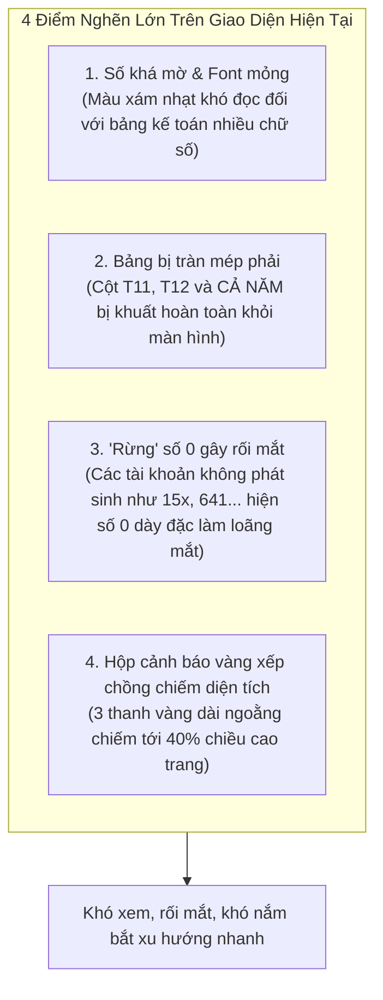

# Brainstorm Proposal: Trực Quan Hóa Đồ Thị & Nâng Cấp Độ Rõ Nét Bảng Ma Trận 12 Tháng

## 1. Phân Tích Thực Trạng & Điểm Nghẽn (Pain Points Trên Ảnh Người Dùng)

Dựa vào ảnh chụp màn hình thực tế từ phía người dùng (`Image #1`), phân hệ **#05 Phân Tích Cơ Bản** đang gặp **4 vấn đề lớn về hiển thị và trải nghiệm người dùng (UX/UI)**:

1. **Số khá mờ & Độ tương phản thấp**:
   - Các con số hàng tỷ (ví dụ: `6.156.820.788`, `12.753.616.535`) đang dùng màu xám `#1e293b` với font chữ thông thường, kích thước 12px, không đủ độ đậm nét (font-weight 700) khiến KTV phải căng mắt đọc.
2. **Bị cắt mất cột T11, T12 và CẢ NĂM**:
   - Chiều rộng của 13 cột cộng lại vượt quá bề ngang container (`minWidth: 180px` + padding lớn), khiến các cột quan trọng nhất của mùa kiểm toán là **Tháng 11, Tháng 12 và CẢ NĂM** bị văng ra khỏi màn hình bên phải.
   - Khi người dùng cuộn ngang, cột "Khoản Mục" (tên tài khoản) lại trôi mất, không biết dòng này là tài khoản gì.
3. **Hiển thị số 0 tràn lan gây rối mắt**:
   - Hầu hết các doanh nghiệp dịch vụ hoặc thương mại không phát sinh đồng thời cả 8 tài khoản (ví dụ tài khoản 15x, 641, 811 có 11 tháng bằng 0). Việc in chữ số `0` ở tất cả các ô tạo thành một "bức tường số" vô nghĩa, làm chìm các con số phát sinh thực sự.
   - *Chuẩn mực kế toán quốc tế*: Giá trị bằng 0 phải hiển thị bằng dấu gạch ngang mờ `-` để mắt người dùng lập tức tập trung vào các tháng có tiền.
4. **Thiếu trực quan hóa đồ thị (Visualization)**:
   - Điểm đột biến nghiêm trọng (Tháng 4 Chi phí khác 811 vọt lên **12.75 tỷ**) nằm lọt thỏm trong bảng số, chỉ nhìn bảng số rất khó hình dung được độ dốc và biên độ so với doanh thu.
5. **Các thanh cảnh báo màu vàng xếp chồng**:
   - 3 Hộp cảnh báo màu vàng dài ngoằng xếp dọc chiếm quá nhiều khoảng trống dưới đáy, gây cảm giác nặng nề.

---

## 2. Hợp Đồng Brainstorm (Brainstorm Contract)

### 2.1. Outcome (Kết quả đầu ra kỳ vọng)
- **Đồ thị Xu hướng 12 Tháng Tương tác (Interactive SVG Trend Chart)**:
  + Tích hợp ngay phía trên bảng số liệu.
  + Thể hiện các đường biểu diễn uốn lượn mềm mại (Bézier Splines): Doanh thu 511 (Xanh dương), Chi phí khác 811 (Cam), Chi phí QLDN 642 (Tím), Chi phí tài chính 635 (Hồng).
  + Bộ lọc bật/tắt chuỗi (Series Toggles) giúp KTV chủ động chọn xem đường mong muốn.
  + Các tháng đột biến (Spikes) được đánh dấu bằng **chấm tròn có hiệu ứng nhấp nháy (pulsing badge) và icon ⚠️**.
  + Hover chuột vào từng tháng: Hiển thị Tooltip popover số tiền chi tiết từng tài khoản.
- **Bảng Ma trận 12 Tháng Rõ Nét**:
  + Cố định cột đầu tiên (**Sticky First Column**): Khi cuộn ngang sang T11, T12 và CẢ NĂM, tên tài khoản luôn hiển thị cố định bên trái.
  + Số tiền đậm nét (`#0f172a`, font-weight: 700), dùng font monospace chuẩn tài chính.
  + Các ô bằng 0 tự động hiển thị dấu gạch ngang mờ `-` (`color: #cbd5e1`).
  + Các ô đột biến được bọc viền vàng nổi bật `background: #fffbeb, border: 1px solid #fde68a, color: #b45309`.
- **Hộp Cảnh Báo Thông Minh (Smart Audit Alerts)**:
  + Gom 3-5 thanh cảnh báo xếp chồng thành 1 thẻ tổng hợp tinh gọn dạng lưới (Grid), phân loại rõ theo từng tháng.
- **Thẻ Pareto Gọn Gàng**:
  + Khi 1 khách hàng / NCC chiếm 100%, thu gọn cảnh báo Going Concern thành inline badge, không chiếm 5 dòng to đùng.

### 2.2. Constraints (Ràng buộc)
- **100% Offline / Zero-Bundle-Bloat**: Không cài thêm các thư viện vẽ biểu đồ cồng kềnh (như `recharts`, `chart.js`, `d3`) làm phình file đóng gói Electron. Toàn bộ đồ thị được dựng bằng **Pure React SVG component** siêu nhẹ (~5KB), render tức thì, không giật lag.
- **Giữ nguyên 100% logic số liệu**: Dữ liệu lấy trực tiếp từ `trend12m.rows` và `pareto` đã được kiểm thử ở Phase 2.
- **Đồng bộ Light Theme Pro**: Tuân thủ chuẩn bảng màu slate/sky của AuditSoft.

### 2.3. Non-goals
- Không sửa đổi thuật toán phát hiện đột biến của `Trend12MAnalyzer`.
- Không thay đổi cấu trúc dữ liệu trả về của IPC.

### 2.4. Acceptance Criteria
1. Bảng 12 tháng có thể xem trọn vẹn T1 đến T12 và cột CẢ NĂM; cột Tên khoản mục cố định khi cuộn.
2. Các ô số 0 hiển thị dạng `-` mờ, số dương hiển thị đậm, sắc nét.
3. Đồ thị SVG hiển thị rõ ràng đường Doanh thu và Chi phí khác (811) vọt lên ở Tháng 4, hover chuột hiển thị đúng tooltip số tiền.
4. Có các nút bật/tắt từng đường biểu diễn trên đồ thị.
5. Hộp cảnh báo thu gọn chiếm không quá 100px chiều cao.
6. 100% tests, typecheck và lint vượt qua.

---

## 3. So Sánh 3 Phương Án Triển Khai (Option Exploration)

| Tiêu chí | Phương Án 1: Pure SVG Interactive Chart + Sticky Clean Table (Khuyên Dùng) | Phương Án 2: Cài Đặt Thư Viện Charting Ngoài (Recharts / Chart.js) | Phương Án 3: Chỉ Sửa Bảng Số, Không Vẽ Đồ Thị |
| :--- | :--- | :--- | :--- |
| **Trực quan hóa** | **Rất cao**: Biểu đồ Spline Area Chart mượt mà, điểm đột biến T4 nhấp nháy sinh động, hover tooltip trực quan. | Cao: Có sẵn hiệu ứng của thư viện. | Thấp: Vẫn chỉ là bảng số liệu thô, khó nhìn ra xu hướng. |
| **Hiệu năng & Bundle** | **Tối đa**: 0 KB dependency ngoài, render siêu tốc bằng SVG nội bộ của React. | Kém: Thêm 300KB - 500KB bundle, rủi ro xung đột Electron renderer. | Tối đa: Không thêm code đồ thị. |
| **Tùy biến giao diện** | **100% linh hoạt**: Kiểm soát từng pixel màu sắc, font chữ, hiệu ứng hover theo đúng AuditSoft Light Theme. | Khó: Phải ghi đè CSS của thư viện, dễ bị lệch font. | Không áp dụng. |
| **Độ phức tạp** | Thấp - Trung bình (~150 dòng code SVG React thuần túy). | Trung bình: Cần cấu hình ResponsiveContainer, Canvas context. | Rất thấp. |
| **Đánh giá** | **LỰA CHỌN TỐI ƯU (CHỌN)** | Không khuyến nghị | Không giải quyết được yêu cầu của user |

---

## 4. Thiết Kế Kiến Trúc Thành Phần Mới

Tạo component mới:
`src/renderer/components/Analytics/Trend12MVisualChart.tsx`
- Nhận prop: `rows: MonthlyTrendRow[]`.
- Tính toán tọa độ X, Y tự động theo giá trị Max của các chuỗi đang bật.
- Tự động vẽ các đường Bézier `C cp1x cp1y, cp2x cp2y, x y`.
- Cung cấp State bật/tắt từng chuỗi: `visibleSeries = { rev: true, other: true, cogs: true, adm: true, fin: true }`.
- Vẽ các vòng tròn cảnh báo nhấp nháy tại các tháng có `anomalyMonths`.
- Quản lý Tooltip hiển thị số tiền định dạng `fmtMoneyNum(val)`.

Cập nhật `GlAnalyticsTab.tsx`:
- Nhúng `<Trend12MVisualChart rows={trend12m.rows} />` lên trên bảng ma trận.
- Thêm CSS Sticky cho cột 1: `position: 'sticky', left: 0, background: '#ffffff', zIndex: 2`.
- Format số: Nếu `val === 0` $\rightarrow$ hiển thị `-` màu `#cbd5e1`. Nếu `val > 0` $\rightarrow$ hiển thị đậm nét `#0f172a`.
- Gom các hộp cảnh báo vàng thành `<SmartAuditAlerts notes={trend12m.warningNotes} />`.
- Tinh giản thẻ Pareto khi 1 đối tượng chiếm 100%.

---

## 5. Bản Xem Trước Tương Tác

Bản prototype hoàn chỉnh đã được xây dựng tại:  
👉 **`plans/reports/brainstorm-visual-charts-and-table-redesign.html`**  
*(Mở trực tiếp trên trình duyệt để trải nghiệm đồ thị tương tác, bật tắt chuỗi, hover tooltip và bảng ma trận cố định cột với số liệu thật từ screenshot của bạn)*.
