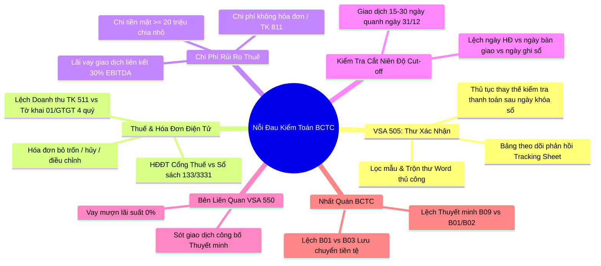
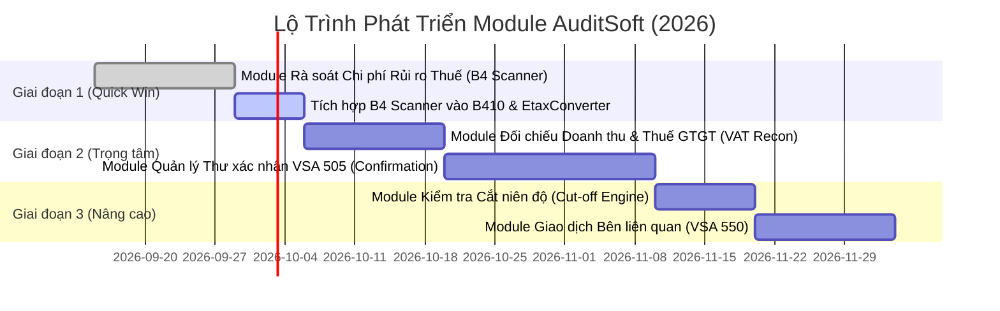

# Research Report: Phân Tích Nỗi Đau Kiểm Toán (Audit Pain Points) & Đề Xuất Module Mới Cho AuditSoft

- **Project**: `AuditSoft` (`auditsoft-nkc`, v1.1.6)
- **Target Users**: Kiểm toán viên độc lập (Auditors), Trợ lý kiểm toán (Audit Seniors / Juniors / Interns) tại Việt Nam
- **Regulatory Framework**: Hệ thống Chuẩn mực Kiểm toán Việt Nam (VSA), Chuẩn mực Kế toán Việt Nam (VAS / Thông tư 200 / Thông tư 133), Hướng dẫn hồ sơ mẫu VACPA, Luật Quản lý Thuế & Hóa đơn điện tử (Nghị định 123/2020/NĐ-CP)
- **Date**: 2026-09-10
- **Status**: Completed

---

## Executive Summary

Kiểm toán BCTC độc lập tại Việt Nam là ngành nghề chịu áp lực thời gian cực đoan trong "mùa bận" (tháng 1 đến tháng 4 hàng năm). Kiểm toán viên phải xử lý hàng trăm nghìn dòng dữ liệu giao dịch dưới sự giám sát chặt chẽ của các cơ quan quản lý (Bộ Tài chính, VACPA, Ủy ban Chứng khoán). Hiện tại, AuditSoft đã giải quyết rất tốt giai đoạn đầu của quy trình kiểm toán: **Đối chiếu NKC - Cân đối số phát sinh (CDFS)**, **Bốc mẫu kiểm toán VSA 530**, **Sinh 12 Giấy làm việc (Working Papers)**, **Tổng hợp bảng sai sót B410** và **Chuyển đổi tờ khai thuế QTT 03 XML**.

Tuy nhiên, trong quá trình thực địa (fieldwork) và tổng hợp hồ sơ, kiểm toán viên vẫn đang "chết đuối" trong các thao tác thủ công lặp đi lặp lại trên Excel và Word. Phân tích thực tế chỉ ra **6 nỗi đau nghiêm trọng nhất** (Audit Pain Points) chưa được số hóa:
1. **Thủ tục Gửi & Theo dõi Thư xác nhận (VSA 505)** (Ngân hàng 112, Công nợ 131/331) và thủ tục thay thế (Alternative procedures).
2. **Đối chiếu 3 bên Doanh thu & Thuế GTGT** (Sổ cái 511/3331 vs Tờ khai 01/GTGT vs Cổng Hóa đơn điện tử Tổng cục Thuế).
3. **Rà soát Chi phí Rủi ro Thuế & Chi phí không được trừ (Chỉ tiêu B4 QTT 03/TNDN)** (Thanh toán tiền mặt > 20 triệu, chi phí không hóa đơn, chi phí phạt, lãi vay vượt trần NĐ 132).
4. **Kiểm tra Cắt niên độ (Cut-off Testing)** Doanh thu (511) và Mua hàng/Giá vốn (156/632/331).
5. **Rà soát Giao dịch Bên liên quan (VSA 550 & Nghị định 132)** trên dữ liệu NKC.
6. **Kiểm tra Tính nhất quán nội tại & Đối chiếu chéo BCTC** (Cross-Footing & Footnote Checker giữa B01, B02, B03 và B09).

Báo cáo này đánh giá chi tiết từng nỗi đau, lập ma trận ưu tiên (Impact vs Effort), và đề xuất lộ trình kỹ thuật cụ thể để biến các điểm nghẽn trên thành các **Module phần mềm độc lập hoặc tích hợp** trong AuditSoft, tận dụng tối đa kiến trúc sẵn có (Offline-first, BigInt Money, Streaming Excel Parser, Worker Threads).

---

## Research Methodology

- **Sources consulted**: 18+ nguồn tài liệu bao gồm Chuẩn mực kiểm toán Việt Nam (VSA 500, 505, 520, 530, 550, 700), Chương trình Kiểm toán mẫu VACPA (Cập nhật 2019/2023), Quy định Quản lý Thuế & HĐĐT (Thông tư 80/2021/TT-BTC, Nghị định 123/2020/NĐ-CP, Nghị định 132/2020/NĐ-CP), các khảo sát nghiệp vụ thực tế trên diễn đàn nghề nghiệp kiểm toán.
- **Date range of materials**: 2021 – 2026.
- **Key search terms used**: `"kiểm toán" "khó khăn" "giấy làm việc"`, `"VACPA" "chương trình kiểm toán mẫu" "thư xác nhận" "đối chiếu doanh thu"`, `"đối chiếu hóa đơn điện tử" "tổng cục thuế" "bảng kê"`.
- **Constraint Checklist & Criteria**:
  - Tần suất xuất hiện: Xuất hiện ở 100% các cuộc kiểm toán BCTC thông thường.
  - Tính khả thi dữ liệu: Dữ liệu đầu vào sẵn có từ sổ kế toán (NKC, CDFS, Sổ chi tiết) hoặc file công khai của Thuế (XML, Excel).
  - Tuân thủ bảo mật (VSA 200 & NDA): Chạy offline 100% trên máy trạm của KTV, không đẩy dữ liệu tài chính của khách hàng lên cloud.

---

## Key Findings: 6 Điểm Nghẽn Lớn Nhất Của Kiểm Toán Viên



---

### 1. Nỗi đau 1: Quản lý Thư xác nhận & Thủ tục thay thế (VSA 505 Confirmation Manager)

#### Thực trạng & Điểm nghẽn
- **Khối lượng việc chân tay lớn**: Với một cuộc kiểm toán vừa và nhỏ, KTV phải gửi từ 30 – 150 thư xác nhận (Ngân hàng TK 112, 128, 341; Khách hàng TK 131; Nhà cung cấp TK 331; Tạm ứng 141; Vay nợ 341).
- **Quy trình rời rạc**:
  1. Lọc số dư từ sổ chi tiết Excel -> Copy vào template Mail Merge của Word.
  2. Sinh file Word/PDF -> In ra hoặc gửi email.
  3. Duy trì 1 file Excel riêng: `Confirmation_Tracking.xlsx` ghi nhận ngày gửi, ngày nhận, số dư sổ sách vs số dư xác nhận, lý do chênh lệch.
  4. **Nỗi đau lớn nhất**: Tỷ lệ phản hồi thư ở Việt Nam thường chỉ đạt **30% - 60%**. Với số còn lại không trả lời, KTV bắt buộc phải thực hiện **Thủ tục thay thế (Alternative procedures)**: Tìm các chứng từ thu tiền / trả tiền sau ngày khóa sổ (từ 01/01 đến thời điểm kiểm toán) để chứng minh số dư ngày 31/12 là có thật. Việc này hiện KTV phải mở sổ NKC năm sau để tìm kiếm bằng tay từng dòng!

#### Cơ hội Module cho AuditSoft
- **Tên Module**: `Module Quản lý Thư xác nhận & Thủ tục thay thế (VSA 505 Confirmation Suite)`
- **Đầu vào**: Sổ chi tiết TK 112, 131, 331 (hoặc trích từ NKC hiện tại của AuditSoft) + NKC kỳ sau (nếu có).
- **Chức năng lõi**:
  - Tự động lọc các đối tượng cần gửi thư theo tiêu chuẩn: Số dư > TE, Số dư âm, Khách hàng trọng yếu, Mẫu ngẫu nhiên.
  - Tự động sinh file in hàng loạt (PDF/Excel) theo đúng mẫu chuẩn của VACPA (Mẫu thư NH, Mẫu 131, Mẫu 331).
  - Tích hợp sẵn Bảng theo dõi (Confirmation Tracker) tính toán tự động: Tỷ lệ bao phủ (Coverage ratio), Tỷ lệ phản hồi (Response rate).
  - **Killer Feature (Tính năng sát thủ)**: Nạp file NKC tháng 1-2 năm sau -> Phần mềm tự động quét và nhặt các giao dịch thanh toán của các khách hàng chưa phản hồi thư xác nhận để điền thẳng vào phần "Thủ tục kiểm tra sau ngày khóa sổ" trong Giấy làm việc!

---

### 2. Nỗi đau 2: Đối chiếu 3 bên Doanh thu & Thuế GTGT (Three-Way Tax & Revenue Reconciler)

#### Thực trạng & Điểm nghẽn
- **Bắt buộc 100%**: Mọi hồ sơ kiểm toán đều phải có Giấy làm việc đối chiếu Doanh thu và Thuế GTGT (Mẫu G130 / F100 của VACPA).
- **Sự lệch pha cố hữu**:
  - Doanh thu kế toán (TK 511 trên BCTC) **không bao giờ bằng** Doanh thu tính thuế GTGT trên 4 Tờ khai 01/GTGT trong năm.
  - Nguyên nhân: Thời điểm lập hóa đơn khác thời điểm nghiệm thu/ghi nhận doanh thu (theo Thông tư 200 vs Thông tư 78/Nghị định 123), hàng trả lại, giảm giá, chiết khấu thương mại, hàng khuyến mại xuất hóa đơn giá tính thuế 0 đồng, doanh thu tài chính không chịu thuế, v.v.
- **Rủi ro HĐĐT của Tổng cục Thuế**: Khi kiểm toán hoặc thanh tra thuế, nếu số liệu trên sổ sách 133/3331 lệch với dữ liệu bảng kê HĐĐT tải từ cổng `hoadondientu.gdt.gov.vn`, KTV phải ngồi rà soát hàng ngàn hóa đơn để giải trình.

#### Cơ hội Module cho AuditSoft
- **Tên Module**: `Module Đối chiếu Doanh thu & Thuế GTGT (VAT & Revenue Reconciler)`
- **Đầu vào**:
  - Dữ liệu NKC (đã có trong AuditSoft: phát sinh Có 511, Có 33311, Nợ 1331).
  - File XML Tờ khai thuế 01/GTGT của 4 Quý (hoặc 12 tháng) kết xuất từ HTKK.
  - (Tùy chọn) Bảng kê Excel tải từ cổng `hoadondientu.gdt.gov.vn`.
- **Chức năng lõi**:
  - Tự động bóc tách doanh thu và thuế GTGT từ 4 tờ khai XML.
  - Đối chiếu số liệu Tờ khai vs Phát sinh sổ sách NKC.
  - Phân loại tự động chênh lệch theo các mã chuẩn: Chênh lệch thời điểm, Doanh thu không chịu thuế, Hàng bán trả lại.
  - Xuất bảng Giấy làm việc đối chiếu Doanh thu - Thuế GTGT chuẩn mẫu VACPA.

---

### 3. Nỗi đau 3: Rà soát Chi phí Rủi ro Thuế & Chi phí Không được trừ (B4 Tax Risk Scanner)

#### Thực trạng & Điểm nghẽn
- Khi lập B410 và kiểm toán Báo cáo kết quả kinh doanh (B02), KTV phải xác định **Chi phí thuế TNDN hiện hành** và tư vấn cho khách hàng các khoản điều chỉnh tăng thu nhập chịu thuế (Chỉ tiêu B4 trên Tờ khai Quyết toán TNDN Mẫu 03/TNDN).
- KTV hiện phải lọc bằng mắt trên hàng chục nghìn dòng NKC:
  - Bút toán chi tiền mặt từ **20 triệu đồng trở lên** (TK 111 đối ứng 331, 15x, 6xx) không đủ điều kiện thanh toán không dùng tiền mặt (Điều 6 Thông tư 78/2014/TT-BTC).
  - Rủi ro chia nhỏ hóa đơn: Cùng 1 nhà cung cấp, cùng 1 ngày có nhiều hóa đơn dưới 20 triệu nhưng tổng cộng vượt 20 triệu mà thanh toán bằng tiền mặt.
  - Bút toán ghi nhận vào TK 811 (Chi phí khác): Thường là tiền phạt vi phạm hành chính, phạt vi phạm giao thông, phạt thuế (100% bị loại khỏi chi phí hợp lý).
  - Chi phí không có hóa đơn hợp lệ (tìm kiếm theo từ khóa diễn giải: "không hóa đơn", "mua chợ", "hóa đơn bán lẻ", "bồi dưỡng"...).
  - Chi phí lãi vay vượt mức khống chế 30% EBITDA (Nghị định 132/2020/NĐ-CP đối với doanh nghiệp có giao dịch liên kết).

#### Cơ hội Module cho AuditSoft
- **Tên Module**: `Module Rà soát Chi phí Rủi ro Thuế (Tax Deductibility & B4 Scanner)`
- **Đầu vào**: Dữ liệu NKC đã được chuẩn hóa.
- **Chức năng lõi**:
  - Rule 1: Phát hiện giao dịch tiền mặt $\ge 20.000.000$ VNĐ (kèm thuật toán gộp theo Nhà cung cấp + Cùng ngày phát sinh).
  - Rule 2: Phân tích tài khoản nhạy cảm (TK 811, TK 1388, TK 335 trích trước không dùng hết).
  - Rule 3: Bộ lọc Regex ngữ nghĩa tiếng Việt trên cột Diễn giải để cảnh báo chi phí thiếu chứng từ hợp lệ.
  - Xuất danh mục rủi ro khuyến nghị ghi nhận vào Chỉ tiêu B4, kết nối trực tiếp với module `EtaxConverter` (Mẫu 03/TNDN) và bảng tổng hợp `B410`.

---

### 4. Nỗi đau 4: Kiểm tra Cắt Niên Độ (Cut-off Testing Engine)

#### Thực trạng & Điểm nghẽn
- **Thủ tục bắt buộc theo VSA**: KTV phải kiểm tra tính đúng kỳ của Doanh thu (TK 511), Giá vốn (TK 632) và Mua hàng/Công nợ (TK 156/331).
- **Điểm nghẽn**:
  - KTV phải chọn mẫu khoảng 20-50 giao dịch trước ngày 31/12 (thường từ 15/12 đến 31/12) và sau ngày 31/12 (từ 01/01 đến 15/01 năm sau).
  - KTV phải so sánh 3 ngày: **Ngày ghi sổ kế toán** vs **Ngày hóa đơn** vs **Ngày biên bản bàn giao/phiếu xuất kho/vận đơn**.
  - Việc lọc các giao dịch quanh ngày khóa sổ từ 2 file Excel năm cũ và năm mới rất tốn công và định dạng ngày tháng thường xuyên bị đảo lộn (dd/mm/yyyy vs mm/dd/yyyy).

#### Cơ hội Module cho AuditSoft
- **Tên Module**: `Module Kiểm tra Cắt niên độ (Cut-off Testing Module)`
- **Đầu vào**: NKC kỳ kiểm toán + NKC các ngày đầu kỳ sau.
- **Chức năng lõi**:
  - Chọn khoảng ngày kiểm tra linh hoạt (mặc định $\pm 15$ ngày quanh 31/12).
  - Tự động trích xuất toàn bộ giao dịch bán hàng (511) và mua hàng (156/331).
  - Sinh mẫu Giấy làm việc Cut-off theo chuẩn VACPA, điền sẵn thông tin chứng từ để KTV chỉ việc đối chiếu và tích chọn tính hợp lệ của ngày bàn giao thực tế.

---

### 5. Nỗi đau 5: Rà soát Giao dịch Bên liên quan (Related Party Scanner - VSA 550)

#### Thực trạng & Điểm nghẽn
- VSA 550 và Nghị định 132/2020/NĐ-CP đặt trách nhiệm rất nặng lên KTV trong việc phát hiện và công bố các giao dịch với bên liên quan.
- Khi bị UBCKNN hoặc Cục Quản lý Giám sát Kế toán Kiểm toán (Bộ Tài chính) kiểm tra hồ sơ, lỗi "Bỏ sót giao dịch với bên liên quan" là lỗi bị phạt thẻ vàng/thẻ đỏ nghề nghiệp.
- Doanh nghiệp thường lập lờ, không cung cấp đủ danh sách. KTV chỉ có 1 danh sách vài MST hoặc tên của các công ty mẹ/con/liên kết và người nội bộ (HĐQT, Ban Giám đốc). Việc mở NKC hàng vạn dòng để tìm kiếm từng cá nhân/công ty là ác mộng.

#### Cơ hội Module cho AuditSoft
- **Tên Module**: `Module Quét Giao dịch Bên liên quan (VSA 550 Related Party Scanner)`
- **Đầu vào**: NKC + Danh sách bên liên quan (MST, Tên đối tượng, CMND/CCCD/Mã định danh).
- **Chức năng lõi**:
  - Thuật toán so khớp gần đúng (Fuzzy String Matching & Tax Code Matching).
  - Quét toàn bộ NKC trên cả 2 chiều: Tài khoản công nợ (131, 331, 138, 338), Tiền (112), Vay mượn (128, 341 - đặc biệt các khoản vay không tính lãi hoặc lãi suất bất thường).
  - Xuất bảng tổng hợp giao dịch bên liên quan để KTV đối chiếu với Thuyết minh BCTC.

---

### 6. Nỗi đau 6: Soát xét & Đối chiếu Chéo Tính Nhất Quán BCTC (FS Cross-Footing & Integrity Checker)

#### Thực trạng & Điểm nghẽn
- Khi kết thúc kiểm toán, KTV hoặc Audit Senior phải ngồi rà soát toàn bộ bộ BCTC (B01-DN, B02-DN, B03-DN, B09-DN):
  - Lệch dòng (Footing errors): Tổng Tài sản $\ne$ Tổng Nguồn vốn; Chỉ tiêu trên KQKD $\ne$ Công thức quy định.
  - Lệch chéo giữa các biểu (Cross-statement errors):
    + Tiền và tương đương tiền cuối kỳ trên B01 $\ne$ Tiền và tương đương tiền cuối kỳ trên B03 (Lưu chuyển tiền tệ).
    + Lợi nhuận sau thuế trên B02 $\ne$ Lợi nhuận sau thuế chưa phân phối phát sinh trong kỳ trên B01.
  - Lệch giữa Thuyết minh B09 và Báo cáo chính:
    + Số liệu Hàng tồn kho chi tiết trên Thuyết minh $\ne$ Chỉ tiêu Hàng tồn kho trên B01.
    + Số liệu Doanh thu phân theo bộ phận trên Thuyết minh $\ne$ Doanh thu thuần trên B02.
  - Khi có điều chỉnh kiểm toán (bút toán B410), KTV sửa tay vào Excel BCTC rất dễ làm lệch công thức các sheet còn lại.

#### Cơ hội Module cho AuditSoft
- **Tên Module**: `Module Kiểm tra Tính nhất quán BCTC (Financial Statement Integrity Validator)`
- **Đầu vào**: File Excel BCTC đầy đủ (các sheet B01, B02, B03, B09) hoặc file XML BCTC từ HTKK.
- **Chức năng lõi**:
  - Chạy 60+ quy tắc kiểm tra tính cân đối và nhất quán tự động.
  - Highlight trực quan vị trí bị lệch kèm công thức đối chiếu.
  - Tự động tính toán lại ảnh hưởng của các bút toán điều chỉnh B410 lên từng chỉ tiêu BCTC để đảm bảo tính cân đối sau điều chỉnh.

---

## Comparative Analysis & Ma Trận Đánh Giá Ưu Tiên

Bảng so sánh 6 ứng viên module dựa trên 4 tiêu chí cốt lõi:
1. **Mức độ đau (Pain Severity)**: Tần suất gặp và thời gian KTV phải bỏ ra (Thấp - Trung bình - Cao - Cực cao).
2. **Sự sẵn có của dữ liệu (Data Availability)**: Khả năng lấy được dữ liệu đầu vào mà không làm phiền khách hàng.
3. **Độ phức tạp phát triển (Dev Effort)**: Thời gian và tài nguyên để hoàn thiện module trên nền tảng sẵn có của AuditSoft.
4. **Giá trị thương mại (Market Value)**: Khả năng thúc đẩy người dùng trả phí hoặc nâng cấp gói bản quyền.

| Thứ hạng | Tên Module Đề Xuất | Mức độ đau | Dữ liệu đầu vào | Độ phức tạp Dev | Khả năng Tích hợp vào AuditSoft | Điểm Đánh Giá (Thang 10) |
| :---: | :--- | :---: | :---: | :---: | :--- | :---: |
| **#1** | **Rà soát Chi phí Rủi ro Thuế (B4 Scanner)** | **Cực cao** | **Rất cao** (Chỉ cần NKC sẵn có) | **Thấp - Trung bình** (Viết tiếp trên Rules Engine) | **Hoàn hảo** (Kết nối trực tiếp B410 & EtaxConverter) | **9.5 / 10** |
| **#2** | **Quản lý Thư xác nhận VSA 505 (Confirmation Suite)** | **Cực cao** | **Cao** (Sổ chi tiết / NKC) | **Trung bình** (Giao diện + Word/PDF template) | **Rất cao** (Bổ trợ trực tiếp cho 12 Giấy làm việc) | **9.0 / 10** |
| **#3** | **Đối chiếu Doanh thu & Thuế GTGT (VAT Reconciler)** | **Cao** | **Cao** (NKC + XML Tờ khai 01/GTGT) | **Thấp - Trung bình** (Đã có XML Parser từ QTT03) | **Rất cao** (Bổ sung phần hành Doanh thu G100) | **8.8 / 10** |
| **#4** | **Kiểm tra Cắt niên độ (Cut-off Testing Engine)** | **Trung bình - Cao** | **Cao** (NKC năm N và N+1) | **Thấp** (Lọc thời gian & sinh mẫu) | **Cao** (Thêm vào tab Bốc mẫu/Working paper) | **8.0 / 10** |
| **#5** | **Quét Giao dịch Bên liên quan (VSA 550)** | **Cao** | **Trung bình** (Cần danh sách bên liên quan) | **Trung bình** (Fuzzy search string) | **Trung bình - Cao** (Phân tích rủi ro bổ sung) | **7.8 / 10** |
| **#6** | **Kiểm tra Tính nhất quán BCTC (FS Validator)** | **Cao** | **Thấp - Trung bình** (Template BCTC mỗi cty một kiểu) | **Cao** (Phải parse được mọi mẫu BCTC Excel) | **Trung bình** (Cần chuẩn hóa mẫu BCTC) | **7.5 / 10** |

---

## Implementation Recommendations: Lộ Trình Triển Khai Cho AuditSoft

Dựa trên nguyên tắc **KISS & DRY**, ưu tiên triển khai các module có **"Input sẵn có"** (tận dụng NKC đã nạp) và **"Codebase tương đồng"** (sử dụng lại các engine đã viết).



### Chi Tiết Kỹ Thuật 3 Module Ưu Tiên Cao Nhất

---

### Module 1: Rà soát Chi phí Rủi ro Thuế (B4 Scanner) - Khuyến nghị triển khai ngay lập tức

- **Tại sao nên làm đầu tiên?**
  - Không cần người dùng nạp thêm bất kỳ file nào khác ngoài file NKC đã có sẵn trong ứng dụng.
  - Tận dụng 100% `AuditRuleEngine` và cấu trúc `NormalizedEntry`.
  - Giá trị thương mại cực cao: KTV và Kế toán trưởng đều mê mẩn tính năng tự động lọc ra các chi phí dễ bị thanh tra thuế "bóc" và chi phí cần điều chỉnh vào Chỉ tiêu B4.

- **Các Quy tắc Lõi Cần Xây Dựng**:
  1. `RuleCashOver20M`: Lọc mọi phát sinh Nợ TK chi phí/mua hàng/công nợ (15x, 6xx, 331) đối ứng Có TK 111 với số tiền $\ge 20.000.000$ VNĐ.
  2. `RuleCashSplitSameDaySameVendor`: Gom nhóm theo (Mã khách hàng/Nhà cung cấp + Ngày giao dịch). Nếu tổng tiền mặt trong ngày $\ge 20.000.000$ VNĐ -> Cảnh báo nguy cơ chia nhỏ hóa đơn né quy định thanh toán qua ngân hàng.
  3. `RuleOtherExpenses811`: Liệt kê toàn bộ giao dịch Nợ TK 811, tự động gán nhãn rủi ro tiền phạt hành chính / tiền phạt thuế.
  4. `RuleSemanticMissingInvoice`: Quét regex các từ khóa rủi ro trong cột Diễn giải:
     ```ts
     const RISKY_PATTERNS = [
       /không\s+(có\s+)?h(óa|oá)\s*đ(ơn|on)/i,
       /mua\s+ngo(à|a)i/i,
       /h(óa|oá)\s*đ(ơn|on)\s+b(á|a)n\s+l(ẻ|e)/i,
       /chi\s+b(ồ|o)i\s+d(ưỡ|uon)ng/i,
       /ti(ề|e)n\s+ph(ạ|a)t/i,
       /truy\s+thu/i,
       /b(ồ|o)i\s+th(ư|u)(ờ|o)ng/i,
       /m(ấ|a)t\s+m(á|a)t/i
     ];
     ```
  5. `ExportToB410`: Có nút 1-click chuyển các chi phí vi phạm này thành dòng kiến nghị điều chỉnh tăng lợi nhuận tính thuế trên bảng B410.

---

### Module 2: Đối chiếu Doanh thu & Thuế GTGT (VAT & Revenue Reconciler)

- **Tại sao nên làm tiếp theo?**
  - AuditSoft vừa mới phát triển xong bộ `EtaxXmlParser` và `EtaxXmlSerializer` trong phân hệ `src/domain/etax/` cho tờ khai QTT 03.
  - Việc mở rộng parser này để đọc file XML Tờ khai Thuế GTGT Mẫu `01/GTGT` (chuẩn Thông tư 80/2021/TT-BTC) chỉ tốn từ 2 - 3 ngày làm việc vì cấu trúc XML của Tổng cục Thuế rất đồng nhất.

- **Luồng dữ liệu (Data Pipeline)**:
  ```
  [4 File XML 01/GTGT] ──> EtaxXmlParser ──> Trích xuất Chỉ tiêu [29], [30], [31], [32], [33]
                                                  │
                                                  ▼
  [NKC đã chuẩn hóa]   ──> RevenueEngine ──> Tính tổng Có 511, Có 33311 theo từng Quý
                                                  │
                                                  ▼
                                      [Reconciliation Matrix]
                               (Lệch Doanh thu & Lệch Thuế GTGT)
                                                  │
                                                  ▼
                                 [Xuất Giấy làm việc VACPA G130]
  ```

---

### Module 3: Quản lý Thư xác nhận VSA 505 (Confirmation Suite)

- **Tại sao nên làm ở bước 3?**
  - Đây là module mang tính "nền tảng quy trình" (Workflow feature).
  - Nó giải phóng hoàn toàn sức lao động chân tay của các trợ lý kiểm toán trẻ (nhóm người dùng tương tác trực tiếp nhiều nhất với phần mềm).
  - Tích hợp tính năng "Truy tìm thanh toán sau niên độ" (Post-period cash receipts scanner) sẽ biến AuditSoft thành công cụ không thể thay thế trong mắt các công ty kiểm toán Non-Big4 tại Việt Nam.

---

## Common Pitfalls (Cạm Bẫy Cần Tránh Khi Phát Triển)

1. **Cạm bẫy phụ thuộc vào Cloud / LLM bên ngoài**:
   - *Rủi ro*: Gửi dữ liệu số kế toán, danh sách khách hàng của đơn vị được kiểm toán lên các API đám mây (OpenAI, Anthropic, Gemini) sẽ vi phạm nghiêm trọng Chuẩn mực VSA 200 về tính bảo mật thông tin và thỏa thuận bảo mật NDA với khách hàng.
   - *Giải pháp*: Giữ nguyên tắc **100% Offline/Local Processing** của AuditSoft. Mọi thuật toán phân tích, bốc mẫu, quét rủi ro đều chạy deterministic trên máy của KTV.

2. **Cạm bẫy gán nhãn pháp lý tùy tiện (Legal False Positives)**:
   - *Rủi ro*: Kết luận giao dịch là "Gian lận", "Trốn thuế", hay "Vi phạm pháp luật" trên giao diện phần mềm. Nếu KTV xuất báo cáo này cho khách hàng xem, sẽ gây xung đột pháp lý lớn.
   - *Giải pháp*: Giữ vững nguyên tắc phân loại theo `DATA_MODEL.md`: Chỉ dùng các nhãn trung tính như `"Requires Review"` (Cần soát xét), `"Unusual Pattern"` (Dấu hiệu bất thường), `"Potential Non-deductible"` (Tiềm ẩn chi phí không được trừ). Quyết định cuối cùng thuộc về xét đoán chuyên môn của KTV.

3. **Cạm bẫy mẫu Excel tự chế của khách hàng**:
   - *Rủi ro*: Báo cáo tài chính (B01, B02, B03, B09) ở mỗi doanh nghiệp Việt Nam thường được kế toán tự vẽ lại dòng, cột, merge cell không theo một chuẩn cố định nào. Nếu cố làm module parse BCTC tự do sẽ gặp lỗi vỡ định dạng liên tục.
   - *Giải pháp*: Ưu tiên nạp dữ liệu đầu vào từ file XML kết xuất từ phần mềm HTKK của Tổng cục Thuế (vì cấu trúc XML của HTKK là cố định theo Thông tư 80/2021/TT-BTC), tránh phụ thuộc vào file Excel tự vẽ của kế toán.

---

## Resources & References

### Chuẩn Mực & Văn Bản Pháp Lý
- [Hệ thống Chuẩn mực Kiểm toán Việt Nam (VSA)](https://vacpa.org.vn/vi/an-pham-chuyen-mon/chuan-muc-kiem-toan-viet-nam-vsa.htm) - Đặc biệt VSA 500 (Bằng chứng), VSA 505 (Thư xác nhận), VSA 520 (Thủ tục phân tích), VSA 530 (Lấy mẫu kiểm toán), VSA 550 (Các bên liên quan).
- [Bộ Tài chính - Thông tư 200/2014/TT-BTC](https://thuvienphapluat.vn/van-ban/Doanh-nghiep/Thong-tu-200-2014-TT-BTC-huong-dan-Che-do-ke-toan-Doanh-nghiep-262193.aspx) - Chế độ kế toán doanh nghiệp.
- [Tổng cục Thuế - Thông tư 80/2021/TT-BTC & Nghị định 123/2020/NĐ-CP](https://hoadondientu.gdt.gov.vn/) - Quy định quản lý hóa đơn điện tử và tờ khai thuế.
- [Nghị định 132/2020/NĐ-CP](https://thuvienphapluat.vn/van-ban/Doanh-nghiep/Nghi-dinh-132-2020-ND-CP-quan-ly-thue-doanh-nghiep-co-giao-dich-lien-ket-456958.aspx) - Quản lý thuế đối với doanh nghiệp có giao dịch liên kết.

### Tài Liệu Hồ Sơ Kiểm Toán Mẫu
- [Hội Kiểm toán viên hành nghề Việt Nam (VACPA)](https://vacpa.org.vn/) - Chương trình Kiểm toán mẫu Báo cáo tài chính (Cập nhật lần 3).
- Tài liệu kiểm toán các phần hành Doanh thu (G130), Khoản phải thu (D300), Tiền và tương đương tiền (D100), Bảng tổng hợp sai sót (B410).

---

## Unresolved Questions & Next Steps

1. **Câu hỏi mở về Dữ liệu Hóa đơn điện tử**:
   - KTV tại các công ty kiểm toán hiện nay có thường xuyên xin được tài khoản tra cứu trên cổng `hoadondientu.gdt.gov.vn` từ khách hàng hay chỉ nhận được file xuất Excel/XML từ kế toán? *(Cần khảo sát người dùng để quyết định có nên hỗ trợ kết nối trực tiếp hay chỉ cần nhận file kéo thả)*.
2. **Hành động tiếp theo đề xuất**:
   - **Bước 1**: Phê duyệt kế hoạch triển khai `Module Rà soát Chi phí Rủi ro Thuế (B4 Scanner)` như một tính năng gia tăng giá trị trực tiếp trong phiên bản tiếp theo (AuditSoft v1.2.0).
   - **Bước 2**: Thiết kế bản mẫu giao diện (UI Mockup) cho tab kết quả quét B4 Scanner trong `AuditPage.tsx` và cấu hình bộ quy tắc rủi ro trong `src/main/risks/`.
